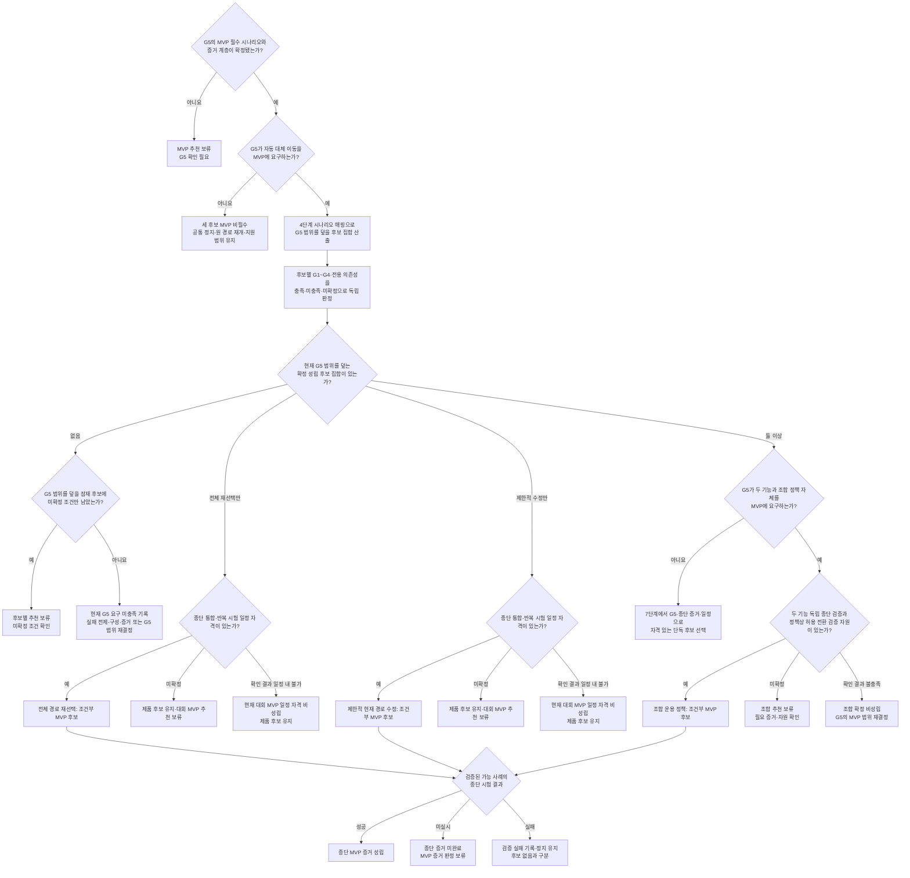

# 경로 기능 6단계 조건부 추천안

- 상태: 사용자 승인 — 6단계 완료
- 작성일: 2026-08-09
- 승인일: 2026-08-09
- 단계: 경로 알고리즘 분석·설계 순서 6단계
- 상위 기준: [1단계 기준선](path-planning-baseline.md), [2단계 추상 시나리오](path-planning-functional-scenarios.md), [3단계 의존성](path-planning-dependencies.md), [4단계 경로 전략 비교](path-planning-strategy-comparison.md), [5단계 안전·권한 흐름](../safety/path-safety-authority-flow.md)
- 참조 승인 판본 확인: 3단계 `사용자 승인 — 3단계 완료`·승인일 2026-08-09(`MAP-01~09`, `SAFE-01~07`, `SYS-01~07` 포함), 5단계 `사용자 승인 — 5단계 완료`·승인일 2026-08-09(`AUTH-01~18` 포함)
- 목적: 세 경로 후보 가운데 무엇을 언제 추천할 수 있는지 조건부로 정리하고, 현재 정보로 추천할 수 없는 범위를 드러낸다.

참조 문서의 승인 상태는 해당 단계에서 정의한 의존성·안전 경계를 승인했다는 뜻이다. `MAP-08/09`, `SAFE-07`, `SYS-07`의 실제 값·표현·임계값과 `AUTH-15/18`의 후속 발행 영역·사람 확인 범위까지 확정됐다는 뜻은 아니다.

3단계와 5단계 문서에는 별도 리비전 번호나 최종수정일 메타데이터가 없으므로 같은 날짜의 여러 스냅샷을 고유하게 식별할 수는 없다. 위 표기는 이 문서 작성 시 로컬 저장소에서 직접 확인한 승인 상태·승인일·ID 범위다.

## 이번 단계의 결론

현재는 실제 시연 지도, 차체·제어 특성, 제공 가능한 장애물·위치 정보, 실행·통신 경계와 MVP 증거 배분인 `G1~G5`가 모두 미정이다. 따라서 지금 당장 세 후보 중 하나를 최종 채택하지 않으며, 현재 계획 상태는 모두 `추천 보류`다.

`추천 보류`는 후보의 성능 실패나 최종 기각을 뜻하지 않는다. 필요한 조건과 증거가 아직 확인되지 않아 MVP 채택 근거가 부족하다는 뜻이다. 이 문서는 그 조건이 확인됐을 때 적용할 추천 규칙을 미리 고정한다.

| 구분 | 의미 | 결과 |
|---|---|---|
| 설계 단계의 정보·증거 부족 | 후보를 비교하거나 MVP 범위에 넣을 근거가 아직 없음 | 추천 보류, 팀 확인 항목으로 남김 |
| 후보 비대상 | 해당 상황이 이 경로 기능으로 해결할 문제가 아님 | 원 경로 재개·대기·정지 유지·지원 같은 공통 결과로 처리 |
| 확정 비성립 | 현재 확인된 `G1~G5` 구성·증거 스냅샷에서 후보의 필수 조건이 확인 결과 충족되지 않음 | 현재 스냅샷의 후보에서 제외하되, 실패한 필수 조건·구성·측정·증거 또는 `G5` 범위가 바뀌면 같은 증거 계층에서도 재평가 |
| MVP 비필수 | 후보 자격과 별개로 `G5`가 해당 기능을 대회 MVP에 요구하지 않음 | 제품·이후 확장 후보로 유지할 수 있으나 MVP 후보에서는 제외 |
| 정상 음성 결과·해 없음 | 운행 중 유효한 입력으로 판단했지만 해당 사례에 안전한 경로가 없음 | 후보 설계 실패로 세지 않고 정지 유지 |
| 검증된 가능 사례에서 기능·실행 실패 | 기대 결과와 수행 가능성이 확인된 시험에서 경로 기능 또는 실행 결과가 기대를 충족하지 못함 | 성능 실패로 기록하고 이동을 중단·정지 유지 |
| 운행 중 정보 부족·노후·불일치 | 현재 상황에서 안전한 대체 이동을 충분히 판단할 수 없음 | 정지 유지, 자동 해결이 불가능하면 사람 지원 |
| 보수적 정지 성공 | 위험한 이동을 하지 않고 정지 상태에 도달·유지함 | 안전 결과와 임무 미완료를 별도로 기록 |

후보 판정은 `기능 비대상 → 확인된 필수 조건 미충족 → 미확정 조건 존재 → 조건부 추천 자격 성립` 순서로 적용한다. 확인된 미충족과 미확정이 함께 있으면 현재 확인된 구성·증거 스냅샷에서는 `확정 비성립`으로 판정한다. 이미 필수 조건 하나가 충족되지 않았다는 사실을 다른 미확정 정보가 바꾸지는 못하기 때문이다. 이후 실패한 전제·구성·측정·증거가 바뀌면 새 스냅샷으로 다시 판정할 수 있다.

## 추천 대상의 경계

이번 추천은 정상 주행 전체를 고르는 것이 아니다. 안전정지 뒤 원래 경로를 안전하게 재개할 수 없을 때 검토하는 다음 세 대체 이동 후보만 다룬다.

1. 전체 경로 재선택
2. 제한적 현재 경로 수정
3. 두 경로 기능의 조합 운용 정책

원래 경로 계속, 정지 뒤 원래 경로 재개, 기다림, 정지 유지와 사람 지원은 세 후보의 공통 바깥 결과다. 이를 특정 후보의 기능 장점으로 계산하지 않는다.

조합 운용 정책은 세 번째 경로 생성 기능이 아니다. 전체 경로 재선택과 제한적 현재 경로 수정 중 어떤 기능을 검토·선택·전환·중단할지 다루는 상위 정책이다.

## 어떤 후보에도 필요한 공통 조건

아래 조건은 세 후보의 차별점이 아니라 실제 대체 이동을 허용하기 위한 공통 전제다.

- 예정 경로의 충돌 가능성이 생기거나 이를 배제할 수 없으면 다른 이동 행동보다 로컬 안전정지를 먼저 개시한다.
- 실제 정지 완료를 확인하기 전에 계산된 경로 후보를 실행하지 않는다. 정지 중 잠정 계산은 가능하지만 정지 완료 뒤 현재 정보로 유효성을 다시 확인한다.
- 현재 미션과 목적지, 지도, 위치·진행, 장애물, 정지 상태와 경로 결과가 현재 상황에 맞고 서로 일치해야 한다.
- 목적지의 필수 승하차 공간 또는 승인된 대체 정지 위치가 유효해야 한다. 다른 접근 통로나 국소 이탈 경로가 있다는 사실은 점유된 필수 승하차 공간을 대신하지 않는다. `[MAP-07]`
- 계산된 경로가 실제 차체로 수행 가능하다는 근거가 있어야 한다.
- 경로 기능의 `재개 가능` 또는 `대체 경로 가능` 판정은 실제 이동 허가가 아니다.
- 보호정지 뒤에는 정지 전 이동 허가나 시작·재개 지시를 재사용하지 않는다. 새로 생성되거나 시스템 정책에 따라 명시적으로 재유효화된 운행 지시와 로봇 로컬 이동 허가, 물리 안전 금지 없음이 모두 확인돼야 한다.
- 필수 정보가 부족하거나 오래됐거나 서로 맞지 않으면 어느 후보도 임의 실행하지 않는다.
- 대체 이동 중 새 위험이 생기면 사용 중인 후보와 관계없이 다시 정지하고 전체 상황을 재판단한다.

공통 정지·허가 경계는 `SAFE-01~07`, `SYS-04~07`과 5단계 `AUTH-01~18`을 따른다. 이 조건을 만족한다는 사실을 후보별 가점으로 중복 계산하지 않는다.

## 대회 MVP의 공통 종단·일정 자격

후보의 논리 시험과 차체의 미리 정한 경로 주행을 각각 성공시키는 것만으로 대회 MVP 자격이 성립하지 않는다. `G5`에서 축소 실물 MVP로 배정하려면 같은 미션과 입력 상태에서 생성된 후보가 전체 이동 허가 절차를 거쳐 실제 로봇 운행에 사용됐고, 목적지 도착 또는 보수적 정지 결과까지 모순 없이 이어졌음을 관찰·기록할 수 있어야 한다. `[LOC-01, SAFE-02/04, SYS-04/07, VAL-04~06, AUTH-04/05/06/10/12/15/16]`

종단 통합에서 확인할 의미 사슬은 다음과 같다. 이는 실제 필드명·메시지 형식·통신 계약을 확정하는 목록이 아니다.

```text
동일 미션과 목적지
→ 현재 장애물·지도·위치 입력과 입력 유효성
→ 선택된 경로 후보와 생성 시점
→ 실제 정지 완료와 새·재유효화 운행 지시
→ 로봇 로컬 이동 허가와 물리 안전 금지 없음
→ 실제 실행 경로
→ 목적지 도착 또는 보수적 정지·지원 결과
```

이 연결 증거가 없으면 논리 결과와 실물 주행은 서로 독립된 성공으로만 기록하며 종단 MVP 후보 추천은 보류한다. 어느 사용자 흐름·운행 단계와 후속 결과를 대표 종단 시연에 포함할지는 `G5`에서 정한다.

단독 후보라는 이유나 네 명이라는 팀 구성만으로 일정 자격을 가정하지 않는다. 팀이 첫 종단 성공일과 기능 동결 기준을 실제로 채택하고, 해당 후보의 종단 통합·반복 시험·증거 수집을 그 전에 완료할 담당자와 실행 계획이 있으며, 종단 시연과 제출 증거 준비를 침해하지 않는다고 확인할 때만 대회 MVP 일정 자격이 성립한다. 담당·계획·일정 적합성이 아직 확인되지 않았으면 대회 MVP 추천을 보류한다. 확인 결과 채택된 일정 안에 검증할 수 없으면 제품 후보로 유지하되 현재 대회 MVP 일정 자격은 비성립으로 기록하며, 일정이나 실행 계획이 바뀌면 다시 평가할 수 있다. 내부 일정의 날짜는 팀 합의 전 기획 초안이며 이 문서에서 확정하지 않는다.

## 조건부 추천 1: 전체 경로 재선택

### 추천 문장

실제 시연 지도에 갈림길과 사용 가능한 다른 통로가 있고, 현재 운용 정책에서 원 경로 재개만으로 처리할 수 없는 유효한 통로 사용 불가 상태와 후보 통로 상태가 현재 상황에 맞으며, 현재 위치·진행 방향에서 다른 통로의 첫 구간까지 실제로 이어질 수 있고, 차체가 그 경로를 통과할 수 있다는 증거가 있다면 → `전체 경로 재선택`을 후보로 추천한다 → 현재 통로의 상위 통로·구간 순서를 바꿔 같은 목적지를 유지하는 문제와 직접 맞고 제한적 수정에 필요한 세밀한 이탈·재합류 판단을 추가하지 않아도 되기 때문이다 → 필수 조건의 충족 여부가 아직 확인되지 않았다면 추천을 보류하고, 확인 결과 필수 조건이 충족되지 않으면 현재 `G5`·증거 범위에서 확정 비성립으로 판정하며, 운행 중 입력이 부족·노후·불일치하거나 안전한 경로가 없으면 결과를 실행하지 않고 정지 유지·필요 시 사람 지원으로 닫는다.

### 성립 조건과 보류 조건

| 비교 기준 | 추천이 성립하는 조건 | 추천 보류 조건 | 확정 비성립 조건 | 추적 근거 |
|---|---|---|---|---|
| 기능 충족 범위 | 현재 상위 통로를 계속 사용할 수 없고 같은 목적지로 이어지는 다른 상위 통로가 필요하며, 목적지의 필수 공간은 사용 가능함 | `G5` 대표 시연에 상위 통로 변경 상황을 포함할지와 목적지 필수 공간을 구성할 수 있는지 아직 확인하지 못함 | `G5`가 상위 통로 변경을 요구하지만 현재 확인된 구성에서 목적지 필수 공간 또는 이를 충족하는 전체 경로 범위를 만들 수 없음 | `A-05b`, `S-02`; 조건부 `S-01`, `D-02`, `D-04`, 안정화된 `C-01`; `A-05a/d` 배제, `MAP-07` |
| 추가 의존성 | 실제 갈림길·대체 통로, 차단 반영과 복수 후보 기준이 있음 | 선택할 시연 지도에서 갈림길·대체 통로·차단 상태를 제공할 수 있는지 아직 확인하지 못함 | 선택한 `G5` 시연 지도·구성에 실제 갈림길 또는 목적지로 이어지는 대체 통로를 마련할 수 없음 | `MAP-03/05/09` |
| 판단 불충분 조건 | 현재 미션·목적지·구간·방향, 현재 통로와 후보 통로 상태를 충분히 판단함 | 필요한 정보의 제공 범위·신뢰 수준을 아직 확인하지 못함 | 선택한 MVP 구성에서 현재 위치·진행·통로 상태의 최소 신뢰 정보를 제공할 수 없음 | `LOC-01~05`, `OBS-04/06` |
| 물리 수행 위험 | 현재 위치·방향에서 대체 통로 진입점까지 이어지고 차체가 회전·진입·통과할 수 있음 | 실제 진입·회전·통과 가능성을 아직 측정하지 못함 | 측정 결과 현재 위치에서 진입하거나 후보 통로를 통과할 수 없음 | `MAP-02/04`, `VEH-01/02`, `VAL-04` |
| 입력 최신성 위험 | 통로 상태, 위치와 경로 결과가 같은 현재 상황을 나타냄 | 최신성·일치 여부를 검증하는 능력을 아직 확인하지 못함 | 선택한 MVP 구성에서 필요한 최신성과 상태 일치를 유지할 수 없음 | `MAP-05/06`, `SYS-07` |
| 실패 시 보수적 종료 | 경로 없음·진입 불가·판단 불충분을 구분해 보고하고 정지·지원으로 닫을 수 있음 | 실패 처리와 지원 전달의 종단 증거가 아직 없음 | 경로 없음에서 추정 경로를 실행하거나 이전 결과를 재사용해 보수적으로 닫을 수 없음 | 정지 유지, 필요 시 `SAFE-06` 지원 |

### 대회 MVP 조건부 우선순위

`G1`에서 실제 갈림길과 대체 통로가 확인되고, `G2~G4`에서 대체 통로 진입·통과, 입력 최신성, 실행·통신 경계에 필요한 조건이 닫히며, `G5`에서 통로 전체 차단 장면을 단일 축소 실물 기능으로 보여주기로 합의하고, 제한적 수정의 세밀한 공간 조건은 아직 닫히지 않았거나 MVP에 필요하지 않으며, 위 공통 종단·일정 자격이 성립한다면 → 전체 경로 재선택을 **단일 대체 이동 MVP의 우선 후보**로 추천할 수 있다 → 통로 전체 차단 장면을 관객에게 명확하게 보여주면서 제한적 수정의 세밀한 공간 판단과 재합류 검증을 동시에 떠안지 않을 수 있기 때문이다 → 조건이 미확정이거나 종단·일정 증거가 없으면 MVP 추천을 보류하고, 확인 결과 필수 공간·진입·차체 조건이 충족되지 않으면 현재 축소 실물 MVP 범위에서 확정 비성립으로 판정하며, 운행 중 조건을 잃으면 경로를 실행하지 않은 채 정지 유지·필요 시 사람 지원으로 닫는다.

이는 현재 채택이 아니다.

## 조건부 추천 2: 제한적 현재 경로 수정

### 추천 문장

상위 통로·구간 순서를 유지한 채 이동이 허용된 국소 공간으로 이탈할 수 있고, 승인된 위치·방향으로 안전하게 재합류할 수 있으며, 장애물 점유 범위·주변 여유·현재 경로와 차체의 관계를 충분히 판단하고 축소 실물에서 수행 가능성을 검증할 수 있다면 → `제한적 현재 경로 수정`을 후보로 추천한다 → 다른 통로가 없어도 일부 점유 구간만 돌아간 뒤 기존 경로를 유지하는 장면을 직접 다룰 수 있기 때문이다 → 필수 조건의 충족 여부가 아직 확인되지 않았다면 추천을 보류하고, 확인 결과 필수 조건이 충족되지 않으면 현재 `G5`·증거 범위에서 확정 비성립으로 판정하며, 운행 중 입력이 부족·노후·불일치하거나 안전한 수정 경로가 없으면 결과를 실행하지 않고 정지 유지·필요 시 사람 지원으로 닫는다.

### 성립 조건과 보류 조건

| 비교 기준 | 추천이 성립하는 조건 | 추천 보류 조건 | 확정 비성립 조건 | 추적 근거 |
|---|---|---|---|---|
| 기능 충족 범위 | 같은 상위 통로 안에서 일부 점유를 제한적으로 돌아가고 승인된 위치·방향으로 재합류함. 목적지 접근 수정이라면 승인된 대체 정지 위치가 있음 | `G5` 대표 시연에 제한적 수정 상황을 포함할지와 승인된 대체 정지 위치를 구성할 수 있는지 아직 확인하지 못함 | `G5`가 제한적 수정을 요구하지만 현재 확인된 구성에서 승인된 이탈·재합류 또는 대체 정지 범위를 만들 수 없음 | `A-05c`, `S-01`; 엄격한 조건의 `D-02`, `D-04`, 안정화된 `C-01`; `A-05a/d` 배제, `MAP-07` |
| 추가 의존성 | 허용 이탈·재합류 구역과 장애물 점유 범위·주변 여유가 있음 | 선택할 시연 지도에서 허용 공간·재합류 구역과 점유·주변 여유 정보를 제공할 수 있는지 아직 확인하지 못함 | 선택한 `G5` 시연 지도·관측 구성에서 허용 이탈·재합류 공간을 마련할 수 없거나 필요한 주변 여유 정보를 제공할 수 없음 | `MAP-08`, `OBS-02`; 동적 범위를 넣을 때만 `OBS-03` |
| 판단 불충분 조건 | 현재 경로와 차체의 상대 위치, 점유 범위, 통과 여유와 재합류 가능성을 충분히 판단함 | 필요한 위치·관측 수준과 신뢰 정보를 아직 확인하지 못함 | 선택한 MVP 구성에서 위치·점유·통과 여유·재합류의 최소 신뢰 정보를 제공할 수 없음 | `MAP-02/04`, `LOC-02/03/05`, `OBS-04/06` |
| 물리 수행 위험 | 차체 외곽·회전·정지와 빈차·탑승 상태를 반영해 이탈·통과·재합류가 반복 검증됨 | 차체의 이탈·통과·재합류 가능성을 아직 측정하지 못함 | 측정 결과 차체가 허용 범위에서 통과·회전·재합류할 수 없음 | `VEH-01~05`, `SAFE-03/07`, `VAL-04` |
| 입력 최신성 위험 | 장애물 범위와 재합류 공간이 현재 상황에 맞고 변화 뒤에는 기존 결과를 무효화함 | 변화·최신성·결과 무효화 능력을 아직 확인하지 못함 | 선택한 MVP 구성에서 필요한 최신성과 결과 무효화를 유지할 수 없음 | `OBS-03~06`, `SYS-07` |
| 실패 시 보수적 종료 | 통과 여유·차체 수행·재합류 중 하나라도 부족하면 수정 결과를 실행하지 않고 정지·지원으로 닫을 수 있음 | 실패 처리와 지원 전달의 종단 증거가 아직 없음 | 빈 공간이나 차체 능력을 가정해 결과를 실행하여 보수적으로 닫을 수 없음 | 별도 자격이 확인된 후보가 없으면 정지 유지·필요 시 `SAFE-06` 지원 |

### 대회 MVP 조건부 우선순위

`G1`에서 넓고 허용된 이탈·재합류 공간이 확인되고, `G2~G4`에서 차체 움직임, 필요한 공간·장애물 정보, 입력 최신성, 실행·통신 경계에 필요한 조건을 반복 검증할 수 있으며, `G5`에서 일부 점유 장면을 단일 축소 실물 기능으로 보여주기로 합의하고, 전체 재선택의 대체 통로 조건은 닫히지 않았거나 MVP에 필요하지 않으며, 위 공통 종단·일정 자격이 성립한다면 → 제한적 현재 경로 수정을 **단일 대체 이동 MVP의 우선 후보**로 추천할 수 있다 → 일부 점유 장애물을 돌아 원래 경로에 복귀하는 움직임을 시각적으로 보여줄 수 있기 때문이다 → 조건이 미확정이거나 종단·일정 증거가 없으면 MVP 추천을 보류하고, 확인 결과 필수 공간·관측·차체 조건이 충족되지 않으면 현재 축소 실물 MVP 범위에서 확정 비성립으로 판정하며, 운행 중 조건을 잃으면 수정 결과를 실행하지 않은 채 정지 유지·필요 시 사람 지원으로 닫는다.

움직이는 사람이나 이동체라는 이유만으로 이 후보를 추천하지 않는다. 동적 위험은 먼저 정지·재판단하며, 상대 움직임·통행 우선권·측면 여유를 충분히 판단하지 못하면 제한적 수정의 성립 조건이 아니다.

## 조건부 추천 3: 두 기능의 조합 운용 정책

### 추천 문장

일부 점유와 통로 전체 차단이 모두 명시적인 MVP 또는 확장 요구이고, 두 단독 기능의 공간·입력·차체·최신성 조건과 독립 종단 증거가 모두 확보되며, 최초 선택, 정책이 허용하는 모든 전환 방향, 전략 선택·전환 과정의 진행 중 후보 계산·결과 취소와 다른 후보 재검토, 결과 무효화와 반복 전환 방지까지 시험할 자원과 일정이 별도로 확보된다면 → `두 경로 기능의 조합 운용 정책`을 후보로 추천한다 → 서로 다른 두 차단 형태를 같은 미션 체계에서 다룰 수 있고 어떤 기능을 언제 쓰지 말아야 하는지까지 검증할 수 있기 때문이다 → 필수 조건이 미확정이면 조합 추천을 보류하고, 확인 결과 어느 단독 기능이나 정책상 필요한 전환 조건이 충족되지 않으면 현재 `G5`·증거 범위에서 조합을 확정 비성립으로 판정하며, 실행 중 선택·전환 판단이 불충분하면 어느 기능도 임의 실행하지 않은 채 정지 유지·필요 시 사람 지원으로 닫는다.

### 성립 조건과 보류 조건

| 비교 기준 | 추천이 성립하는 조건 | 추천 보류 조건 | 확정 비성립 조건 | 추적 근거 |
|---|---|---|---|---|
| 기능 충족 범위 | 일부 점유와 통로 전체 차단을 한 범위에서 모두 다뤄야 하고 정책상 허용된 선택·전환도 검증 대상임 | 두 상황군을 모두 MVP에 넣을지와 허용할 전환 방향이 아직 미정임 | `G5`가 두 기능과 조합 정책을 요구하지만 구성 단독 기능 중 하나가 현재 스냅샷에서 확정 비성립임 | `A-05b/c`, `S-01/S-02`; 조건부 `D-02/D-04/C-01` |
| 추가 의존성 | 두 단독 기능의 추가 의존성이 모두 충족됨 | 한쪽 또는 양쪽 전용 의존성의 제공 여부를 아직 확인하지 못함 | 확인 결과 한쪽 전용 의존성을 제공할 수 없어 해당 구성 기능이 성립하지 않음 | `MAP-03/05/09`, `MAP-08`, `OBS-02`; 동적 범위일 때만 `OBS-03` |
| 판단 불충분 조건 | 두 결과가 같은 현재 미션·지도·위치·장애물 상태를 사용하고 선택 근거가 재현 가능함 | 상태 일치·선택 근거·정책상 전환을 아직 검증하지 못함 | 선택한 MVP 환경에서 두 결과의 상태 일치나 정책상 선택·전환을 유지할 수 없음 | `MAP-06`, `LOC-02/03/05`, `SYS-04~07` |
| 물리 수행 위험 | 각 단독 기능과 정책이 허용하는 전환 위치에서 실제 연결·차체 수행이 검증됨 | 단독 기능 또는 허용 전환의 물리 수행을 아직 측정하지 못함 | 측정 결과 정책이 요구하는 구성 기능이나 허용 전환을 실제 차체로 수행할 수 없음 | `VEH-01~05`, `VAL-04/05` |
| 입력 최신성 위험 | 늦은 결과, 전환 중 상태 변화와 새 위험에서 기존 결과를 무효화할 수 있음 | 결과 최신성·취소·반복 전환 방지 능력을 아직 확인하지 못함 | 선택한 MVP 범위에서 오래된 결과 폐기나 허용 전환의 상태 일치를 유지할 수 없음 | `SYS-04~07`, `VAL-02/04/05` 검증 확대 |
| 실패 시 보수적 종료 | 선택·전환이 불충분하거나 새 위험이 생기면 기존 결과를 무효화하고 다시 정지·전체 재판단함 | 조합 실패 처리와 지원 전달의 종단 증거가 아직 없음 | 한쪽 실패를 다른 쪽의 자동 허가로 바꾸거나 반복 전환을 끝내지 못해 보수적으로 닫을 수 없음 | 불가하면 정지 유지·필요 시 `SAFE-06` 지원 |

## 후보 자격과 분리해 기록하는 결과

아래 결과는 위 표의 `확정 비성립`과 합치지 않는다. 특정 운행 사례의 정상적인 해 없음이나 검증 실패를 제품 후보의 영구 기각으로 바꾸지 않으며, 기능 비대상과 MVP 비필수도 서로 다르게 기록한다.

| 판정 | 전체 경로 재선택 | 제한적 현재 경로 수정 | 조합 운용 정책 | 공통 후속 결과 |
|---|---|---|---|---|
| 기능 비대상 | 원 경로 재개로 처리할 수 있거나 같은 상위 통로 안의 일부 점유를 제한적 수정만으로 처리하기로 한 경우, `A-05a/d`, `D-01/D-06/R-01` 같은 공통 결과 상황 | 상위 통로 변경이 필요함, `A-05a/d`, `S-02`, `D-01/D-06/R-01` 같은 공통 결과 상황 | 한 기능의 선택·전환 문제조차 없고 원 경로 재개·정지·지원 같은 공통 결과만 필요함 | 해당 기능으로 해결하려 하지 않고 승인된 공통 결과 적용 |
| MVP 비필수 | `G5`가 상위 통로 변경 장면을 MVP에 요구하지 않음 | `G5`가 제한적 이탈·재합류 장면을 MVP에 요구하지 않음 | `G5`가 자격 있는 단독 기능 하나만 요구하거나 조합 정책 자체를 요구하지 않음 | 제품·이후 확장 후보로 남길 수 있으나 MVP 가점으로 세지 않음 |
| 운행 중 정상 음성 결과·해 없음 | 유효한 현재 입력으로 판단했지만 안전한 대체 통로 또는 진입 방법이 없음 | 유효한 현재 입력으로 판단했지만 통과 여유·재합류 방법이 없음 | 유효한 현재 입력으로 판단했지만 어느 기능도 안전하게 선택·전환할 수 없음 | 후보 설계 실패로 세지 않고 정지 유지·필요 시 사람 지원 |
| 운행 중 정보 부족·노후·불일치 | 현재 통로·후보 통로·위치 결과를 실행하지 않음 | 점유·여유·재합류 결과를 실행하지 않음 | 어느 하위 결과도 선택하거나 전환하지 않음 | 기존 결과를 재사용하지 않고 정지 유지 |
| 검증된 가능 사례의 기능·실행 실패 | 가능하다고 정한 사례에서 올바른 전체 경로 결과 또는 실제 종단 실행을 만들지 못함 | 가능하다고 정한 사례에서 올바른 수정 결과 또는 실제 종단 실행을 만들지 못함 | 가능하다고 정한 사례에서 정책상 선택·전환·무효화 또는 실제 종단 실행을 충족하지 못함 | 성능 실패로 기록하고 이동 중단·정지 유지; `후보 없음`과 구분 |

### 대회 MVP와 이후 확장의 위치

조합은 두 기능의 단순 합이 아니며 공통 안전정지·정지 유지·지원 결과를 중복 가점하지 않는다. 두 단독 기능 시험에 더해 최초 선택, 정책이 허용하는 모든 전환 방향, 전략 선택·전환 중 후보 계산·결과 취소와 다른 후보 재검토, 최신성 상실과 반복 전환 방지 시험이 필요하므로 검증 범위는 단순 합보다 커질 수 있다. 정책이 단방향 전환만 허용하면 그 방향만 시험하고, 한 정지 사건에서 전략 변경을 금지하면 금지 조건이 지켜지는지를 시험한다.

일반 미션 취소와 일반적인 재시도는 세 후보에 공통으로 필요한 서비스·운행 시험이다. 여기서 조합의 추가 부담으로 말하는 `취소·재검토`는 전략 선택 또는 전환 과정에서 진행 중인 후보 계산·결과를 폐기하고 다른 후보를 검토하는 처리만 뜻한다.

따라서 `G5`가 두 기능과 조합 정책을 실제 MVP에 요구하는지 또는 추가 검증 자원이 있는지가 미확정이면 조합 추천을 보류한다. `G5`에서 자격 있는 단독 기능 하나만 필요하다고 확인하면 조합은 MVP 비필수이며 이후 확장 후보로 남길 수 있다. 두 기능과 조합 정책이 모두 필수인데 구성 단독 기능이나 정책상 필요한 전환 조건 하나가 확인 결과 충족되지 않으면 현재 MVP 조합은 확정 비성립이고 `G5` 범위를 다시 결정해야 한다. 두 단독 기능 중 하나라도 종단·실물 근거가 부족하면 조합 장면을 성공했다고 주장하지 않는다.

## 현재 조건에 따른 MVP 추천 규칙

아래 규칙은 하나를 지금 채택하는 순위표가 아니라 팀이 각 후보의 자격을 독립적으로 확인한 뒤 적용할 분기다. 두 단독 후보가 모두 성립해도 어느 하나가 자동 우선하지 않는다.



`G5`의 MVP 필수 시나리오·증거 계층이나 후보별 필수 정보가 아직 미확정이면 `추천 보류`다. `G5`가 자동 대체 이동을 요구하지 않는다고 확인하면 세 후보는 MVP 비필수이며 제품·확장 후보로는 남을 수 있다. 반대로 자동 대체 이동이 필수인데 확인 완료 결과 현재 `G5` 범위를 덮는 후보가 하나도 없다면 더 이상 추천 보류로 남기지 않고 `현재 요구 미충족`을 기록해, 미충족으로 확인된 `G1~G5` 전제·구성·증거나 `G5` 범위를 다시 결정해야 한다. 이는 6단계가 범위를 자동 축소하거나 재설계한다는 뜻이 아니라, 7단계에 넘길 서로 다른 조건부 종단을 분리한다는 뜻이다.

두 단독 후보 조건이 동시에 성립해도 조합이나 특정 단독 후보가 자동으로 선택되지는 않는다. 하나의 단독 기능만으로 팀이 합의한 MVP 장애물 장면과 종단 흐름을 충분히 증명할 수 있다면, `G5`에서 시연하려는 차단 형태와 확보 가능한 종단 증거·일정 자격을 기준으로 하나를 선택한다. 두 상황군을 모두 MVP 필수로 유지하면서 정책상 허용 전환의 검증 자원을 확보하지 못한 경우에는 단독 후보 하나로 요구를 충족했다고 간주하지 않고, 조합 추천을 보류한 채 `G5`의 MVP 범위를 다시 결정한다.

현재는 `G1~G5`가 닫히지 않았으므로 위 분기의 출발점에서 멈춘다. 즉 현재 MVP 채택 결과는 `세 후보 모두 추천 보류`다.

## 정적·동적 장애물에 대한 적용

장애물이 정적인지 동적인지는 필요한 관측과 재판단 범위를 바꾸지만 후보를 자동 결정하지 않는다.

- 정적 대상이 통로 일부만 점유하고 허용 이탈·재합류 조건이 충족되면 제한적 수정 후보가 될 수 있다.
- 정적 대상에 대해 안전정지·재판단을 거친 현재 판단 시점에도 현재 통로 전체가 사용 불가이고 다른 통로가 실제로 연결된다고 충분히 판단되면 전체 재선택 후보가 될 수 있다.
- 움직이는 대상은 먼저 정지·재판단 대상이며, 움직인다는 이유만으로 특정 후보를 고르지 않는다. 제품 기능 공간에서는 `D-02/D-04`처럼 상대 움직임·통행 우선권·통과 여유와 필요한 현재 정보·최신성을 충분히 판단할 수 있는 제한된 경우, 대상이 계속 움직이더라도 승인된 조건에 맞는 후보를 검토할 수 있다. 이는 제품 후보 범위를 유지한다는 뜻이며 대회 MVP 채택을 의미하지 않는다.
- `C-01`에서는 동적 위험이 해소되고 남은 차단 형태가 현재 정보로 충분히 판단될 때만 해당 후보를 검토한다. 동적 대상이 남아 있거나 판단이 불충분하면 어느 후보도 실행하지 않는다.
- 갑작스럽거나 불규칙한 이동, 좁은 통로 교착, 복수 이동체 또는 판단 불충분 상태는 현재 두 대체 이동 후보의 성립 조건이 아니다.
- 대상 유형이 같아도 일부 점유, 통로 전체 차단, 일시 해소와 판단 불충분에 따라 결과가 달라진다.

`G5`에서 별도 축소 실물 범위로 합의하기 전에는 대회 MVP의 동적 대상 증거를 정지 우선, 실제 정지 완료 확인, 현재 정보 재판단과 원 경로 재개 가능 또는 정지 유지·사람 지원 결과까지로 제한한다. 움직이는 대상을 대상으로 한 전체 경로 재선택·제한적 수정은 기본 MVP 긍정 시나리오가 아니다. `G5`가 이를 MVP에 포함하면 상대 움직임·통행 우선권·공간 여유·입력 최신성과 공통 종단·일정·축소 실물 자격을 모두 다시 확인한다. 불규칙한 사람 이동, 좁은 통로 대치, 복수 이동체, 사각지대의 갑작스러운 진입과 추월이 필요한 느린 동적 대상은 기본 MVP 대체 이동 자격으로 사용하지 않는다.

## 증거 계층별 추천 범위

| 증거 계층 | 확인할 수 있는 것 | 확인할 수 없는 것 | 후보 적용 |
|---|---|---|---|
| Python 논리 검증 | 추상 연결 관계의 경로 존재·부재, 조건 분기, 오래된 결과 무효화, 조합 선택·전환 논리 | 실제 공간 여유, 차체 동작, 정지 안전 | 세 후보의 논리 후보 검증 |
| Unity 시각 검증 | 병원 모형에서 경로 변화·재합류·전환 이유, 시연 장면의 이해도 | 실제 센서·제동·마찰·차체 수행 | 시각 설명과 공간 후보 검토 |
| 축소 실물 검증 | 특정 차체와 코스의 통과·회전·정지·재합류 및 반복 결과 | 실제 성인 탑승, 비통제 병원 환경, 의료기기·제품 안전 | 물리 MVP 주장에 필수 |
| 종단 통합 검증 | 같은 미션·입력의 경로 후보가 정지 확인·이동 허가를 거쳐 실제 실행 경로와 목적지 도착 또는 보수적 정지 결과로 이어졌는지 | 실제 필드·통신 방식의 사전 확정, 실제 사람 탑승·제품 안전 | 경로 기능을 실제 로봇 운행에 사용했다는 MVP 주장에 필수 |
| 이후 제품 검증 | 별도 위험분석과 운영환경을 포함한 검증 대상 | 현재 네 증거 계층의 결과만으로 대신할 수 없음 | 현재 범위 밖 |

Python 또는 Unity에서만 통과한 후보는 논리·시각 검증 범위나 이후 확장 후보로 표시한다. 축소 실물의 미리 정한 경로 주행까지 성공해도 논리 결과가 실제 운행에 사용됐다는 종단 연결이 없으면 통합 성공으로 표시하지 않는다. 어느 계층의 성공도 실제 사람 탑승 안전 증거로 확대하지 않으며, 서로 다른 증거 계층을 하나의 성공 점수로 합치지 않는다. `[VAL-06]`

## 이후 확장 조건부 추천

- 여러 등록 지점 사이에 실제 대체 통로가 반복적으로 존재하고, 임시 통로 폐쇄·지도 변경·현재 위치에서 진입 가능성을 운영 중 최신 상태로 유지할 수 있다면 → 전체 경로 재선택을 이후 확장 후보로 추천 → 반복되는 통로 단위 차단을 같은 목적지 유지로 처리할 수 있기 때문 → 이 운영 정보가 유지되지 않으면 정지·지원으로 닫는다.
- 여러 공간에서 허용 이탈·재합류 구역, 세밀한 점유·위치 정보, 차체 모델과 충분한 물리 회귀시험을 유지할 수 있다면 → 제한적 현재 경로 수정을 이후 확장 후보로 추천 → 같은 통로 안의 부분 점유 대응 범위를 넓힐 수 있기 때문 → 공간·관측·차체 증거가 부족하면 수정하지 않고 정지한다.
- 실제 사용 요구가 두 차단 형태를 반복적으로 포함하고 두 단독 기능이 독립적으로 안정화됐으며 선택·전환·결과 무효화·반복 방지 시험의 소유자와 자원이 있다면 → 조합 운용 정책을 이후 확장 후보로 추천 → 두 기능을 같은 운행 정책으로 다룰 근거와 검증 능력이 함께 생기기 때문 → 한쪽이 미성숙하거나 전환 검증이 부족하면 검증된 단독 후보만 재평가하고 조합은 보류한다.

## 7단계 전에 팀이 확인할 최소 항목

이 목록은 7단계 결정을 대신하지 않는다. 6단계 추천 조건을 실제 값에 대입하기 위한 입력 목록이다.

1. `G1 — 시연 지도`: 실제 시연 지도에 갈림길·다른 통로가 있는가? 장애물 옆의 허용 이탈·재합류 공간도 있는가? 어느 장면을 축소 실물로 보여줄 것인가?
2. `G2 — 차체·제어`: 차체 외곽, 가능한 이동·회전, 실제 정지와 빈차·인형 탑승 차이를 언제 어떤 반복 시험으로 확인할 수 있는가?
3. `G3 — 관측 정보`: 경로 기능이 받을 수 있는 정보는 통로 사용 불가 상태인가, 장애물 점유 범위·주변 여유인가? 변화·신뢰·최신성 정보도 제공할 수 있는가?
4. `G4 — 실행·통신 경계`: 실행 위치와 가용 연산, 통신 단절 시 허용 동작, 실제 위치·정지 상태의 권위 있는 근거를 어떻게 합의할 것인가?
5. `G5 — MVP 증거 배분`: 전체 재선택, 제한적 수정과 조합 정책을 각각 축소 실물, Python, Unity, 이후 확장 중 어디에 둘 것인가? 선택한 후보를 어느 대표 종단 흐름에 연결해 실제 로봇 운행에 사용됐음을 증명할 것인가?
6. 팀이 첫 종단 성공일과 기능 동결일을 실제로 채택했는가? 후보 추가가 종단 시연·보고서·영상 증거를 침해하면 무엇을 먼저 축소할 것인가?
7. 조합을 MVP로 검토한다면 단독 기능 시험 외에 채택될 정책이 허용하는 최초 선택·전환 방향, 후보 결과 취소·무효화, 다른 후보 재검토, 최신성 상실과 반복 전환 방지 시험의 담당과 시간을 확보했는가?
8. 논리·시각·축소 실물·종단 통합 시험별 합격 기준과 주장 가능한 증거 범위를 어떻게 나눌 것인가? `[VAL-05/06]`
9. 확인 완료 결과 현재 `G5` 범위를 충족하는 후보가 하나도 없다면 자동 대체 이동을 MVP에서 제외할지, 아니면 미충족으로 확인된 `G1~G5` 전제·구성·증거나 `G5` 범위를 바꿔 다시 검증할지 7단계에서 어떻게 결정할 것인가?

## 이번 단계에서 확정하지 않은 것

- 세 후보 중 최종 MVP 채택안
- 구체 경로 계산·국소 수정 알고리즘
- 지도와 좌표의 표현 방식
- 위치 판단과 장애물 관측 방식
- 센서, 차체 수치, 안전 임계값과 계산 자원
- 경로 판단의 실행 위치와 통신 계약
- 재개 지시 발행 영역과 로봇 로컬 안전 기능의 내부 배치
- 기다림, 양보, 추월과 사람 지원 전환의 세부 정책
- 7단계 팀 결정과 8단계 상세 설계

## 완료 확인

- [x] 세 후보 모두 조건·후보·근거·실패 시 결과가 드러난다.
- [x] 현재 결론은 최종 기각이 아니라 `G1~G5 미확정에 따른 추천 보류`다.
- [x] 추천 보류, 현재 구성의 확정 비성립, 기능 비대상, MVP 비필수, 운행 중 해 없음과 검증 실패를 분리했다.
- [x] 단일 MVP의 조건부 우선순위와 조합의 추가 부담을 구분했다.
- [x] 공통 안전정지·정지 유지·지원 결과를 특정 후보의 장점으로 중복 계산하지 않았다.
- [x] 승인된 3·5단계의 상태와 `MAP-08/09`, `SAFE-07`, `SYS-07`, `AUTH-15~18` 참조를 확인했다.
- [x] 단독 후보에도 종단 통합·일정 자격을 적용하고, 조합은 채택될 정책이 허용하는 전환만 추가 검증하도록 했다.
- [x] Python·Unity·축소 실물·종단 통합·이후 제품 증거의 한계를 구분했다.
- [x] 구체 알고리즘·센서·수치·실행 위치·통신 계약을 미리 확정하지 않았다.
- [x] 독립 회귀 감사에서 P0/P1 문제가 남지 않았음을 확인했다.

사용자의 `수정 후 승인` 조건을 모두 반영해 6단계를 완료했다. 7단계 팀 결정 게이트는 시작하지 않았으며, 사용자의 명시적인 시작 지시 전에는 넘어가지 않는다.
