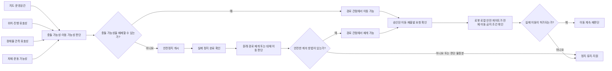

# 경로 기능 3단계 의존성 목록

- 상태: 사용자 승인 — 3단계 완료
- 작성일: 2026-08-09
- 승인일: 2026-08-09
- 상위 기준: [경로 기능 1단계 기준선](path-planning-baseline.md)
- 기능 공간: [경로 기능 2단계 추상 시나리오](path-planning-functional-scenarios.md)
- 조사 근거: [경로·장애물 대응 문헌 조사](../research/navigation-obstacle-literature-review-2026-08-09.md)
- 목적: 경로 방식과 구현 기술을 고르기 전에, 각 기능을 정의하고 검증하려면 어떤 정보와 다른 영역의 입력이 필요한지 식별한다.

## 이번 단계에서 하지 않는 것

- 지도·경로 데이터 형식 확정
- 위치 판단 방식 확정
- 센서와 제어 장치 선택
- 제한적 현재 경로 수정 또는 전체 경로 재선택의 채택
- 알고리즘, 내부 상태명, 통신 필드와 수치 임계값 확정
- Python·Unity·실물 코드 구현

의존성이 있다는 말은 특정 기술을 채택한다는 뜻이 아니다. 예를 들어 현재 위치를 판단할 정보는 필요하지만, 그 정보를 어떤 센서와 계산 방식으로 얻을지는 이 단계에서 정하지 않는다.

## 상속하는 승인 기준선

- 알려진 지도와 등록된 지점을 사용한다.
- 단층의 통제된 공간에서 한 대의 휠체어를 다룬다.
- 예정 경로의 충돌 가능성이 생기거나 이를 배제할 수 없으면 다른 이동 행동보다 안전정지 동작을 먼저 개시한다.
- 정지 뒤 안전한 대체 이동이 가능하면 같은 목적지를 유지한다.
- 대체 이동이 없거나 안전 판단이 불충분하면 정지 상태를 유지한다.
- 모든 정지→이동 전환 직전에 다시 판단하며, 위험 해소 관측만으로 자동 재출발하지 않는다.

## 의존성 분류 축

서로 다른 성격의 분류를 한 값으로 합치지 않고 세 축으로 기록한다.

| 분류 축 | 값 | 의미 |
|---|---|---|
| 적용 범위 | 공통 필수 | 어떤 경로 방식을 택하더라도 최종 설계와 검증 전에 알아야 한다. |
| 적용 범위 | 후보 조건부 | 명시된 기능 후보를 MVP나 검증 범위에 넣을 때 필요하다. |
| 닫는 방법 | Software A 결정 | 경로 기능 분석과 후보 비교로 정한다. |
| 닫는 방법 | 연동 합의 | 다른 담당 영역과 책임 또는 제공 정보의 경계를 맞춘다. |
| 닫는 방법 | 실물 측정 | 실제 차체·제어·관측 성능을 반복 측정해 정한다. |
| 닫는 방법 | 시연 공간 확인 | 실제 모형 지도와 부스·주행 공간을 확인해 정한다. |
| 닫는 방법 | 후속 범위 결정 | 어떤 기능을 실물·모의·확장으로 둘지 정한 뒤 닫는다. |
| 수치 시점 | 해당 없음 | 이 단계에서 수치값이 필요하지 않다. |
| 수치 시점 | 후속 수치 | 하드웨어·시연 공간·반복 시험 뒤 실제 값을 정한다. |

## 먼저 내릴 수 있는 결론

1. Software A는 실제 값이 없어도 의존성을 변수로 두고 경로 방식 비교와 추상 시험 설계를 독자적으로 계속할 수 있다.
2. 정확한 차체 크기, 회전 특성, 정지 특성과 센서 관측 능력이 없으면 실물 통과 가능성과 물리 안전성을 최종 판정할 수는 없다.
3. 정밀한 관제 좌표는 제품 필수 요구가 아니지만, 로봇 내부에서 어느 수준의 위치·진행 판단이 필요한지는 선택한 경로 방식에 따라 달라진다.
4. 다른 통로가 없는 시연 지도에서는 전체 경로 재선택을 논리적으로 시험할 수 있어도 실물 시연의 장점은 보여주기 어렵다.
5. `[3단계 승인]` 충돌 가능성이 생기거나 이를 배제할 수 없으면 로봇 로컬 영역은 서버 응답 없이 안전정지를 개시할 수 있어야 한다. 로봇 내부의 어느 장치가 판단·개시·모터 차단을 담당할지는 미정이다.
6. 안전한 대체 이동은 경로가 존재한다는 사실만으로 판정할 수 없다. 지도 유효성, 위치·관측 판단의 충분성, 실제 차체의 이동 가능성과 정지 완료·재개 조건이 함께 충족돼야 한다.
7. `[3단계 승인]` 경로 기능의 `재개 가능`은 실제 이동 허가가 아니다. 최종 이동 허가는 로봇 로컬 안전 게이트가 다른 이동 금지 조건과 승인된 이동·재출발 요청을 확인한 뒤 내리며, 서버나 경로 기능은 이 거부권을 우회할 수 없다.

## 의존성의 연결 순서

이 흐름은 경로·장애물 관점의 판단을 중심으로 나타낸다. 충돌 가능성을 배제했다는 사실만으로 실제 이동이 허가되지는 않는다. 탑승·하차, 물리 비상정지, 모터·전원 상태, 통신 단절 정책, 정지 완료, 위치·경로 유효성과 승인된 이동·재출발 요청은 로봇 로컬 안전 게이트에서 함께 확인한다.

판단에 사용하는 지도·위치·관측·정지 상태 정보는 단순한 값뿐 아니라 `사용 가능`, `판단 불충분`, `오래되었거나 현재와 맞지 않음`을 구분할 수 있어야 한다. 이를 어떤 필드와 시간 기준으로 표현할지는 기술 설계에서 정한다.

## 의존성 목록

### 1. 지도와 운영 공간

| ID | 알아야 할 정보 | 적용 범위 | 닫는 방법 | 수치 시점 | 필요한 이유 | 현재 상태 |
|---|---|---|---|---|---|---|
| MAP-01 | 등록된 대기 위치·승차 지점·목적지와 현재 활성 경로의 구간 순서 | 공통 필수 | Software A 결정·시연 공간 확인 | 해당 없음 | 출발지와 목적지, 현재 경로 존재 여부를 판단해야 한다. | 등록 지점 사용만 승인, 실제 지점 구성 미정 |
| MAP-02 | 이동 허용 구역과 이동 금지 구역의 경계 | 공통 필수 | Software A 결정·시연 공간 확인 | 해당 없음 | 대체 이동이 병원 지도 안의 허용 공간인지 판정해야 한다. | 미정 |
| MAP-03 | 갈림길과 다른 통로를 포함한 전체 연결 관계 | 전체 경로 재선택·조합 조건부 | 시연 공간 확인 | 해당 없음 | 전체 경로 재선택을 실제로 시험하려면 대체 통로가 필요하다. | 미정 |
| MAP-04 | 통로·출입구·모퉁이·목적지 주변의 통과 가능 공간 | 공통 필수 | 시연 공간 확인·실물 측정 | 후속 수치 | 차체가 충돌 없이 지나고 회전할 수 있는지 확인해야 한다. | 장소 종류만 정의, 실제 치수 미정 |
| MAP-05 | 임시 통행 불가 구간과 지도·실제 공간 불일치의 반영 | 전체 경로 재선택·조합 조건부 | Software A 결정·연동 합의 | 해당 없음 | 현재 통로 차단, 지도 변경과 S-05를 구분해 판단하려면 필요하다. | 기능 상황만 정의 |
| MAP-06 | 지도를 생성·수정·배포하는 책임과 유효한 지도 판단 | 공통 필수 | 연동 합의 | 해당 없음 | 서로 다른 지도를 사용하면 경로 판단과 실제 이동이 어긋날 수 있다. | 미정 |
| MAP-07 | 목적지 접근 구역, 정상 정지 위치와 탑승·하차에 필요한 공간 | 공통 필수 | Software A 결정·시연 공간 확인 | 후속 수치 | 목적지 근처에 있는 것과 승객 운송 임무를 정상 종료한 것을 구분해야 한다. | 등록 목적지 사용만 승인, 도착 판정 범위 미정 |
| MAP-08 | 현재 경로에서 허용되는 이탈 공간과 원래 경로에 안전하게 재합류할 수 있는 구역·방향 | 제한적 현재 경로 수정·조합 조건부 | Software A 결정·시연 공간 확인 | 후속 수치 | 주변에 빈 공간이 있어도 그 공간을 주행하고 기존 경로에 복귀할 수 있는지는 별도 판단이 필요하다. | 미정 |
| MAP-09 | 여러 안전한 경로 후보 중 허용 후보와 우선순위를 판단할 상위 기준 | 전체 경로 재선택·조합 조건부 | Software A 결정 | 해당 없음 | 복수 후보의 선택 결과를 재현하고 설명하려면 안전·금지구역·차체 수행 가능·동일 목적지를 우선하는 기준이 필요하다. | 효율·승차감의 세부 기준은 후속 비교 |

### 2. 현재 위치와 진행 상태

| ID | 알아야 할 정보 | 적용 범위 | 닫는 방법 | 수치 시점 | 필요한 이유 | 현재 상태 |
|---|---|---|---|---|---|---|
| LOC-01 | 현재 미션의 출발지·목적지와 운행 단계 | 공통 필수 | Software A 결정·연동 합의 | 해당 없음 | 빈차 승차지 이동, 승객 이동과 빈차 복귀를 서로 다른 미션으로 판단한다. | 상위 흐름 승인 |
| LOC-02 | 현재 어느 경로 구간 또는 의미적 위치에 있으며 어느 방향으로 진행 중인지 | 공통 필수 | Software A 결정·연동 합의 | 해당 없음 | 예정 경로와 장애물 관계, 남은 경로와 원래 경로 복귀 여부를 판단한다. | 필요성만 확인, 판단 방식 미정 |
| LOC-03 | 현재 위치·진행 판단을 신뢰할 수 있는지 나타내는 정보 | 공통 필수 | 연동 합의 | 후속 수치 | 판단 불충분이면 출발하거나 계속 이동하지 않는 원칙을 적용한다. | 기능 결과 승인, 산출·임계 방식 미정 |
| LOC-04 | 지도상 예상 상태와 실제 통행 상태가 일치하는지 | 공통 필수 | Software A 결정·연동 합의 | 해당 없음 | 경로 상실과 지도 불일치 상황에서 보수적으로 정지해야 한다. | 기능 상황 정의 |
| LOC-05 | 하드웨어·위치 판단부가 제공 가능한 위치 표현 수준, 갱신 특성과 신뢰 정보 | 공통 필수 | 연동 합의 | 후속 수치 | 실제 제공 가능 수준과 각 경로 후보가 요구하는 최소 위치 수준을 비교해야 한다. | 제공 가능 수준 미정 |

A-08은 같은 정지 결과를 내더라도 `현재 위치 판단 자체가 유효하지 않음`과 `위치는 알지만 예정 경로를 따르는지 판단할 수 없음`을 별도 원인으로 추적한다. 두 원인의 복구 의존성이 다르기 때문이다.

다음 단계의 후보 비교는 각 방식이 최소한 요구하는 위치 표현이 `구간·지점 수준`인지 `연속 위치 수준`인지 결과로 제시하고, 이를 LOC-05의 실제 제공 가능 수준과 대조한다. 이 최소 요구 수준은 3단계의 외부 입력으로 미리 확정하지 않는다.

### 3. 장애물과 주변 공간 관측

| ID | 알아야 할 정보 | 적용 범위 | 닫는 방법 | 수치 시점 | 필요한 이유 | 현재 상태 |
|---|---|---|---|---|---|---|
| OBS-01 | 대상이 예정 경로와 보호해야 할 이동 공간에 충돌 가능성을 만드는지 | 공통 필수 | Software A 결정·연동 합의 | 해당 없음 | 계속 이동과 안전정지의 첫 분기 조건이다. | 기능 원칙 승인, 관측 방식 미정 |
| OBS-02 | 대상이 차지한 범위와 주변에 통과 가능한 여유가 있는지 | 제한적 현재 경로 수정·조합 조건부 | 연동 합의 | 후속 수치 | 제한적 현재 경로 수정 가능 여부를 판단할 때 필요하다. | 미정 |
| OBS-03 | 대상이 정지·이동·전환 중인지와 그 상태가 어떻게 변하는지 | 동적 대응·조합 조건부 | Software A 결정·연동 합의 | 후속 수치 | 동적 상황, 기다림과 재판단 시나리오를 구분할 때 필요하다. | 추상 축만 승인 |
| OBS-04 | 관측과 판단이 충분히 신뢰 가능한지 | 공통 필수 | 연동 합의 | 후속 수치 | 충돌 가능성을 배제할 수 없으면 먼저 정지하는 원칙을 적용한다. | 기능 원칙 승인, 판정 방식 미정 |
| OBS-05 | 마지막 위험 조건이 해소됐는지 | 공통 필수 | 연동 합의 | 후속 수치 | 원래 경로 재개 가능성을 다시 판단하는 입력이며 재출발 명령 자체는 아니다. | 기능 의미 승인, 확인 조건 미정 |
| OBS-06 | 자율주행부가 실제로 받을 수 있는 장애물 정보의 범위·갱신·신뢰 수준 | 공통 필수 | 연동 합의 | 후속 수치 | 하드웨어·임베디드가 제공할 수 없는 정보를 전제로 경로 기능을 확정하면 안 된다. | 미정 |

### 4. 차체와 움직임

| ID | 알아야 할 정보 | 적용 범위 | 닫는 방법 | 수치 시점 | 필요한 이유 | 현재 상태 |
|---|---|---|---|---|---|---|
| VEH-01 | 축소 휠체어의 실제 외곽 크기와 필요한 안전 여유 | 공통 필수 | 실물 측정 | 후속 수치 | 지도상 통과 가능 공간과 장애물 충돌 가능성을 판단한다. | 영유아보다 약간 작은 인형 규모만 알려짐 |
| VEH-02 | 전진·후진·제자리 회전 등 가능한 움직임과 회전 공간 | 공통 필수 | 연동 합의·실물 측정 | 후속 수치 | 계산된 이동이 실제 차체로 수행 가능한지 판단한다. | 하드웨어 구성 미정 |
| VEH-03 | 명령 뒤 정지 완료까지의 실제 시간과 이동 거리 | 공통 필수 | 실물 측정 | 후속 수치 | 먼저 정지한다는 기능이 물리적으로 가능한 조건을 검증한다. | 반복 시험 전 미정 |
| VEH-04 | 시연 속도와 가속·감속 범위 | 공통 필수 | 실물 측정 | 후속 수치 | 정지 가능성과 안정적인 모형 운행의 합격 기준에 영향을 준다. | 미정 |
| VEH-05 | 빈차와 인형 탑승 상태가 움직임·정지에 만드는 차이 | 공통 필수 | 실물 측정 | 후속 수치 | 차이가 있는지 확인한 뒤 두 운행 단계에 같은 제약을 쓸 수 있는지 판단한다. | 미정 |

### 5. 정지, 재판단과 이동 재개

| ID | 알아야 할 정보 | 적용 범위 | 닫는 방법 | 수치 시점 | 필요한 이유 | 현재 상태 |
|---|---|---|---|---|---|---|
| SAFE-01 | 서버 응답 없이 로봇 로컬 영역에서 안전정지를 개시할 책임 경계 | 공통 필수 | 연동 합의 | 해당 없음 | 충돌 가능성이 생기거나 이를 배제할 수 없을 때 통신 지연·단절 때문에 정지 우선 원칙이 깨지면 안 된다. | 로컬 정지 권한 승인, 내부 장치별 책임 미정 |
| SAFE-02 | 정지 요청과 실제 정지 완료를 구분해 확인하는 정보 | 공통 필수 | 연동 합의·실물 측정 | 후속 수치 | 정지 완료 전 대체 이동이나 재출발을 시작하면 안 된다. | 미정 |
| SAFE-03 | 예정 경로와 보호해야 할 이동 공간의 범위 | 공통 필수 | Software A 결정·실물 측정 | 후속 수치 | 충돌 가능성과 재출발 가능성을 같은 기준으로 다시 판단한다. | 개념만 승인 |
| SAFE-04 | 경로의 재개 가능 판정과 로봇 로컬 안전 게이트의 실제 이동 허가 경계 | 공통 필수 | 연동 합의 | 해당 없음 | 위험 해소나 경로 가능 판정만으로 자동 재출발하지 않고 다른 이동 금지 조건과 승인된 요청을 확인해야 한다. | 로컬 안전 거부권 승인, 세부 요청·장치 미정 |
| SAFE-05 | 경로 기능 정지와 물리 비상정지·임계 전원 정지의 구분 | 공통 필수 | 연동 합의 | 해당 없음 | 서버나 경로 기능이 로봇 로컬 안전 금지를 우회하지 못하게 해야 한다. | 상위 거부권 승인, 장치별 해제 절차 미정 |
| SAFE-06 | 판단 불충분·대체 이동 없음·복구 불가를 사람에게 알리고 전달 성공 여부를 확인하는 결과 | 공통 필수 | 연동 합의 | 해당 없음 | 안전한 임무 중단과 수동 회수를 종단 흐름으로 연결하며, 알림 생성만으로 지원 전달 성공을 가정하지 않는다. | 상위 결과와 전달 평가 승인, 표시·전달 방식 미정 |
| SAFE-07 | 장애물 관측 가능 범위·갱신 지연과 차량 속도·판단 지연·명령 지연·실제 정지 여유의 결합이 충돌 전 정지를 허용하는지 | 공통 필수 | 연동 합의·실물 측정 | 후속 수치 | 관측 가능성과 정지 가능성을 따로 확인하는 것만으로 충돌 전 정지를 보장할 수 없다. | 결합 검증 필요성 승인, 수식·값 미정 |

SAFE-07은 기능 수준에서 `사용 가능한 관측 여유가 판단·명령 지연과 실제 정지에 필요한 전체 여유보다 커야 한다`는 관계만 확정한다. 계산식과 실제 값은 하드웨어·관측 구성 뒤 정한다.

`[3단계 승인]` 경로 기능은 `재개 가능` 또는 `재개 불가`를 출력한다. 최종 이동 허가는 로봇 로컬 안전 게이트가 실제 정지 완료, 위치·경로 유효성, 탑승·하차 상태, 물리 비상정지, 모터·전원 상태, 통신 단절 정책과 승인된 이동·재출발 요청을 함께 확인한 뒤 내린다. 정확한 내부 장치와 재출발 요청 주체는 후속 연동 설계에서 정한다.

서버도 정지를 요청할 수 있지만 유일한 정지 권한자가 될 수 없고, 서버나 경로 기능은 로봇 로컬 안전 게이트의 이동 금지를 강제로 해제할 수 없다.

### 6. 실행 위치, 통신과 정보 권위

| ID | 알아야 할 정보 | 적용 범위 | 닫는 방법 | 수치 시점 | 필요한 이유 | 현재 상태 |
|---|---|---|---|---|---|---|
| SYS-01 | 경로 판단을 로봇 내부와 서버 중 어디에서 실행하는지 | 공통 필수 | 연동 합의 | 해당 없음 | 지도 보유 위치, 통신 지연, 연결 단절 처리와 계산 자원이 달라진다. | 미정 |
| SYS-02 | 통신 없이 동작을 허용할 경우 실행 위치에 보유해야 하는 지도·현재 경로 정보 | 통신 단절 운행 조건부 | 연동 합의 | 해당 없음 | 서버 연결이 없어도 가능한 행동의 범위를 정한다. | 미정 |
| SYS-03 | 통신이 끊겼을 때 계속 가능한 동작과 반드시 정지할 동작 | 공통 필수 | 연동 합의 | 해당 없음 | 경로 기능과 운영 서버의 책임 경계를 정한다. | 미정 |
| SYS-04 | 실제 위치·정지·이동 상태의 권위가 어느 영역에 있는지 | 공통 필수 | 연동 합의 | 해당 없음 | 서버 기록과 실제 로봇 상태가 다를 때 잘못된 재개를 막는다. | 미정 |
| SYS-05 | 경로 기능이 받아야 할 최소 의미 정보와 내보낼 최소 결과 | 공통 필수 | 연동 합의 | 해당 없음 | Software A와 서버·임베디드 사이의 책임을 연결한다. | 의미 수준만 정의, 필드·형식 미정 |
| SYS-06 | 실제 실행 장치의 계산·메모리·갱신 능력 | 공통 필수 | 연동 합의·실물 측정 | 후속 수치 | 최종 방식의 복잡도와 실행 주기를 현실적으로 제한한다. | 보드 구성 미정 |
| SYS-07 | 위치·장애물·지도·정지 상태가 같은 판단에 쓸 만큼 최신이며 계산된 경로가 현재 미션과 상황에 여전히 유효한지 | 공통 필수 | 연동 합의 | 후속 수치 | 서로 다른 시점의 정상 입력이나 오래된 계산 결과가 잘못된 재개·경로 실행을 만들 수 있다. | 시간 정합성 필요성 승인, 표현·임계값 미정 |

### 7. 검증 환경

| ID | 알아야 할 정보 | 적용 범위 | 닫는 방법 | 수치 시점 | 필요한 이유 | 현재 상태 |
|---|---|---|---|---|---|---|
| VAL-01 | 각 추상 시나리오의 입력 조건과 기대 기능 출력 | 공통 필수 | Software A 결정 | 해당 없음 | 서로 다른 환경에서 같은 기능 요구를 검증한다. | 26개 시나리오 승인 |
| VAL-02 | Python 논리 시험에 사용할 지도 연결 구조와 장애물 변화 순서 | Python 검증 조건부 | Software A 결정 | 해당 없음 | 빠르고 반복 가능한 경로 논리 검증에 필요하다. | 환경 구상만 승인, 구현 안 함 |
| VAL-03 | Unity 병원 모형의 공간 구조, 축척과 이동체 행동 순서 | Unity 검증 조건부 | Software A 결정 | 해당 없음 | 병원 장면과 동적 상호작용을 시각적으로 검토할 때 필요하다. | 환경 구상만 있음, 구현 안 함 |
| VAL-04 | 실물 모형 지도와 차체의 실제 치수·운동·정지 측정값 | 공통 필수 | 시연 공간 확인·실물 측정 | 후속 수치 | 논리적 가능성과 실제 수행 가능성을 구분한다. | 미정 |
| VAL-05 | 안전, 임무, 운행 품질과 지원 전달의 합격 기준 | 공통 필수 | Software A 결정·실물 측정 | 후속 수치 | 목적지 도착만으로 안전 실패를 가리지 않도록 한다. | 평가 축 승인, 수치 기준 미정 |
| VAL-06 | 논리 시험·시각 시뮬레이션·실물 시험이 각각 증명할 수 있는 범위 | 공통 필수 | Software A 결정 | 해당 없음 | Python·Unity 결과를 실물 안전성 증거로 과장하지 않는다. | 구분 필요 |

## 기능 후보별 의존성 비교

기호의 의미는 다음과 같다.

- ●: 직접 필요
- △: 공통 입력만으로 가능할 수도 있으나 세부 방식에 따라 추가 정보가 필요
- —: 해당 기능 때문에 새로 생기는 의존성은 없음

| 의존성 묶음 | 정상 경로 계속 | 안전정지 | 정지 후 원래 경로 재개 | 제한적 현재 경로 수정 | 전체 경로 재선택 | 정지·지원 전환 |
|---|---:|---:|---:|---:|---:|---:|
| 현재 활성 경로·구간 순서 | ● | △ | ● | ● | ● | △ |
| 다른 통로를 포함한 전체 연결 관계 | — | — | △ | △ | ● | — |
| 허용 공간과 실제 통과 가능 공간 | ● | ● | ● | ● | ● | △ |
| 현재 위치·진행과 판단 확실성 | ● | △ | ● | ● | ● | ● |
| 장애물과 예정 경로의 관계 | ● | ● | ● | ● | ● | ● |
| 장애물의 공간 범위 | △ | △ | △ | ● | △ | △ |
| 장애물의 시간 변화 | △ | △ | ● | △ | △ | △ |
| 차체 외곽·회전·정지 특성 | ● | ● | ● | ● | ● | △ |
| 관측 능력과 실제 정지 성능의 결합 여유 | ● | ● | ● | ● | ● | △ |
| 실제 정지 완료 확인 | — | ● | ● | ● | ● | ● |
| 경로 관점의 재개 가능 판정 | — | — | ● | ● | ● | △ |
| 최종 이동 허가와 로봇 로컬 안전 거부권 | ● | △ | ● | ● | ● | ● |
| 현재 경로 이탈 허용 범위 | — | — | — | ● | △ | — |
| 원래 경로 재합류 가능성 | — | — | — | ● | △ | — |
| 복수 안전 경로의 선택 원칙 | — | — | — | △ | ● | — |
| 통행 불가 구간의 반영 | △ | △ | △ | △ | ● | △ |
| 입력과 계산 결과의 시간적 정합성 | ● | ● | ● | ● | ● | ● |
| 실행 위치와 통신 단절 정책 | ● | △ | ● | ● | ● | ● |

이 표는 기능의 우열을 판정하지 않는다. 제한적 수정과 전체 재선택이 어떤 추가 정보에 의존하는지를 다음 단계에서 비교하기 위한 입력이다.

### 기능별 최소 입력과 보수적 종료

| 기능 | 최소한 필요한 의존성 | 정보가 없거나 불충분할 때 |
|---|---|---|
| 정상 경로 계속 | 활성 미션·목적지, 유효한 현재 경로, 현재 진행 판단, 충돌 가능성 배제, 차체 이동 가능성, 로봇 로컬 안전 게이트 허가 | 출발 억제 또는 안전정지 |
| 안전정지 | 충돌 가능성 또는 판단 불충분 입력, 서버 응답 없는 로봇 로컬 정지 개시, 관측·속도·지연·정지 성능의 결합 여유, 실제 정지 완료 확인 | 정지 요구를 유지하고 실제 상태가 불확실함을 사람에게 전달 |
| 원래 경로 재개 | 동일 미션·목적지, 위험 해소 관측, 현재 위치·원래 경로 유효성 재판단, 정지 완료, 경로 관점 재개 가능, 승인된 재출발 요청과 로봇 로컬 안전 게이트 허가 | 정지 유지 |
| 제한적 현재 경로 수정 후보 | 일부 점유 공간, 주변 통과 여유, 현재 위치·경로, 차체 외곽·회전 가능성, 허용 이탈 범위, 원래 경로 재합류 가능성, 입력 최신성 | 수정하지 않고 정지 유지 또는 다른 후보 판단 |
| 전체 경로 재선택 후보 | 현재 통로 차단, 대안 통로를 포함한 전체 연결 관계, 다른 통로의 현재 상태, 현재 위치, 동일 목적지, 차체 통과 가능성, 복수 안전 경로 선택 원칙, 결과 최신성 | 경로 없음 또는 판단 불충분으로 정지 유지 |
| 정지·사람 지원 전환 | 정지 완료, 자동 계속 불가 이유, 현재 미션·의미적 위치, 지원 요청 전달 결과 | 자동 재출발하지 않고 정지 유지 |

### 같은 시나리오 안에서 별도로 추적할 원인

- A-05: 현재 통로만 막혀 다른 통로가 있는 경우와 모든 허용 경로가 막힌 경우
- A-08: 현재 위치 판단 자체가 유효하지 않은 경우와 위치는 알지만 경로 추종 여부가 불명확한 경우
- S-05: 실제 공간이 달라진 경우와 사용 중인 지도 정보가 유효하지 않은 경우
- C-04: 지원 요청을 생성한 경우와 담당자에게 실제 전달된 경우

## Software A가 독자적으로 계속할 수 있는 범위

다음 작업은 실제 센서·차체 수치와 팀 최종 결정을 기다리지 않고 진행할 수 있다.

- 위 의존성을 변수로 둔 조건부 경로 방식 비교
- 정상 이동, 정지, 재개, 대체 이동 가능, 정지 유지의 추상 입출력 정의
- 작은 추상 지도에서 갈림길 유무와 장애물 변화에 따른 종이 검증 설계
- Python 논리 시험과 Unity 시각 시험이 각각 검증할 항목의 구분
- 각 방식이 어떤 정보가 없을 때 판단 불충분으로 종료해야 하는지 정의
- 후보 방식별 계산량·설명력·시연 가능성 비교

다음 단계의 후보 비교표는 가정을 실제 확정값처럼 사용하지 않도록 최소한 다음 열을 갖는다.

| 후보 | 미해결 의존성 ID | 가정한 조건 또는 가능한 범위 | 가정 변화가 결과에 미치는 영향 | 정보 부족 시 보수적 결과 | 최종 구현 채택을 막는가 |
|---|---|---|---|---|---|
| 전체 경로 재선택 / 제한적 현재 경로 수정 / 조합 | 다음 단계에서 기록 | 다음 단계에서 기록 | 다음 단계에서 기록 | 원칙적으로 정지 유지 | G1~G5와 함께 판정 |

비교 결과는 `제품 기능 관점에서 확장성이 높은 후보`와 `2026년 대회 MVP에 적합한 후보`를 분리한다. 두 결과가 같다고 미리 가정하지 않는다.

다음 단계에서는 세 후보를 최소한 아래 기준으로 비교한다.

| 비교 기준 | 확인할 내용 |
|---|---|
| 기능 충족 범위 | 2단계 시나리오 중 무엇을 처리하는가? |
| 추가 의존성 | 공통 입력 외에 무엇이 더 필요한가? |
| 판단 불충분 조건 | 어떤 정보가 없으면 정지해야 하는가? |
| 물리 수행 위험 | 차체·회전·정지 특성에 얼마나 민감한가? |
| 입력 최신성 위험 | 계산 중 환경이 바뀌면 결과가 얼마나 쉽게 무효화되는가? |
| 실패 시 보수적 종료 | 실패가 정지 유지로 닫히는가? |
| 실물 시연 가능성 | 실제 지도와 차체로 후보의 차이를 보여줄 수 있는가? |
| 대회 일정 위험 | 구현·통합·검증 부담이 어느 정도인가? |
| 설명 가능성 | 심사위원에게 선택 이유와 실패 처리를 설명할 수 있는가? |

다음 내용은 Software A가 임의로 실제 값까지 확정하면 안 된다.

- 차체 크기·회전 범위·실제 정지거리
- 센서가 제공할 수 있는 장애물 범위·갱신·신뢰 정보
- 실제 구동을 담당하는 영역이 정지 완료를 확인해 주는 방식
- 시연 공간의 실제 통로 폭과 갈림길 배치
- 서버·로봇 사이의 실행 위치와 통신 단절 책임

이는 다음 단계 진행을 막는다는 뜻이 아니다. 현재는 변수를 두고 조건부로 비교하고, 최종 방식 채택과 실물 합격선 전에 실제 입력을 받으면 된다.

## 최종 방식 채택 전에 닫아야 할 결정 게이트

| 게이트 | 닫아야 하는 질문 | 닫히지 않아도 가능한 작업 | 닫히기 전 불가능한 주장 |
|---|---|---|---|
| G1 시연 지도 | 실제 갈림길·대체 통로와 허용 공간이 있는가? | 추상 지도 비교 | 전체 재선택의 실물 시연 가능 |
| G2 차체·제어 | 외곽, 회전과 정지 특성의 측정값은 무엇인가? | 기호·가정 기반 논리 설계 | 실제 통과·정지 안전성 |
| G3 관측 입력 | 경로 기능이 장애물 범위·변화·판단 확실성을 어느 수준까지 받을 수 있는가? | 필요한 추상 입력 정의 | 실제 장애물 대응 가능성 |
| G4 실행 경계 | 경로 판단 위치와 통신 단절 정책은 무엇인가? | 알고리즘 계열의 독립 비교 | 실제 배치와 종단 책임 |
| G5 MVP 범위 | 원래 경로 재개, 제한적 수정, 전체 재선택 중 무엇을 실물·모의·확장으로 분류하는가? | 세 방식의 조건부 비교 | 대회 구현 범위와 일정 |

## 3단계 완료 판정

이 문서는 다음을 확정하지 않고 구분한다.

- 경로 기능이 반드시 필요로 하는 정보
- 특정 기능을 선택할 때만 추가되는 정보
- 하드웨어와 반복 시험 뒤 받을 실제 수치
- 다른 담당 영역과 맞춰야 하는 책임 경계
- Software A가 지금 독자적으로 진행할 수 있는 분석

첨부 피드백의 완료 조건을 다음과 같이 충족했다.

- [x] 공통 필수·후보 조건부와 연동 합의·실물 측정·시연 공간 확인을 독립된 분류 축으로 분리
- [x] 서버 응답 없이 로봇 로컬 영역에서 정지를 개시할 상위 제약 확정
- [x] 경로의 재개 가능 판정과 실제 이동 허가를 분리하고 로봇 로컬 안전 거부권 명시
- [x] SAFE-07, SYS-07, MAP-08과 MAP-09 추가
- [x] 기능 비교표에서 현재 경로·대체 연결, 정지 완료·재개 판정·최종 허가와 이탈·재합류 분리

3단계 의존성 목록화를 완료했다. 다음 단계에서는 구현 없이 전체 경로 재선택, 제한적 현재 경로 수정과 두 방식의 조합을 조건부로 비교한다.
