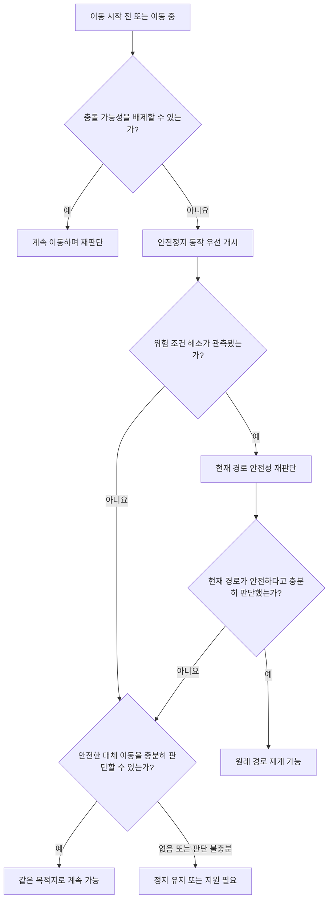

# 경로 기능 2단계 추상 시나리오

- 상태: 사용자 승인
- 승인일: 2026-08-09
- 상위 기준: [경로 기능 1단계 기준선](path-planning-baseline.md)
- 조사 근거: [경로·장애물 대응 문헌 조사](../research/navigation-obstacle-literature-review-2026-08-09.md)
- 목적: 센서와 알고리즘을 정하기 전에 경로 기능이 다뤄야 할 상황과 기대 출력을 기능 수준에서 정의한다.

## 문서 상태 표기

- `[기준선]`: 사용자가 승인한 1단계 기준선에 직접 들어 있는 원칙
- `[2단계 승인]`: 이번 추상화 단계에서 추가로 승인한 기능 구분
- `[후속 미정]`: 2단계에서 채택하지 않고 이후 범위 결정·기술 설계로 넘긴 내용

## 이번 단계의 경계

이번 단계에서는 `어떤 상황에서 어떤 기능 출력과 평가 결과가 나와야 하는가`까지만 다룬다.

다음 내용은 정하지 않는다.

- 센서 종류와 장애물 감지 방식
- SLAM과 위치 추정 방식
- 좌표계, 격자, 노드와 경로 데이터 구조
- 구체적인 경로 알고리즘
- 속도, 거리, 통로 폭과 대기시간
- 제동, 모터와 조향 제어 방식
- Python·Unity·실물에서의 구현 구조

## 제품 기능 공간과 대회 MVP의 분리

`[2단계 승인]` 이 문서의 시나리오 26개는 제품 수준에서 고려할 경로 기능 공간을 정의한다. 시나리오가 포함됐다는 사실은 해당 기능을 2026년 대회 MVP에서 모두 실물 구현한다는 뜻이 아니다.

후속 단계에서 각 시나리오를 다음 중 하나로 분류한다.

- 축소 실물 검증 대상
- Python·Unity 등의 모의·논리 검증 대상
- 이후 확장 대상
- 현재 범위 제외 대상

제한적 현재 경로 수정, 전체 경로 재선택, 복잡한 양보와 교착 해소는 현재 MVP 구현 약속이 아니다.

현재 MVP의 기본 기능 결과는 다음 수준으로 제한한다.

- 충돌 가능성을 배제할 수 있음: 불필요하게 정지하지 않고 계속 이동
- 충돌 가능성이 있거나 배제할 수 없음: 다른 주행 행동보다 안전정지 동작을 우선 개시
- 위험이 지속되거나 안전 판단이 불충분함: 정지 유지
- 현재 허용된 자동 기능만으로 해결할 수 없음: 사람 지원 필요 상태 표시
- 위험 조건 해소 뒤 재판단 완료: 원래 경로 재개 가능 또는 정지 유지 결과 생성
- 실제 재출발 조건·권한, 기다림, 제한적 경로 수정과 전체 경로 재선택: 후속 범위

## 상황을 정의하는 다섯 축

현실의 물체를 하나씩 끝없이 나열하지 않고 다음 입력 축을 교차해 상황을 정의한다. 기능 출력은 입력 축에 포함하지 않는다.

| 축 | 값 |
|---|---|
| 운행 단계 | 출발 전, 빈차 승차지 이동, 탑승·하차, 승객 목적지 이동, 빈차 복귀 |
| 대상 행동 상태 | 대상 없음, 정지, 이동, 정지·이동 전환, 복수·혼합 |
| 경로 영향 | 영향 없음, 일부 점유, 현재 통로 차단, 모든 허용 경로 차단 |
| 시간 변화 | 지속, 일시적 해소, 변화 지속, 전환 반복, 예측 불가 |
| 공간 형태 | 열린 구역, 넓은 복도, 좁은 복도·출입구, 교차점·사각 모퉁이, 출발지·목적지 |

### 별도 교차 속성: 판단 확실성

판단 확실성은 모든 상황에 붙을 수 있는 별도 속성이다.

- 판단 충분
- 판단 불충분

`불확실한 대상`을 정적·동적 대상과 같은 종류로 분류하지 않는다. 대신 다음처럼 표현한다.

> 대상의 행동, 진행 방향 또는 경로 영향에 대한 판단이 불충분한 상태

정지한 사람도 `대상 행동 상태: 정지`이면서 `판단 확실성: 불충분`일 수 있다.

### 정적·동적이라는 표현의 의미

- 정적 상황: 현재 대상 행동 상태가 `정지`
- 동적 상황: 현재 대상 행동 상태가 `이동` 또는 `정지·이동 전환`
- 복합 상황: 대상 행동 상태가 `복수·혼합`

정적·동적은 상위 설명 용어로 계속 사용하지만, 실제 시나리오는 다섯 축과 판단 확실성으로 표현한다.

## 기능 출력의 계층

하나의 상황에서 여러 출력이 순서대로 발생할 수 있으므로 서로 배타적인 단일 결과 목록으로 합치지 않는다.

### 1단계: 즉시 반응

- 영향 없이 계속
- 출발 억제
- 안전정지 동작 우선 개시
- 이미 정지 상태이면 정지 유지
- 목적지 도착에 따른 정상 정지

`안전정지 동작 우선 개시`는 다른 회피·우회·진행 행동보다 안전정지 동작을 먼저 시작하고 정지 상태로 전환한다는 뜻이다. 순간적으로 이미 완전 정지했다는 기술적 의미는 아니다.

### 2단계: 판단 후 결과

- 정지 유지
- 원래 경로 재개 가능
- 안전한 대체 이동 가능
- 사람 지원 필요
- 목적지 도착으로 이동 종료

### 별도 처리 정책

- 계속 재판단
- 정지 뒤 즉시 재판단
- 기다린 뒤 재평가 `[후속 미정]`
- 판단 복구 뒤 재평가 `[후속 미정]`

### 같은 목적지로 계속 이동하는 방법

```text
같은 목적지로 계속
├─ 원래 경로를 그대로 계속
├─ 정지 후 원래 경로 재개
├─ 제한적 현재 경로 수정 [후속 미정]
└─ 전체 경로 재선택 [후속 미정]
```

`원래 경로 재개 가능`은 판단 결과이고, 실제 재출발은 후속 단계에서 정할 조건과 권한을 통과한 뒤의 행동이다.

### 평가 판정

기능 출력과 별도로 시험 결과를 다음 축으로 판정한다.

| 평가 축 | 판정 값 |
|---|---|
| 안전 | 안전 성공, 안전 실패 |
| 임무 | 목적지 성공, 임무 미완료 |
| 운행 품질 | 정상, 불필요한 정지, 반복 정지·재출발, 장기 교착 |
| 운영 지원 | 지원 불필요, 지원 필요, 지원 요청 전달 성공, 지원 요청 전달 실패 |

목적지에 도착했다는 이유로 안전 실패를 상쇄할 수 없다.

## 공통 기능 원칙

1. `[2단계 승인]` 충돌 가능성을 배제할 수 있는 동안에는 불필요하게 정지하지 않고 이동을 계속하며, 대상 행동과 경로 영향의 변화는 계속 재판단한다.
2. `[기준선]` 예정 경로를 방해해 충돌 가능성이 생기면 다른 주행 행동보다 안전정지 동작을 우선 개시한다.
3. `[2단계 승인]` 예정 경로와 보호해야 할 이동 공간에 대한 충돌 가능성을 현재 정보로 배제할 수 없으면, 이동을 시작하거나 계속하지 않고 안전정지 동작을 우선 개시한다.
4. `[기준선]` 정지 뒤 안전한 대체 이동이 가능하면 같은 목적지로 이동을 계속한다.
5. `[기준선]` 안전한 대체 이동 방법이 없으면 정지 상태를 유지한다.
6. `[기준선]` 정지 뒤 대체 이동의 안전성을 판단할 수 없으면 정지 상태를 유지한다.
7. `[2단계 승인]` 어떤 이유로든 정지 상태에서 이동 상태로 전환하기 직전에는 현재 예정 경로와 보호해야 할 이동 공간의 충돌 가능성을 다시 판단한다.
8. `[2단계 승인]` 위험 조건이 해소됐다는 관측만으로 자동 재출발하지 않는다.
9. `[후속 미정]` 실제 재출발 조건과 권한, 기다림 정책은 이후 정한다.
10. `[후속 미정]` 안전한 대체 이동을 전체 경로 재선택, 제한적 현재 경로 수정 또는 두 방식 모두로 제공할지는 이후 정한다.

## 공통 판단 흐름



원래 경로 재개의 기능 순서는 다음과 같다.

```text
위험 조건 해소 관측
→ 예정 경로의 안전성 재판단
→ 원래 경로 재개 가능 또는 불가 판정
→ 후속 단계에서 정할 권한에 따라 실제 이동 재개
```

## 기능 시나리오 26개

### A. 정상·운행 경계·경로 상태

| ID | 상황 | 즉시 반응 | 판단 후 결과 |
|---|---|---|---|
| A-01 | 유효한 경로가 있고 충돌 가능 대상이 없다. | 영향 없이 계속 | 같은 목적지로 계속 |
| A-02 | 대상은 존재하지만 충돌 가능성을 배제할 수 있다. | 영향 없이 계속 | 같은 목적지로 계속 |
| A-03 | 출발 전에 목적지까지 안전한 경로가 없다고 판단한다. | 출발 억제 | 정지 유지, 필요 시 사람 지원 |
| A-04 | 출발 전에 안전한 경로가 있는지 판단할 수 없다. | 출발 억제 | 정지 유지 |
| A-05 | 출발지 또는 목적지의 필요한 공간이 점유되어 있다. | 출발 억제 또는 안전정지 동작 우선 개시 | 안전한 대체 이동 가능 또는 정지 유지 |
| A-06 | 탑승 대기·탑승 중 또는 하차 대기·하차 중이다. | 출발 억제 | 절차 완료 확인 전 정지 유지 |
| A-07 | 등록 목적지에 정상적으로 도착한다. | 목적지에서 정지 | 해당 승객 운송 임무 정상 종료 |
| A-08 | 운행 중 현재 위치 또는 예정 경로를 올바르게 따르는지 판단할 수 없다. | 안전정지 동작 우선 개시 | 정지 유지 |

A-07에서 하차 절차와 빈차 자동복귀는 별도로 판정한다. 하차 완료 뒤의 빈차 자동복귀는 동일한 경로 기능을 재사용하더라도 별도의 빈차 재배치 임무다.

따라서 다음 결과를 독립적으로 기록한다.

- 승객 목적지 운송 성공 또는 실패
- 빈차 자동복귀 성공 또는 실패

복귀 실패가 이미 완료된 승객 운송 성공을 실패로 바꾸지 않는다.

### S. 정지 대상 상황

| ID | 상황 | 즉시 반응 | 판단 후 결과 |
|---|---|---|---|
| S-01 | 정지 대상이 통로 일부를 점유해 충돌 가능성이 생긴다. | 안전정지 동작 우선 개시 | 안전한 대체 이동 가능 또는 정지 유지 |
| S-02 | 정지 대상이 현재 통로 전체를 막지만 다른 허용 경로가 존재할 수 있다. | 안전정지 동작 우선 개시 | 안전한 대체 이동 가능 또는 정지 유지 |
| S-03 | 정지 대상 때문에 모든 허용 경로가 막힌다. | 안전정지 동작 우선 개시 | 정지 유지 또는 사람 지원 필요 |
| S-05 | 지도상 이동 가능 공간과 실제 통행 가능 상태가 다르다. | 안전정지 동작 우선 개시 | 안전성을 충분히 판단할 수 없으면 정지 유지 |

기존 S-04는 정적 상황에만 해당하지 않으므로 공통 재개 시나리오 R-01로 이동했다. 번호는 기존 검토 이력을 추적하기 위해 비워 둔다.

S-03은 먼저 정지 유지로 판정한다. 후속 단계에서 정할 대기·재평가 정책으로도 자동 계속이 불가능하다고 판정되는 경우 사람 지원 필요로 전환한다.

### D. 이동·전환 대상 상황

| ID | 상황 | 즉시 반응 | 판단 후 결과 |
|---|---|---|---|
| D-01 | 사람이나 이동체가 예정 경로를 횡단한다. | 충돌 가능성을 배제할 수 없으면 안전정지 동작 우선 개시 | 원래 경로 재개 가능 또는 정지 유지 |
| D-02 | 사람이나 이동체가 정면에서 접근한다. | 안전정지 동작 우선 개시 | 안전한 대체 이동 가능 또는 정지 유지 |
| D-03 | 좁은 복도·출입구에서 반대 방향 대상과 서로 진행할 수 없다. | 안전정지 동작 우선 개시 | 정지 유지 또는 사람 지원 필요 |
| D-04 | 같은 방향의 느린 대상 때문에 추돌 가능성이 생긴다. | 안전정지 동작 우선 개시 | 안전한 대체 이동 가능 또는 정지 유지 |
| D-05 | 사각 모퉁이나 옆 통로에서 대상이 갑자기 진입한다. | 안전정지 동작 우선 개시 | 재판단 전 정지 유지 |
| D-06 | 움직이던 대상이 멈추거나 멈췄던 대상이 다시 움직인다. | 충돌 가능성을 배제할 수 없을 때마다 안전정지 동작 우선 개시 | 원래 경로 재개 가능 또는 정지 유지 |
| D-07 | 여러 사람·이동체가 동시에 있거나 움직임이 불규칙하다. | 안전정지 동작 우선 개시 | 정지 유지 |
| D-08 | 프로젝트가 제어하지 않는 외부 자율휠체어, 병상 또는 의료 카트와 경로가 충돌한다. | 안전정지 동작 우선 개시 | 정지 유지 |

프로젝트가 제어하는 휠체어는 한 대라는 기준선을 유지한다. D-08의 다른 자율휠체어는 병원 환경에 존재할 수 있는 외부 이동체이지 두 번째 제어 차량이 아니다.
좁은 통로의 양보·후퇴·우선권과 지원 전환 조건은 후속 단계에서 정한다.

### C. 복수·혼합·판단 불충분 상황

| ID | 상황 | 즉시 반응 | 판단 후 결과 |
|---|---|---|---|
| C-01 | 정지 대상과 이동 대상이 동시에 경로에 영향을 준다. | 안전정지 동작 우선 개시 | 안전한 대체 이동 가능 또는 정지 유지 |
| C-02 | 대상 행동·진행 방향 또는 경로 영향을 충분히 판단할 수 없다. | 충돌 가능성을 배제할 수 없으면 안전정지 동작 우선 개시 | 정지 유지 |
| C-03 | 대체 이동을 시작한 뒤 새로운 충돌 가능 대상이 나타난다. | 다시 안전정지 동작 우선 개시 | 정지 유지 |
| C-04 | 현재 허용된 자동 기능만으로 임무를 계속할 수 없다. | 안전정지 동작 우선 개시 또는 정지 유지 | 사람 지원 필요 |
| C-05 | 양측이 계속 정지해 충돌은 없지만 아무도 진행하지 못한다. | 정지 유지 | 정지 유지 또는 사람 지원 필요 |

C-03에서는 기존 대체 이동을 중단하고 새로운 전체 상황을 다시 판단한다.
C-04의 사람 지원은 원격조종이나 자동 우회를 반드시 구현한다는 의미가 아니다.
C-05의 안전, 임무와 운행 품질은 기능 결과에 섞지 않고 평가 판정에서 각각 기록한다.

### R. 정지 뒤 공통 재개 상황

| ID | 상황 | 즉시 반응 | 판단 후 결과 |
|---|---|---|---|
| R-01 | 정적·동적·복합 상황의 마지막 위험 조건이 해소되어 기존 통로가 다시 열린 것으로 관측된다. | 재판단이 끝날 때까지 정지 유지 | 원래 경로 재개 가능 또는 정지 유지 |

R-01에서 위험 조건 해소 관측은 실제 재출발 명령이 아니다. 실제 재출발 조건, 권한과 대기 정책은 후속 단계에서 정한다.

## 26개 시나리오 축 대응표

표에서 `공통 이동`은 빈차 승차지 이동, 승객 목적지 이동과 빈차 복귀를 뜻하고, `공통`은 해당 열에 정의된 모든 축 값을 뜻한다. `/`로 나눈 표기는 새 축 값이 아니라 정의된 여러 값에 공통 적용된다는 뜻이다. 판단 열의 `충분`과 `불충분`은 각각 `판단 충분`과 `판단 불충분`의 축약이다.

| ID | 운행 단계 | 대상 행동 | 경로 영향 | 시간 변화 | 공간 형태 | 판단 | 즉시 반응 | 판단 후 결과 | 처리 정책 | 계속 방법 |
|---|---|---|---|---|---|---|---|---|---|---|
| A-01 | 공통 이동 | 대상 없음 | 영향 없음 | 지속 | 공통 | 충분 | 영향 없이 계속 | 같은 목적지로 계속 | 계속 재판단 | 원래 경로를 그대로 계속 |
| A-02 | 공통 이동 | 정지 / 이동 / 정지·이동 전환 | 영향 없음 | 공통 | 공통 | 충분 | 영향 없이 계속 | 같은 목적지로 계속 | 계속 재판단 | 원래 경로를 그대로 계속 |
| A-03 | 출발 전 | 공통 | 모든 허용 경로 차단 | 지속 | 공통 | 충분 | 출발 억제 | 정지 유지 / 사람 지원 필요 | 해당 없음 | 해당 없음 |
| A-04 | 출발 전 | 공통 | 공통 | 예측 불가 | 출발지 | 불충분 | 출발 억제 | 정지 유지 | 판단 복구 뒤 재평가 [후속 미정] | 해당 없음 |
| A-05 | 출발 전 / 승객 목적지 이동 | 정지 / 이동 | 현재 통로 차단 / 모든 허용 경로 차단 | 지속 / 일시적 해소 | 출발지·목적지 | 충분 / 불충분 | 출발 억제 / 안전정지 우선 | 안전한 대체 이동 가능 / 정지 유지 | 정지 뒤 즉시 재판단 | 제한적 현재 경로 수정 / 전체 경로 재선택 [후속 미정] |
| A-06 | 탑승·하차 | 대상 없음 | 영향 없음 | 지속 | 출발지·목적지 | 충분 | 출발 억제 | 정지 유지 | 해당 없음 | 해당 없음 |
| A-07 | 승객 목적지 이동 | 대상 없음 | 영향 없음 | 지속 | 목적지 | 충분 | 목적지 도착에 따른 정상 정지 | 목적지 도착으로 이동 종료 | 해당 없음 | 해당 없음 |
| A-08 | 공통 이동 | 공통 | 공통 | 예측 불가 | 공통 | 불충분 | 안전정지 우선 | 정지 유지 | 판단 복구 뒤 재평가 [후속 미정] | 해당 없음 |
| S-01 | 공통 이동 | 정지 | 일부 점유 | 지속 | 열린 구역 / 넓은 복도 | 충분 / 불충분 | 안전정지 우선 | 안전한 대체 이동 가능 / 정지 유지 | 정지 뒤 즉시 재판단 | 제한적 현재 경로 수정 [후속 미정] |
| S-02 | 공통 이동 | 정지 | 현재 통로 차단 | 지속 | 좁은 복도·출입구 | 충분 / 불충분 | 안전정지 우선 | 안전한 대체 이동 가능 / 정지 유지 | 정지 뒤 즉시 재판단 | 전체 경로 재선택 [후속 미정] |
| S-03 | 공통 이동 | 정지 | 모든 허용 경로 차단 | 지속 / 예측 불가 | 공통 | 충분 | 안전정지 우선 | 정지 유지 / 사람 지원 필요 | 기다린 뒤 재평가 [후속 미정] | 해당 없음 |
| S-05 | 공통 이동 | 정지 / 복수·혼합 | 현재 통로 차단 / 모든 허용 경로 차단 | 지속 | 공통 | 불충분 | 안전정지 우선 | 정지 유지 | 판단 복구 뒤 재평가 [후속 미정] | 해당 없음 |
| D-01 | 공통 이동 | 이동 | 일부 점유 / 현재 통로 차단 | 일시적 해소 / 예측 불가 | 열린 구역 / 교차점·사각 모퉁이 | 충분 / 불충분 | 안전정지 우선 | 원래 경로 재개 가능 / 정지 유지 | 기다린 뒤 재평가 [후속 미정] | 정지 후 원래 경로 재개 |
| D-02 | 공통 이동 | 이동 | 현재 통로 차단 | 변화 지속 | 넓은 복도 / 좁은 복도·출입구 | 충분 / 불충분 | 안전정지 우선 | 안전한 대체 이동 가능 / 정지 유지 | 정지 뒤 즉시 재판단 | 제한적 현재 경로 수정 / 전체 경로 재선택 [후속 미정] |
| D-03 | 공통 이동 | 이동 / 정지·이동 전환 | 현재 통로 차단 | 지속 / 예측 불가 | 좁은 복도·출입구 | 충분 / 불충분 | 안전정지 우선 | 정지 유지 / 사람 지원 필요 | 기다린 뒤 재평가 [후속 미정] | 해당 없음 |
| D-04 | 공통 이동 | 이동 | 일부 점유 | 변화 지속 | 넓은 복도 | 충분 / 불충분 | 안전정지 우선 | 안전한 대체 이동 가능 / 정지 유지 | 정지 뒤 즉시 재판단 | 제한적 현재 경로 수정 [후속 미정] |
| D-05 | 공통 이동 | 이동 | 현재 통로 차단 | 예측 불가 | 교차점·사각 모퉁이 | 불충분 | 안전정지 우선 | 정지 유지 | 정지 뒤 즉시 재판단 | 해당 없음 |
| D-06 | 공통 이동 | 정지·이동 전환 | 일부 점유 / 현재 통로 차단 | 전환 반복 | 공통 | 충분 / 불충분 | 안전정지 우선 | 원래 경로 재개 가능 / 정지 유지 | 계속 재판단 | 정지 후 원래 경로 재개 |
| D-07 | 공통 이동 | 복수·혼합 | 일부 점유 / 현재 통로 차단 / 모든 허용 경로 차단 | 변화 지속 / 예측 불가 | 공통 | 불충분 | 안전정지 우선 | 정지 유지 | 정지 뒤 즉시 재판단 | 해당 없음 |
| D-08 | 공통 이동 | 이동 / 정지·이동 전환 | 현재 통로 차단 | 변화 지속 / 예측 불가 | 넓은 복도 / 좁은 복도·출입구 / 교차점·사각 모퉁이 | 불충분 | 안전정지 우선 | 정지 유지 | 정지 뒤 즉시 재판단 | 해당 없음 |
| C-01 | 공통 이동 | 복수·혼합 | 현재 통로 차단 / 모든 허용 경로 차단 | 전환 반복 / 예측 불가 | 공통 | 충분 / 불충분 | 안전정지 우선 | 안전한 대체 이동 가능 / 정지 유지 | 정지 뒤 즉시 재판단 | 제한적 현재 경로 수정 / 전체 경로 재선택 [후속 미정] |
| C-02 | 공통 이동 | 공통 | 공통 | 예측 불가 | 공통 | 불충분 | 안전정지 우선 | 정지 유지 | 판단 복구 뒤 재평가 [후속 미정] | 해당 없음 |
| C-03 | 공통 이동 | 정지 / 이동 / 복수·혼합 | 일부 점유 / 현재 통로 차단 | 변화 지속 | 공통 | 충분 / 불충분 | 안전정지 우선 | 정지 유지 | 정지 뒤 즉시 재판단 | 해당 없음 |
| C-04 | 공통 이동 | 공통 | 모든 허용 경로 차단 | 지속 | 공통 | 충분 | 안전정지 우선 / 정지 유지 | 사람 지원 필요 | 해당 없음 | 해당 없음 |
| C-05 | 공통 이동 | 이동 / 복수·혼합 | 현재 통로 차단 | 지속 / 전환 반복 | 좁은 복도·출입구 | 충분 | 정지 유지 | 정지 유지 / 사람 지원 필요 | 기다린 뒤 재평가 [후속 미정] | 해당 없음 |
| R-01 | 공통 이동 | 공통 | 영향 없음 | 일시적 해소 | 공통 | 충분 / 불충분 | 정지 유지 | 원래 경로 재개 가능 / 정지 유지 | 정지 뒤 즉시 재판단 | 정지 후 원래 경로 재개 |

각 필수 기능 출력은 최소 한 시나리오에 매핑된다.

- 영향 없이 계속: A-01, A-02
- 출발 억제: A-03, A-04, A-06
- 안전정지 동작 우선 개시: S-01, D-01, C-01 등
- 정지 유지: A-04, S-03, C-02 등
- 원래 경로 재개 가능: D-01, D-06, R-01
- 안전한 대체 이동 가능: S-01, S-02, D-02 등
- 사람 지원 필요: A-03, S-03, C-04, C-05
- 목적지 도착 종료: A-07

## 의미가 없거나 현재 모델 밖인 조합

| 조합 | 제외 이유 |
|---|---|
| 탑승·하차 중 우회·재경로 | 해당 단계는 이동 금지 경계이므로 경로 변경보다 출발 억제가 우선이다. |
| 대상 없음과 대상에 의한 경로 점유 | 조건 자체가 모순이다. |
| 모든 허용 경로 차단과 즉시 안전한 대체 이동 존재 | 같은 시점의 조건으로는 모순이며, 환경이 변한 뒤에는 새로운 판단 시점으로 다룬다. |
| 승객 목적지 운송 종료 뒤 같은 승객 운송 계속 | 승객 운송은 종료됐고 이후 자동복귀는 별도 빈차 재배치 임무다. |
| 프로젝트가 제어하는 두 번째 휠체어 | 한 대 기준선 밖이다. 외부 휠체어는 환경의 이동 대상으로만 다룬다. |
| 충돌 가능성이 없는데 장애물 때문에 안전정지 | 이 경로·장애물 모델에서는 과잉 반응이다. 통신·전원·비상정지 같은 다른 원인은 별도 안전 시나리오다. |

## 평가 예시

| 상황 | 안전 | 임무 | 운행 품질 | 해석 |
|---|---|---|---|---|
| 장애물 앞에서 정지하고 지원 요청 | 성공 | 미완료 | 정상 중단 | 안전한 임무 중단 |
| 장애물을 스치고 목적지 도착 | 실패 | 목적지 도달 | 비정상 | 전체 실패 |
| 위험 해소 뒤 재판단·재개·도착 | 성공 | 성공 | 정상 | 정상 성공 |
| 위험은 없지만 영구 정지 | 성공 | 미완료 | 장기 교착 | 진행 기능 실패 |
| 사람에게 위험한 양보를 강요한 뒤 통과 | 실패 가능 | 목적지 도달 | 비정상 | 단순 성공 처리 금지 |

## 2단계 완료 판정

- [x] 기능 결과를 상황 입력 축에서 분리
- [x] 즉시 반응, 판단 후 결과, 처리 정책, 계속 이동 방법과 평가 판정을 분리
- [x] 불확실성을 대상 종류가 아니라 판단 확실성 속성으로 수정
- [x] 전체 제품 시나리오와 대회 MVP 구현 범위를 분리
- [x] 모든 정지→이동 전환 전에 재판단한다는 공통 원칙 추가
- [x] 자동복귀를 승객 운송과 별도의 빈차 재배치 임무로 구분
- [x] 26개 시나리오를 다섯 축·판단 확실성·기능 출력에 매핑

2단계는 완료됐다. 다음 단계에서는 각 시나리오와 후속 기능 후보가 지도, 위치 판단, 차체와 센서에 요구하는 정보를 정리한다. 이때도 특정 기술이나 알고리즘은 먼저 확정하지 않는다.
