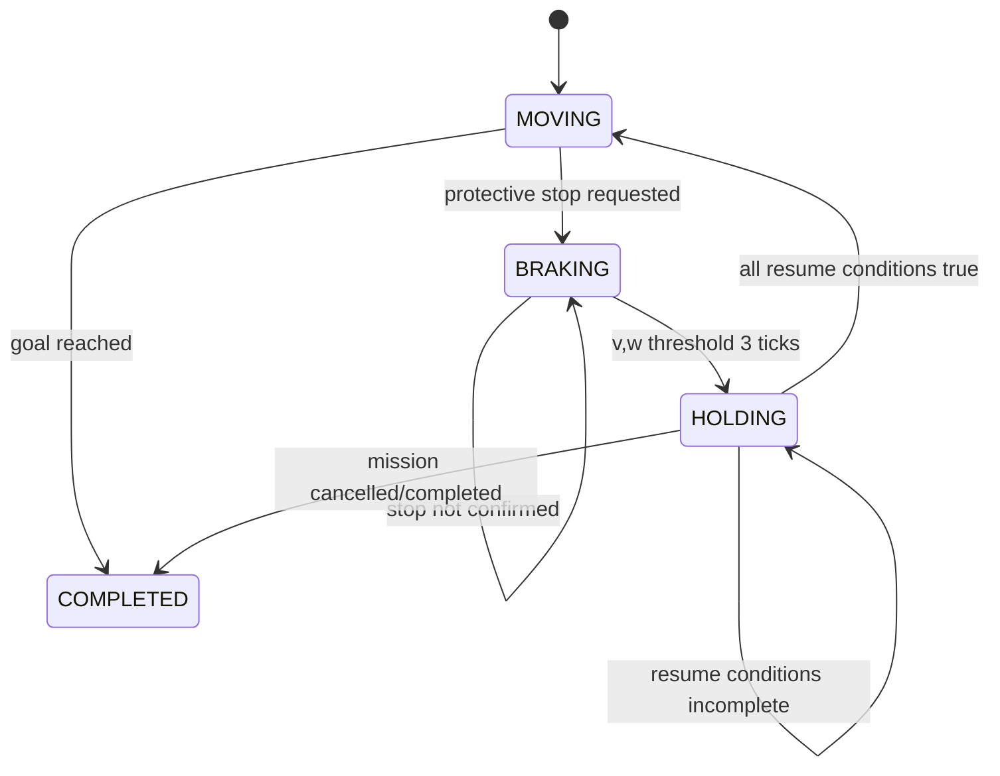

# 3단계 — 안전 게이트, 권한과 시간 계약

## 목표

controller 종류와 무관한 공통 online command filter를 만들고 제한 감속, 보호정지,
`stop_epoch`, 재출발 권한, stale·deadline 처리를 하나의 상태기계로 고정한다.

## 진입조건

- 2단계 frame validation과 Actor tube oracle이 통과한다.
- collision checker가 oriented wheelchair footprint를 검사할 수 있다.

## 수정·추가 대상

```text
src/hospital_path_lab/dynamic_contracts.py
src/hospital_path_lab/dynamic_safety.py
src/hospital_path_lab/safety.py
src/hospital_path_lab/collision.py
tests/test_dynamic_safety.py
tests/test_dynamic_authority.py
tests/test_dynamic_timing.py
```

기존 정적 `SafetyGate` API를 깨지 않는다. 동적 gate는 공통 collision primitive를
재사용하되 별도 상태를 소유한다.

## 상태모델



`stop_epoch`는 서로 다른 보호정지 사건이 처음 `HOLDING/STOP_CONFIRMED`로 전이할 때
한 번만 증가한다. 같은 hold 중에는 증가하지 않으며 정상 goal 도착은 epoch를 만들지 않는다.

## 제한 감속

```text
v_next = sign(v) · max(0, abs(v) - 0.50 · 0.05)
w_next = sign(w) · max(0, abs(w) - 1.60 · 0.05)
```

stale, invalid, late, unauthorized 상태에서는 새 비영점 명령, 속도 크기 증가, 방향
반전을 금지한다. 정지 완료는 `|v|<=0.01`, `|w|<=0.02`가 3 tick 연속일 때다.

## hold reason과 사건

primary reason 우선순위:

```text
INVALID_SOURCE > STALE > DEADLINE > UNAUTHORIZED
> GATE_REJECTION > NO_SAFE_CANDIDATE > TRAFFIC
```

한 tick에는 primary reason 하나만 duration에 집계한다. 다음은 별도 counter다.

- controller stop request
- gate override
- candidate rejected by gate
- late result discarded
- resume authorization rejected

## 권한 계약

```text
ResumeAuthorization
- mission_id
- stop_epoch
- issued_or_revalidated_at_s
- authorization_revision
- content_hash
```

유효조건:

```text
mission 일치
AND stop_epoch 일치
AND 실제 정지 확인 이후 발행·재검증
AND authorization revision 일치
```

재출발은 다음을 모두 만족해야 한다.

```text
authorization valid
AND path still valid
AND local safety recheck passed
AND 1.0 s continuous safe observation
AND observation fresh
AND source valid
```

10 Hz에서 새로운 safe frame 11개를 요구한다. dropout, invalid, unsafe frame은 누적을
초기화한다. fresh empty frame은 안전 재검사 대상이지만 no-frame은 safe frame이 아니다.

## swept safety

- 현재 운동의 50 ms command-apply 구간
- controller rollout
- 제한 감속 terminal stopping

전체에 대해 oriented footprint와 static grid, forbidden cells, Actor tube의 표면거리를
검사한다. 결과가 NaN이거나 geometry가 정의되지 않으면 거부한다.

## 두 timing lane

### 결정론적 lane

- simulation time만 물리상태를 바꾼다.
- accepted command는 다음 50 ms tick에 적용한다.
- result에는 source tick ID가 필수다.
- 현재 tick보다 오래된 결과는 폐기한다.

### wall-clock qualification lane

- physics를 멈춘 frozen snapshot에서 측정한다.
- frame validation부터 최종 gate command까지 포함한다.
- 시각화·I/O·evaluator·global replanning은 제외한다.
- 50 ms 초과 결과는 기록만 하는 것이 아니라 현재 tick 명령으로 사용할 수 없다.

## 시험

| 시험 ID | 내용 | 연결 계약 |
|---|---|---|
| `DYN-T-SAFE-001` | stale·invalid에서 제한 감속만 수행 | `DYN-OBS-002` |
| `DYN-T-SAFE-002` | 선형·각속도 정지 완료 3 tick | `DYN-SAFE-001` |
| `DYN-T-SAFE-003` | Actor tube·static·forbidden swept 거부 | `DYN-SAFE-001` |
| `DYN-T-AUTH-001` | stop epoch one-shot 증가 | `DYN-AUTH-001` |
| `DYN-T-AUTH-002` | 과거 mission·epoch·revision 거부 | `DYN-AUTH-001` |
| `DYN-T-AUTH-003` | 위험 해소만으로 재출발하지 않음 | `DYN-AUTH-002` |
| `DYN-T-AUTH-004` | 11 safe frame과 dropout reset | `DYN-AUTH-002` |
| `DYN-T-TIME-001` | 49/50 ms 허용, 51 ms 폐기 | `DYN-SAFE-002` |
| `DYN-T-TIME-002` | 과거 결과와 최신 결과 순서 역전 | `DYN-SAFE-002` |

## 완료조건

- controller가 위험 명령을 내도 gate가 보수적으로 제동·hold한다.
- 이전 정지 허가와 늦은 명령이 재사용되지 않는다.
- 정지 원인, 상태, 사건 counter가 서로 분리되어 trace에 남는다.
- 단위 fault 주입 시험이 모두 통과한다.

## 커밋 경계

```text
implement dynamic safety authority and timing contracts
```
