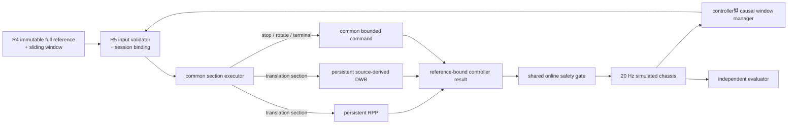

# R5 — Persistent RPP·Source-derived DWB 동일 Reference 비교 명세

## 1. 문서 상태

- 작성일: `2026-08-14`
- 상태: `R5-1~R5-6` 구현, R5-A 1차 public full qualification 실패·receipt 미생성,
  R4 v2 signed reference clean qualification 완료, R5 v2 section-bound 제한 후진 구현 중간 상태
  (`RPP` 대표 case 완료, `DWB` reverse 종점 deadlock 미해결)
- 범위: Python `simulation_only`, 합성 static grid, 가상 차체
- 상위 기준:
  - [`R1~R7 master specification`](10-dynamic-local-maneuver-research-master-spec.md)
  - [`R4 Reference·Sliding Subpath 상세 명세`](15-local-maneuver-reference-contract.md)
  - [`ADR 0012`](../../decisions/0012-persistent-controller-session-for-sliding-subpaths.md)
  - [`ADR 0013`](../../decisions/0013-common-reference-section-executor.md)
  - [`ADR 0014`](../../decisions/0014-section-bound-bounded-reverse-translation.md)
  - [`경로 안전·권한 흐름`](../../safety/path-safety-authority-flow.md)
- 팀 전체 합의: 아님
- 제품 controller 채택: 아님
- hidden: 생성·열람·실행 금지
- 실제 센서·차체·사람 탑승: 범위 밖

이 문서는 R4가 만든 같은 지역 reference를 persistent RPP와 persistent source-derived DWB가
어떻게 실행하는지 비교하는 R5의 구현 계약이다. reference 생성 성공과 controller 실행 성공을
분리하고, local window 이동마다 controller를 다시 만드는 과거 checkpoint 방식을 금지한다.

## 2. 핵심 질문

```text
같은 immutable full reference,
같은 causal sliding-window 규칙,
같은 가상 차체·속도·적용 지연,
같은 shared safety gate를 사용할 때

persistent RPP와 persistent source-derived DWB가
R4 section 순서·정지·회전·재합류를 연속 closed loop로 실행할 수 있는가?
```

R5는 다음을 구분한다.

```text
R4 reference 없음
!= reference는 있으나 controller가 추종하지 못함
!= controller proposal은 있으나 shared gate가 거부함
!= 안전하게 추종했으나 terminal 조건을 못 채움
!= Python wall-clock이 오래 걸림
```

마지막 항은 운영 병목 진단이며 R5 기능·안전 합격조건이 아니다.

## 3. 현재 입력과 선결 상태

R4 clean qualification 결과는 public 21-case 중 8개 `SPATIAL_ONLY` LEFT/RIGHT reference를
생성했다.

```text
wide-straight-left / right
wide-mirror-left / right
vertical-left / right
crossing-static-left / right
```

나머지는 `NO_REFERENCE 11`, `SEARCH_INCONCLUSIVE 1`, `INVALID_INPUT 1`이며 R5 controller를
호출하지 않는다. R4 hard·relation failure는 0, serial/process parity와 repeat determinism은
통과했다.

현재 R5 전에 확인된 코드 차이는 다음과 같다.

| 경계 | 현재 코드 | R5에서 필요한 수정 |
|---|---|---|
| RPP goal | local path 마지막 pose를 goal로 사용 | window endpoint와 full terminal 분리 |
| RPP 수명 | follower 계산은 stateless | section·goal·same-tick state를 가진 persistent adapter |
| DWB path | `set_path()`가 모든 critic을 reset | session reset과 scoring-window update 분리 |
| DWB goal | scoring path 끝과 rotate-to-goal target 결합 | local scoring window와 full terminal 분리 |
| ROTATE | 일반 polyline 추종으로 표현 불가 | 공통 stop-then-rotate executor |
| gate binding | mission·map·observation까지만 검증 | R4 session·revision·reference hash 추가 |
| pipeline 완료 | 일부 기존 경로는 위치만으로 goal 전달 | 위치·yaw·실제 정지·dwell 모두 요구 |

따라서 기존 `DynamicPurePursuitController`나 `SourceDerivedDynamicDwbController`에 R4 window를
그대로 교체해 넣는 방식은 R5 구현으로 인정하지 않는다.

## 4. 증거 lane과 진입 Gate

R2-B observation/prediction hard failure 2건을 보존하고 있으므로 R5를 세 lane으로 나눈다.

| lane | 입력 evidence | 현재 진입 | 말할 수 있는 것 |
|---|---|---|---|
| `R5-A STATIC_REFERENCE_TRACKING` | R4 `SPATIAL_ONLY`, fresh-empty infrastructure stream | 가능 | 정적 reference·window·section의 연속 추종 |
| `R5-B IDEAL_TEMPORAL_TRACKING` | R4 `GROUND_TRUTH_TEMPORAL` + R2-A exact witness + Ideal causal stream | 차단 | 동결된 합성 Actor 시간 경로에서의 실행 |
| `R5-C OBSERVATION_INTEGRATED` | R4 `OBSERVATION_INTEGRATED` + R2-B 통과 | 차단 | no-dropout·Normal·Stress 관측 아래 실행 |

`R5-A` 통과를 전체 R5 완료, Actor 추월 성공 또는 perception 통합으로 부르지 않는다. R5-B는
R2 temporal evidence가 R4 reference에 실제 결박된 뒤 시작하고, R5-C는 R2-B hard failure를
닫기 전 시작하지 않는다.

`fresh-empty infrastructure stream`은 shared gate의 provenance·tick 계약을 실행하기 위한 합성
빈 관측이다. 카메라가 사람이 없음을 증명했다는 의미가 아니다.

## 5. 책임과 비책임

### R5가 책임지는 것

- R4 full reference와 current window의 exact identity 검증
- 같은 full path 안에서 controller instance·state 유지
- section별 translation·planned stop·rotation·terminal 실행
- persistent RPP와 source-derived DWB의 paired closed-loop 실행
- controller result에 reference identity 왕복
- shared gate 전후 명령과 원인 분리
- repeat determinism, session lifecycle와 stale/late fault 시험
- 기능·안전 결과와 Python 운영시간 분리

### R5가 책임지지 않는 것

- 새 LEFT/RIGHT/WAIT path 생성 또는 candidate 선택
- sibling candidate로 자동 전환
- Actor GT를 controller 입력으로 사용
- 위험 해소나 EMPTY만으로 HOLD 자동 해제
- global reroute·support request 처리
- native timing qualification
- 제품 controller 선정, G1~G5, 경로분석 7단계

## 6. 전체 구조



독립 evaluator만 R4 source expectation과 ground truth를 사용할 수 있다. controller, section
executor와 gate에는 corpus category·oracle·hidden identifier를 전달하지 않는다.

## 7. 동결 연구 수치

R5 v1은 기존 가상 차체와 controller 수치를 바꾸지 않는다.

```text
control_period_s                       = 0.05
simulated_command_apply_latency_s      = 0.05
free_space_target_speed_mps            = 0.20
maximum_forward_speed_mps              = 0.30
maximum_reverse_speed_mps              = 0.10
maximum_angular_speed_radps             = 0.80
linear_acceleration_mps2                = 0.25
linear_deceleration_mps2                = 0.50
angular_acceleration_radps2             = 1.60
angular_deceleration_radps2             = 1.60
minimum_surface_clearance_m             = 0.08
tracking_error_limit_m                  = 0.10
position_tolerance_m                    = 0.05
yaw_tolerance_rad                       = 0.08
stopped_linear_velocity_mps             = 0.01
stopped_angular_velocity_radps           = 0.02
stopped_confirmation_ticks              = 3
terminal_dwell_s                        = 0.50
```

`maximum_reverse_speed_mps`는 차체 후진 translation 상한이다. 제자리회전에서 좌우 휠의 구동
방향이 달라지는 것과 차체 전체의 `v < 0`은 구분한다. v2는 R4가 명시한 reverse section에서만
이 상한을 사용하며, forward section에서 controller가 임의로 후진해 새 기동을 만들지 않는다.

`tracking_error_limit_m=0.10`은 R5 연구용 기능 threshold다. 이 조건을 통과해도 static·Actor
clearance `0.08m` hard gate를 대신하지 않는다. 좁은 geometry에서 tracking error는 작아도
clearance가 부족하면 hard failure다.

공통 simulation timeout은 full reference translation arc `L_ref`로 계산한다.

```text
T_episode = max(30.0, L_ref / 0.20 * 2.5 + 10.0)
```

이는 simulation 진행 한계이고 계산 deadline이나 실제 운행시간이 아니다.

## 8. 입력 계약

### 8.1 Reference binding

```text
PersistentReferenceBinding
  schema_version
  candidate_id
  reference_session_id
  mission_id
  stop_epoch
  map_id
  map_revision
  mission_revision
  maneuver_revision
  path_revision
  subgoal_revision
  full_reference_hash
  window_content_hash
  source_window_control_tick
  binding_content_hash
```

binding hash에는 elapsed time이나 worker 정보가 들어가지 않는다.

### 8.2 한 tick의 immutable 입력

```text
PersistentControllerTickInput
  schema_version
  controller_tick
  simulation_time_s
  full_reference
  local_window
  reference_binding
  robot_state
  static_grid_snapshot
  validated_observation
  actor_prediction_set | null
  vehicle_profile
  current_gate_motion_state
  current_gate_stop_epoch
  current_resume_authorization_revision | null
  tick_input_content_hash
```

`current_gate_motion_state`는 controller가 이동 권한을 결정하기 위한 입력이 아니다. planned
section state와 protective hold를 로그에서 분리하고 stale binding을 검출하는 데만 사용한다.
실제 command 허용은 shared gate가 결정한다.

### 8.3 입력 허용 조건

다음을 모두 만족해야 controller를 계산한다.

1. full reference·window·binding의 schema와 semantic hash를 재계산해 일치한다.
2. window는 full reference의 수정 없는 contiguous slice다.
3. candidate/session/maneuver/path/subgoal identity가 세 객체에서 일치한다.
4. mission·map·revision·grid·vehicle·stop epoch가 현재 context와 일치한다.
5. `source_window_control_tick == controller_tick`이다. 같은 slice 재전달은 window hash와
   subgoal revision을 유지하되 현재 tick으로 다시 발행해야 한다.
6. reference lifecycle이 `AVAILABLE`이다.
7. 같은 session의 revision은 감소하지 않는다.
8. 같은 revision에 다른 content가 오지 않는다.
9. R5-A는 `SPATIAL_ONLY`, R5-B/C는 해당 lane의 evidence level과 정확히 일치한다.
10. non-finite robot state·path·grid·prediction은 fail-closed한다.

실패 시 새 비영점 command를 만들지 않고 `INVALID_REFERENCE_INPUT` 결과를 반환한다.

### 8.4 금지 입력

controller package는 다음을 import하거나 필드로 받지 않는다.

```text
expectation_category
oracle_spec
latent_case_id
split / hidden_seed
ground_truth_actor_state
source feasible_witness의 정답 event
evaluator verdict
```

## 9. 출력 계약

```text
PersistentControllerResult
  schema_version
  controller_name
  source_controller_tick
  status
  requested_twist
  predicted_trajectory
  failure_reason | null
  decision_trace
  reference_binding_echo
  tick_input_content_hash
  controller_session_transition
  executor_state
  active_section_index
  active_section_kind
  tracking_error_m | null
  candidate_diagnostics | null
  planned_section_stop
  controller_requested_protective_stop
  no_safe_candidate
  elapsed_nonqualification_ns
  semantic_content_hash
```

상태는 다음으로 제한한다.

```text
COMMAND_FOUND
PLANNED_STOP
HOLD_REQUESTED
NO_SAFE_COMMAND
INVALID_REFERENCE_INPUT
STALE_REFERENCE_INPUT
LATE_RESULT
SECTION_EXECUTION_FAILED
COMPLETED
```

`elapsed_nonqualification_ns`는 semantic hash에서 제외한다. result는 입력 binding의 모든 필드를
그대로 echo하며, 다른 session/revision/hash를 가진 결과는 zero command보다 먼저 폐기한다.

## 10. Session·revision 수명주기

### 10.1 Controller session 상태

```text
UNBOUND
  └─ valid new reference ─> ACTIVE

ACTIVE
  ├─ same-window duplicate ─> ACTIVE, cached result
  ├─ same-session window update ─> ACTIVE, state preserved
  ├─ protective gate hold ─> ACTIVE, command authority 없음
  ├─ new maneuver/path/stop epoch ─> INVALIDATED
  ├─ explicit withdrawal ─> INVALIDATED
  └─ terminal dwell complete ─> COMPLETED
```

새 reference를 수용할 때만 controller instance 또는 stateful session을 초기화한다. gate가 정지한
사실만으로 session state를 지우지 않지만, `stop_epoch`가 바뀌면 기존 reference는 stale이므로
새 command를 만들지 않는다.

### 10.2 Update matrix

| 입력 변화 | 결과 | controller state |
|---|---|---|
| 같은 tick·같은 full semantic input | cached 동일 result | 유지 |
| 같은 tick·다른 input | `same_tick_input_changed` | fail-closed |
| tick regression | `controller_tick_regression` | fail-closed |
| 같은 session·같은 window 재전달 | idempotent | 유지 |
| 같은 session·subgoal `+1`·새 window hash | scoring window만 갱신 | 유지 |
| subgoal 증가 없이 window hash 변경 | `same_revision_different_window` | fail-closed |
| subgoal regression | `subgoal_revision_regression` | fail-closed |
| path revision 변경·같은 session | `path_changed_without_new_session` | fail-closed |
| 새 path revision·새 session | 새 bind | reset 1회 |
| maneuver 의미/side/candidate 변경 | 새 revision·session 필요 | 기존 폐기 |
| stop epoch 변경 | 기존 reference stale | 기존 폐기 |
| 이전 window/session의 늦은 result | `LATE_RESULT` | 적용 금지 |

window update 횟수와 controller reset 횟수를 모두 기록한다. 정상 한 episode에서 reset은 최초 bind
1회이며, `subgoal_revision 0→N` 이동으로 추가 reset이 발생하면 기능 실패다.

### 10.3 Causal window 공정성

paired closed loop에서 두 controller의 chassis state가 달라질 수 있으므로 window manager도
controller별 독립 instance를 사용한다. 두 controller에 같은 window event 시각을 강제하지 않는다.

공정 조건은 다음이다.

- 같은 immutable full reference와 같은 window manager config
- 같은 start state·map·차체·simulation tick
- 각 controller의 실제 pose로 causal projection
- mutable manager·gate·controller instance 공유 금지

별도의 contract replay lane에서는 동결된 동일 window sequence를 두 adapter에 주어 session
update 의미만 비교한다. 이 replay는 closed-loop 성능 결과와 섞지 않는다.

## 11. 공통 Reference Section Executor

### 11.1 상태기계

```text
TRACK_TRANSLATION
  → APPROACH_PLANNED_STOP
  → CONFIRM_PLANNED_STOP
  → ROTATE_IN_PLACE
  → CONFIRM_ROTATION_STOP
  → TRACK_TRANSLATION
  → TERMINAL_STOP
  → TERMINAL_DWELL
  → COMPLETED

HOLD section
  → HOLD_REQUESTED
  → 자동 전이 없음
```

translation section은 RPP 또는 DWB가 실행한다. 나머지 상태는 동일 executor가 실행한다.

### 11.2 Planned stop과 protective stop 분리

planned stop은 R4 section을 정상 실행하기 위한 감속이다.

```text
planned_section_stop = true
controller_requested_protective_stop = false
```

따라서 planned stop만으로 shared gate가 traffic hold·새 `stop_epoch`를 만들지 않는다. 반대로
source stale, unsafe trajectory, controller no-safe command는 protective stop으로 귀속한다.

### 11.3 실제 정지 확인

다음 두 조건을 3개 연속 control tick에서 만족해야 planned stop을 확인한다.

```text
abs(actual_linear_velocity)  <= 0.01 m/s
abs(actual_angular_velocity) <= 0.02 rad/s
```

command가 0인 것만으로 정지 완료로 간주하지 않는다.

### 11.4 Rotation

- `ROTATE` entry·exit knot는 같은 위치여야 한다.
- translation이 실제로 정지한 뒤에만 `linear=0` 회전을 시작한다.
- shortest angular distance 방향을 사용한다.
- 각가속·각감속 `1.60rad/s²`, 최대 `0.80rad/s`를 지킨다.
- 위치 오차 `<=0.05m`, yaw 오차 `<=0.08rad`, 실제 정지 3 tick 뒤 section을 완료한다.
- rotation section은 window update로 절단하거나 건너뛰지 않는다.

### 11.5 Terminal

terminal `REJOIN+STOP_MARKER`에서 다음을 모두 요구한다.

```text
position error <= 0.05m
yaw error      <= 0.08rad
actual stopped confirmation = 3 ticks
stopped dwell  >= 0.50s
```

local window가 terminal을 포함하지 않으면 window 끝에서 완료·goal stop을 선언하지 않는다.
pipeline의 `DynamicSafetyContext.goal_reached`도 위치만으로 먼저 `true`가 되면 안 된다. executor가
위 네 조건을 모두 확인해 `COMPLETED`로 전이한 다음 tick에만 mission completion 요청을
전달한다.

### 11.6 HOLD limitation

R4의 WAIT reference는 `HOLD→FOLLOW_ORIGINAL` 의미를 보존하지만 자동 release 조건을 갖지 않는다.
따라서 R5 v1은 HOLD에서 다음 section으로 자동 전이하지 않는다.

```text
Actor 해소 / fresh EMPTY / path 존재
→ HOLD 해제 근거 아님
```

실제 WAIT 후 진행 시험에는 최신 stop epoch·새 authorization·local recheck에 결박된 새 maneuver
revision과 실행 시작 section을 표현하는 후속 R4/R5 계약이 필요하다. 현재 public R4 8개에는
WAIT reference가 없으므로 R5-A PASS tracking을 막지는 않지만, WAIT_AND_FOLLOW 완결은
`미구현`으로 남긴다.

## 12. Persistent RPP 계약

controller 이름은 `persistent_rpp_reference`로 고정한다. 기존 `RegulatedPurePursuitFollower`의
수치를 사용한다.

```text
lookahead_min_m             = 0.25
lookahead_max_m             = 0.50
lookahead_velocity_gain     = 0.75
minimum_tracking_speed_mps  = 0.05
curvature_gain              = 2.0
```

RPP adapter 규칙:

1. current window의 translation knot와 R4 v2 section의 `travel_direction`을 함께 사용한다.
2. current pose를 full reference의 active translation section에도 투영해 section progress를
   계산한다.
3. local window 끝은 goal이 아니다.
4. 속도 감속은 active section의 명시적 stop marker 또는 full terminal까지의 remaining arc로
   계산한다.
5. current window가 terminal을 포함할 때만 full terminal goal을 활성화한다.
6. `ROTATE`와 `HOLD`는 follower에 넣지 않고 common executor가 처리한다.
7. RPP는 새로운 lateral detour·side switch·sibling candidate 전환을 만들지 않는다.
8. command는 current twist에서 한 control period의 가감속 한계를 지킨다. forward section은
   nonnegative, reverse section은 nonpositive 선속도만 허용한다.
9. post-apply pose부터 2.0초·0.05초 구간의 41-pose rollout을 생성한다. 명시적
   stop/terminal이 없는 translation은 constant-command rollout을 사용하고, 명시적 stop 또는
   terminal이 앞에 있는 translation은 현재 명령 한 구간 뒤 제한 감속·정지·hold가 가능한
   fallback rollout을 사용한다. 이 fallback은 shared gate의 terminal stopping 검사를 생략하지
   않는다.
10. same tick duplicate는 state를 두 번 진행하지 않고 동일 result를 반환한다.
11. reverse lookahead와 curvature는 signed travel direction에 맞춰 계산하고 `-0.10m/s`보다
    빠른 후진을 만들지 않는다.
12. active section 방향과 반대 부호의 command가 필요하면 새 경로를 만들지 않고 보수적으로 멈춘다.

window마다 goal 감속이 관측되거나 session state가 초기화되면 RPP 기능 실패다.

## 13. Persistent source-derived DWB 계약

controller 이름은 `persistent_dwb_reference`로 고정한다. 기존 source-derived DWB의 frozen
upstream attribution, generator, critic order·weight·tie-break와 프로젝트 hard constraint를
유지한다.

### 13.1 후보 생성

```text
nominal linear samples  = 7
nominal angular samples = 31
rollout horizon         = 2.0s
integration step        = 0.05s
pose samples            = 41 including initial pose
forward section         = 0 <= v <= 0.30m/s
reverse section         = -0.10m/s <= v <= 0
free sign switching     = disabled
```

R5 v1의 `reverse=disabled`는 첫 public 실패를 재현하는 역사적 기준선으로 보존한다. v2는 reverse를
모든 tick에 자유롭게 열지 않는다. active R4 v2 translation section이 `REVERSE`일 때만 음의 후보를
생성하고, `FORWARD`일 때는 기존처럼 음의 후보를 생성하지 않는다. 방향 전환 section 경계에서는
common executor의 실제 정지 확인 전 반대 부호 후보를 활성화하지 않는다.

source-derived velocity iterator는 범위 안의 0이 균등 sample에 없으면 0을 추가할 수 있다.
따라서 일반 candidate count를 항상 217로 거짓 고정하지 않고 매 tick 실제 axis sample과
candidate count를 기록한다. rest symmetric window의 대표값은 217이며 이 프로젝트 구현의
상한은 `8×32=256`이다. legacy 사용자 정의 DWA의 고정 217 계약과 혼동하지 않는다.

### 13.2 Session과 scoring path 분리

기존 `DwbReferenceCore.set_path()`는 reset을 포함하므로 R5에 직접 사용하지 않는다. 다음 의미를
구현해야 한다.

```text
begin_reference_session(full_reference)
  → 모든 critic reset 1회
  → immutable terminal goal·session binding 설치

update_scoring_window(active_translation_slice(local_window))
  → PathDist / PathAlign / GoalDist / GoalAlign의 local field 갱신
  → Oscillation·section executor·session state 유지
  → local window endpoint를 final goal로 latch하지 않음
```

`RotateToGoalCritic`의 goal은 immutable full terminal에 결박한다. R4 intermediate `ROTATE`와
planned stop은 common executor가 처리하므로 DWB가 window endpoint를 goal로 보고 stop/rotate하면
안 된다. 네 path critic은 현재 executor가 위임한 translation section의 exact window slice만
점수화한다. 미래 `ROTATE`·다음 translation section은 활성화되기 전에 현재 후보 점수에 섞지
않는다. scoring goal의 forward-point 거리 안에서는 `GoalAlign`의 앞쪽 투영을 끄되
`GoalDist`·`PathDist`·`PathAlign`, 후보 안전검사와 외부 gate는 유지한다.

### 13.3 후보 안전과 외부 gate

- 각 후보는 기존 project dynamic safety constraint로 static·forbidden·Actor tube·terminal
  stopping을 검사한다.
- 이 내부 constraint와 shared gate는 같은 model을 사용하므로 독립 redundant safety channel이
  아니다.
- 선택된 result는 외부 shared gate에서 현재 tick으로 다시 검사한다.
- internal no-legal trajectory와 external gate rejection을 별도 기록한다.
- candidate가 없으면 zero/new motion 금지 결과와 `no_safe_candidate=true`를 반환한다.

### 13.4 Python 실행시간

Python safety scoring이 오래 걸리더라도 R5 기능 lane에서는 실제 wall-clock을 합격·탈락에 쓰지
않는다. deterministic simulation lane은 command apply delay를 정확히 `50ms`로 주입한다.

```text
T_wall_python  → elapsed_nonqualification_ns
T_sim_apply    → 0.05s, 기능·안전 궤적에 사용
T_fault        → 49/50/51ms와 old tick fault corpus에만 사용
```

동결 semantic을 C++로 옮긴 뒤의 timing qualification은 R7 책임이다.

## 14. Shared safety gate와 reference binding

R5 result는 기존 `ControllerCommandResult`를 바로 actuator proposal로 바꾸지 않는다.

```text
PersistentControllerResult
→ reference-bound DynamicCommandProposal
→ DynamicSafetyGate
```

R5 lane에서 proposal과 `DynamicSafetyContext`에 동일한 optional
`PersistentReferenceBinding`을 넣는다. 기존 non-R5 lane은 둘 다 `None`으로 유지해 호환한다.
R5에서는 한쪽이라도 없거나 다음 중 하나가 다르면 비영점 command를 적용하지 않는다.

```text
candidate_id
reference_session_id
stop_epoch
maneuver_revision
path_revision
subgoal_revision
full_reference_hash
window_content_hash
source_controller_tick/current tick
```

reference mismatch는 `INVALID_REFERENCE` hold reason과 `reference_binding_mismatch` failure로
기록한다. 이전 valid command를 재사용하지 않는다.

새 R5 pipeline이 gate를 만들 때는 R4 reference의 현재 `stop_epoch`를 생성자 입력으로
명시한다. 기존 non-R5 lane의 기본값은 `0`으로 유지한다. pipeline이 gate의 epoch를 실행 중
임의로 덮어쓰지 않으며, 보호정지로 epoch가 증가하면 기존 reference는 즉시 현재 입력 자격을
잃는다.

shared gate는 계속 다음을 최종 제한한다.

- stale·invalid/no-frame source
- current 50ms motion sweep
- candidate rollout과 terminal stopping
- static·forbidden·Actor clearance
- late/wrong-tick result
- actual stop·current epoch authorization·safe frames·path/local recheck
- active section signed direction·reverse 속도 상한·방향 전환 정지 확인
- reverse current-motion sweep와 뒤쪽 terminal stopping

reference가 valid하다는 사실은 gate 통과나 이동 허가가 아니다.

## 15. Functional pipeline

한 control tick의 순서는 다음으로 고정한다.

```text
1. ground-truth chassis·Actor state를 현재 T_sim까지 적분
2. 도착 observation 전달·source validation·prediction 갱신
3. controller별 R4 window manager를 current pose로 갱신
4. immutable PersistentControllerTickInput snapshot
5. common section executor 상태 확인
6. translation이면 signed section direction과 실제 정지 전환 조건 확인 뒤 RPP 또는 DWB 계산
7. planned stop/rotate/terminal이면 common command 생성
8. reference-bound result 생성
9. shared safety gate 검사
10. current twist로 50ms pose 적분, gate command를 next tick twist로 저장
11. independent evaluator sample·event 기록
```

같은 simulation timestamp에서 위 순서를 바꾸지 않는다. controller 계산 중 Python wall-clock은
T_sim을 진행시키지 않는다. 기존 위치-only goal shortcut은 R5 lane에서 사용하지 않고,
section executor의 위치·yaw·actual stop·dwell 완료 결과만 gate의 mission completion으로 변환한다.

## 16. 평가 지표와 원인 귀속

### 16.1 Hard safety

```text
collision_count                         = 0
forbidden_entry_count                   = 0
actual_surface_clearance                >= 0.08m
stale_or_invalid_nonzero_command        = 0
reference_binding_mismatch_applied      = 0
late_or_wrong_tick_command_applied      = 0
unauthorized_resume                     = 0
wrong_signed_translation_command         = 0
direction_change_without_actual_stop     = 0
reverse_speed_limit_violation            = 0
nonfinite_or_unhandled_exception        = 0
```

### 16.2 Session·section 기능

- initial session bind count `1`
- same-session subgoal update로 인한 controller reset `0`
- window·section index regression `0`
- section skip·rotation marker loss `0`
- planned stop actual confirmation 성공
- rotation position/yaw/stop 조건 성공
- terminal position/yaw/stop/dwell 성공
- reference tracking error `<=0.10m`
- progressable R5-A case completion
- planner deadlock `0`

`planner_deadlock`은 active safety hold가 없고 reference·source·authority가 유효하며 progressable인
상태에서 3초 동안 full-reference progress 증가가 `0.02m` 미만일 때만 판정한다.

### 16.3 Controller별 진단

RPP:

- lookahead point와 active full-reference progress
- curvature·regulated speed
- false local-goal deceleration count

DWB:

- generated/legal/illegal/short-circuit candidate count
- critic별 failure taxonomy와 weighted score
- selected candidate index·command·minimum clearance
- no-legal-trajectory count

공통:

- actual path length, max/RMS tracking error
- longitudinal jerk RMS, angular acceleration/jerk RMS
- peak angular velocity, direction reversal count
- controller stop request, planned stop, gate override, stale/authority hold를 분리한 event count
- `elapsed_nonqualification_ns`, CPU·RSS는 별도 운영 metadata

### 16.4 Paired 분석

각 `reference_session_id`에서 다음 delta를 계산한다.

```text
Δ completion simulation time = T_DWB - T_RPP
Δ tracking error
Δ path length
Δ jerk / angular motion
Δ gate override
Δ controller no-safe command
```

R5-A의 목적은 승격 통계를 만드는 것이 아니라 두 controller가 같은 reference를 실행할 수 있는지
확인하고 실패 계층을 분리하는 것이다. 단일 종합 점수나 제품 추천을 만들지 않는다.

## 17. Failure taxonomy

### 입력·session

```text
unsupported_persistent_controller_schema
reference_content_hash_mismatch
window_content_hash_mismatch
window_not_contiguous
reference_binding_mismatch
same_tick_input_changed
controller_tick_regression
same_revision_different_window
subgoal_revision_regression
path_changed_without_new_session
stale_reference_session
stop_epoch_mismatch
reference_lifecycle_not_available
evidence_lane_mismatch
```

### section executor

```text
active_section_not_in_window
section_index_regression
rotation_marker_missing
rotation_entry_not_stopped
planned_stop_confirmation_timeout
rotation_completion_timeout
hold_release_not_authorized
terminal_rejoin_not_observed
terminal_dwell_incomplete
```

### controller

```text
rpp_projection_ambiguous
rpp_tracking_error_exceeded
rpp_false_window_goal_deceleration
dwb_scoring_window_update_failed
dwb_state_reset_on_subgoal_update
dwb_no_legal_trajectory
dwb_candidate_diagnostics_incomplete
controller_result_nonfinite
```

### gate·authority

기존 gate taxonomy를 유지하고 R5 controller failure와 합치지 않는다.

```text
invalid_source_hold
invalid_reference_hold
stale_source_hold
deadline_hold
gate_rejection
no_safe_candidate_hold
unauthorized_hold
late_result_discarded
```

### Infrastructure

```text
worker_crash
timeout
out_of_memory
partial_output
source_changed_during_run
```

Infrastructure failure는 controller 실패나 `NO_PATH`로 바꾸지 않는다.

## 18. 시험 설계

### 18.1 Contract unit tests

- exact enum/int/finite/hash 검증
- full reference·window·binding tamper
- same tick duplicate와 same tick different input
- subgoal 증가·regression·same revision/different content
- new path without session, old session late result
- stop epoch 변경과 이전 command 폐기
- elapsed 제외 semantic hash
- label/oracle/hidden AST 누출 금지

### 18.2 Section executor tests

- straight translation만 있는 reference
- translation→stop→90° left/right rotation→translation
- forward translation→실제 정지 3 tick→reverse translation과 반대 순서
- zero command와 actual stopped의 구분
- 3-tick actual stop confirmation
- rotation 전 linear nonzero에서 회전 금지
- yaw tolerance 진입 뒤 angular stop confirmation
- window 경계에서 atomic rotation 미절단
- terminal 0.50초 dwell
- HOLD 자동 release 금지
- planned stop이 protective stop/stop epoch를 만들지 않음

### 18.3 Persistent RPP tests

- current window에서 lookahead, full reference에서 remaining arc
- nonterminal window 끝에서 가짜 goal 감속 없음
- terminal window에서만 goal 감속
- subgoal update 뒤 session state 유지
- curve speed regulation과 가감속 limit
- rotation section을 follower가 직접 소비하지 않음
- deterministic 41-pose rollout
- reverse section에서만 signed negative command·뒤쪽 41-pose rollout
- reverse speed `0.10m/s` 상한과 방향 전환 전 actual stop

### 18.4 Persistent DWB tests

- full session 최초 1회 reset
- scoring window update가 path critics만 갱신
- oscillation·session state 유지
- local window endpoint가 rotate-to-goal target이 아님
- nominal 217과 zero-insert variable candidate count·상한 256
- candidate order·score·tie-break 결정론
- no-legal taxonomy
- selected candidate external gate 재검증
- Python elapsed를 semantic 판정에서 제외
- section-bound negative velocity sample과 forward section negative sample 금지
- reverse terminal stopping sweep와 selected candidate external gate 재검증

### 18.5 Gate fault corpus

- old session result
- old/new subgoal result reorder
- same revision/different window hash
- wrong stop epoch
- forced 49ms, 50ms, 51ms simulated result
- late result가 다음 tick에 도착
- stale/no-frame/invalid source
- planned stop과 protective stop attribution

### 18.6 R5-A public matrix

R4 public catalog 21개를 동일 순서로 사용한다.

- `REFERENCE_SET_READY` 8개: 후보별 RPP·DWB paired closed loop
- `NO_REFERENCE` 11개: controller call `0`
- `SEARCH_INCONCLUSIVE` 1개: controller call `0`
- `INVALID_INPUT` 1개: controller call `0`

ready 8개에는 다음 관계를 검사한다.

- left/right mirror trajectory·section relation
- horizontal/vertical rotation relation
- wide/crossing-static section order
- same full reference의 controller별 window sequence monotonicity
- repeated serial semantic determinism
- serial/process episode result parity

독립 public episode는 process 병렬화한다. 한 episode의 controller state, window sequence와 tick은
직렬로 실행한다. 같은 candidate의 RPP·DWB pair는 같은 worker에서 같은 immutable source와
초기조건을 사용하되 mutable instance는 공유하지 않는다.

## 19. R5 단계별 구현 순서

### R5-1 — Contract·binding

```text
persistent_controller_contracts.py
```

- tick input, reference binding, result, status·taxonomy·hash
- R4 objects의 exact semantic validation
- same-tick/revision/session state machine

완료 Gate: contract·tamper·AST 시험 통과, 기존 controller 호출 없음.

구현 상태(`2026-08-14`):

- [`persistent_controller_contracts.py`](../../../simulation/path_planning_lab/src/hospital_path_lab/persistent_controller_contracts.py)에
  R5-A `SPATIAL_ONLY` tick input, reference binding, result, session guard를 구현했다.
- 동일 tick 동일 입력은 idempotent하게 수용하고, 동일 tick 변경 입력·revision 역행은 상태를
  바꾸지 않고 거부한다.
- 같은 window의 다음 tick 재발행과 `subgoal_revision` 전진은 state를 유지하고, 새 path 또는
  maneuver session만 reset 대상으로 분류한다.
- full reference·window·grid·vehicle·stop epoch·현재 delivery tick을 semantic hash와 exact
  slice로 결박한다. 현재 차단된 R5-B/C evidence는 R5-A 입력으로 수용하지 않는다.
- planned section stop과 protective hold/no-safe stop을 result flag와 status에서 혼합하지 않는다.
- 전용 `12 passed`, 당시 R4 직접 영향권 합계 `68 passed`, Ruff를 통과했다. 기존 controller는
  호출하지 않았고 R5-3 이후 구현, public runner, hidden과 전체 회귀는 수행하지 않았다.

### R5-2 — Common section executor

```text
reference_section_executor.py
```

- translation/stop/rotate/terminal/HOLD 상태기계
- planned stop과 protective stop 분리
- idempotence와 session reset

완료 Gate: rotation·stop·dwell unit test, 실제 twist feedback 확인.

구현 상태(`2026-08-14`):

- [`reference_section_executor.py`](../../../simulation/path_planning_lab/src/hospital_path_lab/reference_section_executor.py)에
  translation 위임과 공통 planned stop·rotation·terminal·HOLD 상태기를 구현했다.
- planned stop은 선속도 `0.50m/s²`, 각속도 `1.60rad/s²` 제한 감속을 사용하고 실제 선·각속도
  조건을 3개 연속 tick에서 확인한다. 중간에 어느 한쪽이라도 임계값을 넘으면 확인 횟수를
  초기화한다.
- rotation은 실제 선속도 정지 뒤 shortest direction으로만 실행하며 각가속·각감속
  `1.60rad/s²`, 최대 `0.80rad/s`를 지킨다. rotation 위치 이탈과 비원자적 rotation section은
  protective hold로 종료한다.
- terminal은 위치·yaw·실제 정지 3 tick을 확인한 뒤 별도 10 tick(`0.50s`) dwell을 채우고,
  그 다음 tick에만 completion을 보고한다.
- shared gate가 `BRAKING/HOLDING`이면 executor counter·section을 진행하지 않고 zero command로
  상태를 보존한다. 이는 새 보호정지 요청이나 이동 허가가 아니다.
- HOLD는 authorization field나 정지 사실만으로 해제하지 않는다. 새 authorized reference 계약은
  여전히 미구현이다.
- 전용 `13 passed`, R5-1·R4 직접 영향권 합계 `81 passed`, Ruff·compile 검사를 통과했다.
  실제 R4 causal window 재생에서는 window update 중 session reset 추가 없이 terminal까지
  도달했다. RPP/DWB translation, shared gate 연결, public runner, hidden과 전체 회귀는 수행하지
  않았다.

### R5-3 — Persistent RPP adapter

```text
persistent_rpp_controller.py
```

- window lookahead/full-terminal 감속 분리
- reference-bound result와 rollout
- static representative closed loop

완료 Gate: 대표 `wide-straight-left`에서 subgoal update reset 0, terminal 완료.

구현 상태(`2026-08-14`):

- [`persistent_rpp_controller.py`](../../../simulation/path_planning_lab/src/hospital_path_lab/persistent_rpp_controller.py)에
  common executor를 포함한 `persistent_rpp_reference` adapter를 구현했다.
- lookahead는 current window의 active translation section만 사용하고, progress·tracking error와
  stop remaining은 immutable full reference의 같은 section에서 계산한다. local window 끝 자체는
  감속·완료 근거로 사용하지 않으며 명시적 stop/rotation 경계 또는 terminal에서만 제한 감속한다.
- 선속도는 차체의 한 tick 가감속 한계, 각속도는 `1.60rad/s²` 한계를 지킨다. current twist의
  `50ms` post-apply pose부터 `2.0s / 0.05s`의 41-pose rollout을 만들며, 명시적 stop/terminal
  앞에서는 한 명령 구간 뒤 제한 감속·정지·hold하는 실행 가능한 fallback을 제출한다.
- planned stop·rotation·terminal dwell·HOLD는 follower가 소비하지 않고 R5-2 executor 결과를
  reference-bound controller result로 변환한다. 같은 tick 동일 입력은 elapsed까지 포함한 cached
  object를 그대로 반환한다.
- 실제 public `wide-straight-left` 20Hz closed loop에서 simulation time `20.75s`에 terminal
  completion을 확인했다. 최초 session reset은 `1`, same-session window update는 `4`, 추가 reset은
  `0`, 최대 tracking error는 약 `0.09923m`였다.
- 이 시험에서 동일 위치 회전 중 heading을 cursor locality보다 먼저 적용하면 이전 section으로
  projection이 후퇴하는 R4 결함이 드러났다. geometric tie에서는 이전 monotonic cursor를 먼저
  적용하고 그 범위 안에서 heading을 쓰도록 고쳤으며 적대 회귀시험을 추가했다.
- external gate 장시간 재생에서 tick `89`에 처음 발생한
  `static_clearance_below_minimum`은 현재 50ms 명령이나 reference window 문제가 아니었다.
  RPP가 `0.215m` 앞의 명시적 stop을 알고도 2초 동안 현재 속도로 직진하는 rollout을 제출해,
  gate가 그 끝에 terminal stopping을 붙였을 때 정적 여유가 `0.0745m`로 `0.08m` 기준 아래로
  내려간 것이 원인이었다. 안전 기준과 gate는 유지하고 planned-stop-aware fallback rollout과
  적대 회귀를 추가했다.
- RPP 전용 `8 passed`, R5-1·R5-2·window manager 직접 영향권 합계 `50 passed`, Ruff·compile·
  diff 검사를 통과했다. 기존 follower·R4 contract/builder/validator/public까지 포함한 확장
  영향권은 `124 passed`였다. shared gate, DWB adapter, R5 public 8-case runner, hidden과 전체
  회귀는 수행하지 않았다. 따라서 static Python L1 추종 증거이며 Actor online 안전이나 제품
  채택 증거가 아니다.

### R5-4 — Persistent source-derived DWB adapter

```text
local_algorithms/dwb_reference/persistent_adapter.py
```

- session reset/scoring-window update API 분리
- critic goal binding 분리
- existing source-derived semantic 보존

완료 Gate: fixed window replay와 대표 public에서 session reset 1회, candidate diagnostics 완결.

구현 상태(`2026-08-14`):

- [`persistent_adapter.py`](../../../simulation/path_planning_lab/src/hospital_path_lab/local_algorithms/dwb_reference/persistent_adapter.py)에
  `persistent_dwb_reference` adapter를 구현했다. `PersistentDwbCoreSession`은
  `begin_reference_session(full_reference)`와 `update_scoring_window(local_window)`를 분리하며,
  전자는 전체 critic을 1회 reset하고 후자는 `PathDist`·`PathAlign`·`GoalDist`·`GoalAlign`의
  저장 path만 갱신한다. 점수화 path는 current window 전체가 아니라 executor가 현재 위임한
  translation section의 exact slice다.
- `RotateToGoalCritic`은 immutable full reference terminal에만 결박된다. fixed window replay에서
  local endpoint에 로봇을 놓아도 rotate goal window가 latch되지 않았고, window 변경 뒤에도
  Oscillation sign-reversal restriction과 full-terminal goal이 유지됐다.
- 기존 source-derived generator, critic 순서·scale·strict lower-score tie-break와
  `ProjectDynamicSafetyConstraintCritic`을 그대로 조립한다. nominal rest window는 실제 `217`
  후보, 후보당 `41` pose이며 zero insertion을 포함한 일반 상한 `256` 계약은 유지한다.
- 대표 public `wide-straight-left`의 첫 translation tick에서 session reset `1`, scoring-window
  update `1`, candidate `217`, safe selected candidate와 41-pose rollout을 확인했다. candidate
  count, legal/illegal/short-circuit count, selected index·score와 critic별 비용은 result
  diagnostics에 보존한다. 동일 tick 동일 입력은 같은 result object를 반환하고, 동일 tick의
  다른 입력은 zero protective result로 거부한다.
- 종단 재생에서 첫 구현은 tick `250`부터 `(1.380, 0.893)`에서 영명령을 반복했다. 2cm grid에서
  낮은 전진 후보가 zero와 동점이고, 더 빠른 후보의 `GoalAlign` forward point가 계획된 회전
  경계 너머 장애물 쪽으로 투영된 것이 첫 원인이었다. near-goal projection을 R5 adapter에서만
  끈 뒤에는 미래 세로 우회 section까지 현재 점수에 섞여 `(1.548, 0.980)`으로 끌려가는 두 번째
  교착이 드러났다. active translation slice만 점수화하도록 분리해 두 원인을 닫았다.
- 수정 후 대표 DWB는 tick `393`·simulation time `19.65s`에 external gate rejection `0`, 최소
  정적 여유 약 `0.23562m`, 최대 tracking error 약 `0.04803m`로 terminal 완료했다.
- DWB critic·persistent adapter·pipeline·executor·dynamic safety·authority·timing 집중 영향권
  `93 passed`를 확인했다. 최신 전체 회귀는 실행하지 않았다.
- 전용 `6 passed`, 기존 source-derived DWB 직접 영향권을 합친 `130 passed`, 별도 R5
  contract·executor·RPP·window 영향권 `50 passed`, Ruff·compile·diff 검사를 통과했다. 대표
  1 tick의 Python wall-clock은 기능 합격 근거가 아니며 native timing은 R7에 남긴다.
- R5-4 완료 당시에는 DWB가 translation 후보를 생성·내부 constraint로 거르는 경계까지만
  닫았고, 공통 planned stop·rotation·terminal command와 selected DWB command의 external
  shared-gate 재검사, 20Hz closed loop와 public runner는 후속 범위였다. 이후 R5-5·R5-6에서
  이 연결과 21-case clean public 실행까지 진행했지만 첫 qualification은 실패했고 receipt는
  발급되지 않았다. hidden·제품 controller 채택·Actor online 안전 증거는 여전히 없다.

### R5-5 — Shared gate·functional pipeline

```text
persistent_controller_pipeline.py
```

- reference binding을 proposal/context/gate에 연결
- 20Hz deterministic pipeline
- current 50ms apply, fault-time 분리

완료 Gate: stale/late/session mismatch nonzero 적용 0.

구현 상태(`2026-08-14`):

- [`persistent_controller_pipeline.py`](../../../simulation/path_planning_lab/src/hospital_path_lab/persistent_controller_pipeline.py)에
  R5-A용 20Hz `controller → reference-bound proposal → shared gate → next-tick chassis`
  파이프라인을 구현했다. current twist가 현재 50ms 구간의 pose를 적분하고 gate 출력은 다음
  tick twist가 된다. Python wall-clock은 simulation time을 전진시키지 않는다.
- `DynamicCommandProposal`과 `DynamicSafetyContext`에 optional `PersistentReferenceBinding`을
  추가했다. 기존 lane은 `None/None`으로 유지하고, R5 lane은 proposal/context/current gate의
  binding hash·lifecycle·session/window revision·delivery tick·`stop_epoch`가 모두 일치해야 한다.
  한쪽 누락, 과거 tick, 다른 window 또는 epoch는 `INVALID_REFERENCE`와
  `reference_binding_mismatch`로 제한 감속·hold한다.
- reference 검사는 mission completion 처리보다 먼저 수행한다. 오래된 result가
  `goal_reached`를 주장해도 현재 mission 종료로 수용하지 않는다. planned section stop은
  protective stop flag를 세우지 않아 controller stop count와 `stop_epoch`를 증가시키지 않는다.
  보호정지 확인으로 epoch가 증가한 뒤에는 stale reference로 controller를 다시 호출하지 않고,
  zero proposal을 gate에 전달해 `HOLDING`을 유지한다.
- representative `wide-straight-left`에서 RPP 60-tick prefix와 전체 종단이 외부 gate를
  통과했다. 첫 planned stop 이전 false terminal-tail rejection은 재현 후 닫았고, 전체 종단에서
  tick `417`·simulation time `20.85s`에 완료했으며 external gate rejection·failure는 `0`,
  최소 정적 여유는 약 `0.15967m`였다. 또한
  실제 persistent DWB 첫 tick의 217-candidate/41-pose 선택 결과도 외부 gate가 다시 검사해
  허용했고, DWB 전체 종단도 tick `393`·`19.65s`, gate rejection `0`으로 완료했다. old tick,
  window hash·epoch 변조, binding 한쪽 누락, 51ms와 stale 입력은 비영점
  새 명령 적용 `0`으로 차단했다.
- 이번 수정 뒤 RPP·executor·pipeline·dynamic safety·authority·timing 집중 영향권
  `80 passed`를 확인했다. 최신 전체 회귀는 실행하지 않았다.
  이 단계는 대표 RPP·DWB 종단과 fault boundary 증거다. RPP/DWB 8-case 종단 완료,
  full public runner·receipt와 전체 회귀는 R5-6/7에 남아 있다.
  따라서 제품 controller 채택이나 실제 사람 안전 증거가 아니다.

### R5-6 — Public reporting·runner

```text
persistent_controller_reporting.py
scripts/run_persistent_controller_public.py
```

- R4 catalog 순서·paired RPP/DWB
- JSON/Markdown/PNG·partial/complete·receipt
- process episode 병렬화, input ordinal merge

완료 Gate: representative→읽기 전용 감사→public full 순서 통과.

구현 상태(`2026-08-14`):

- [`persistent_controller_reporting.py`](../../../simulation/path_planning_lab/src/hospital_path_lab/persistent_controller_reporting.py)와
  [`run_persistent_controller_public.py`](../../../simulation/path_planning_lab/scripts/run_persistent_controller_public.py)에
  R4 21-case 순서를 보존하는 public-only runner·JSON/Markdown/PNG writer를 구현했다.
- ready 8개는 한 worker에서 fresh RPP 뒤 fresh DWB를 동일한 immutable R4 source·초기조건으로
  순차 실행하고, non-ready 13개는 controller call `0`으로 닫는다. 독립 case만 process로
  병렬화하고 parent가 input ordinal로 재정렬한다.
- 축소 tick·case 실행은 `partial-state.json`만 남기며 complete state와 receipt를 생성할 수 없다.
  clean full run도 21개 완료, hard failure 0, 기능·관계·repeat·serial/process parity 및 final
  source recheck가 모두 통과해야 receipt를 생성한다.
- tick-1 21-case smoke에서 ready RPP/DWB 결과 `8/8`씩, non-ready controller call `0/13`,
  PNG `21`, receipt `0`을 확인했다. 대표 `wide-straight-left`는 runner 경로에서도 RPP
  completion tick `417`, DWB completion tick `393`, planner deadlock·hard failure `0`이었다.
- 최초 deadlock monitor는 planned stop/rotation과 자기 근처를 재통과하는 return 구간을
  오분류했다. frozen 3초/0.02m 기준은 유지하고 실제 translation section 안에서 관찰된 최대
  순방향 진행만 계산하도록 원인 계층을 바로잡았다.
- reporting·DWB critic·adapter·pipeline·executor·safety·authority·timing 집중 영향권
  `99 passed`, Ruff·compile·diff 검사를 통과했다.
- clean public full은 commit `7e22642`에서 `21/21` 실행됐지만 qualification은 실패했고 receipt는
  생성되지 않았다. ready 8개 R4 reference 모두 reverse translation edge를 한 개 포함하지만 R5
  DWB는 reverse를 금지하며 RPP도 양의 목표 선속도만 만든다는 계약 불일치가 확인됐다. 왼쪽 3건의
  완료는 위치 polyline을 큰 방향 전환으로 따라간 결과이므로 reverse 의미 실행 성공으로 세지 않는다.
  상세 결과는 [R5-A 공개 qualification 결과](r5a-public-persistent-controller-qualification-result-2026-08-14.md)에
  보존한다. hidden은 사용하지 않았다.

### R5 v2 — Section-bound 제한 후진 계약 보정

- 사용자 연구 방향: 제한 후진 허용
- 상태: R4 v2 signed reference clean public qualification 완료, R5 v2 controller·executor 구현과
  재qualification 미시작
- R4 v2가 source primitive에 결박된 `travel_direction`을 발행한다.
- RPP·DWB는 reverse section에서만 최대 `0.10m/s` 음의 선속도를 사용할 수 있다.
- common executor는 forward↔reverse 전환 전 실제 정지 3 tick을 확인한다.
- reverse rollout과 terminal stopping은 shared gate의 동일 static·forbidden·Actor 검사를 받는다.
- 기존 R4 v1 receipt와 R5-A 1차 실패 output은 변경하지 않고 새 version·output으로 재실행한다.

### R5-7 — 최종 감사·회귀

- 직접 영향권 시험
- source freeze 확인
- public run 완료 뒤 receipt
- 분할 전체 회귀 1회
- 문서·TRACEABILITY·result 갱신

코드 변경 뒤 장시간 full을 반복하지 않는다.

## 20. 실행·산출물 수명주기

구현 뒤 output은 새 고유 경로만 사용한다.

```text
outputs/persistent-controller-public-<UTC>-<HEAD>/
  run-manifest.json
  partial-state.json
  cases/<ordinal>-<candidate>/
    source-reference.json
    rpp-result.json
    dwb-result.json
    paired-summary.json
    trajectories.png
  summary.json
  summary.md
  complete-state.json
  qualification-receipt.json
```

manifest에는 최소한 다음 hash를 둔다.

- code commit·tree·source freeze
- R4 catalog·receipt·reference set
- R5 contract·executor·controller config
- vehicle·grid·window manager·gate config
- observation/prediction profile
- public case list
- worker·Python·machine metadata는 nonqualification 영역

partial은 보존하지만 qualification evidence로 사용하지 않는다. receipt는 clean source, 전체
required public, hard failure 0, functional gate, repeat determinism, serial/process parity와 final
source recheck를 모두 통과할 때만 생성한다.

## 21. 완료 판정

### `R5-A STATIC_REFERENCE_TRACKING_QUALIFIED`

- R4 ready 8개 모두 RPP·DWB paired run 완료
- hard safety failure 0
- reference/session/stale/late 적용 failure 0
- subgoal update controller reset 0
- section order·rotation·terminal 조건 통과
- signed forward/reverse section과 방향 전환 actual-stop 조건 통과
- reverse speed·뒤쪽 swept safety 위반 0
- progressable case completion, planner deadlock 0
- repeat determinism·serial/process parity 통과
- source freeze와 clean receipt 생성

### 전체 R5는 아직 완료 아님

R5-A 통과 뒤에도 다음은 별도 미완료다.

```text
R5-B Ideal temporal Actor execution
R5-C no-dropout / Normal / Stress observation integration
WAIT_AND_FOLLOW authorized release
```

R5-B/C를 건너뛰고 R6 perception-integrated 종단이나 R7 hidden으로 진행하지 않는다.

## 22. 중단조건

다음 중 하나면 구현 또는 public 실행을 중단하고 원인 계층으로 되돌린다.

- R4 reference/hash/rotation marker 손실
- local window 끝을 실제 terminal goal로 사용
- subgoal update마다 controller·critic reset
- same revision/different content 수용
- old session/subgoal command 적용 가능
- planned stop이 protective stop epoch를 생성
- HOLD 자동 release
- common executor를 controller별로 다르게 구현
- DWB critic 의미·candidate 축·안전 기준을 결과에 맞춰 변경
- Python wall-clock을 기능·알고리즘 탈락 기준으로 사용
- shared gate 우회 또는 reference binding 미검증
- controller에 category·oracle·ground truth·hidden 누출
- partial/checkpoint를 연속 성공으로 승격

## 23. R6 전달

R5가 R6에 전달하는 것은 제품 controller가 아니라 다음의 public 연구 증거다.

```text
frozen R4 reference catalog
persistent controller contract/version
section executor contract/version
RPP/DWB parameter hashes
paired public result hashes
hard safety and functional verdicts
session/window/reset diagnostics
gate attribution
limitations and incomplete lanes
qualification receipt
```

R6는 하나의 연속 공개 episode에서 Actor 기동 전체를 검증한다. R5-A static tracking만 통과한
상태에서는 R6의 static pipeline 준비까지만 가능하며, R5-B/C 없이 동적 종단 qualification을
주장하지 않는다.

## 24. 증거 한계

R5가 성공해도 다음을 의미하지 않는다.

- RPP 또는 DWB의 일반적 우월성
- 현재 source-derived DWB가 Nav2 DWB 제품 plugin과 동일함
- 카메라가 사람을 정확히 검출·추적함
- 실제 병원 crowd interaction을 해결함
- 제품 알고리즘 채택 또는 G1~G5 결정
- 축소 실물·실차·사람 탑승 안전성
- 의료기기 인증 또는 redundant safety architecture

정확한 결론은 다음 범위로 제한한다.

> 동결된 합성 static grid, R4 immutable reference와 가상 차체에서 persistent RPP와
> source-derived DWB가 같은 section/session/safety 계약 아래 reference를 연속 추종할 수
> 있는지를 비교한 Python simulation 연구 결과다.
