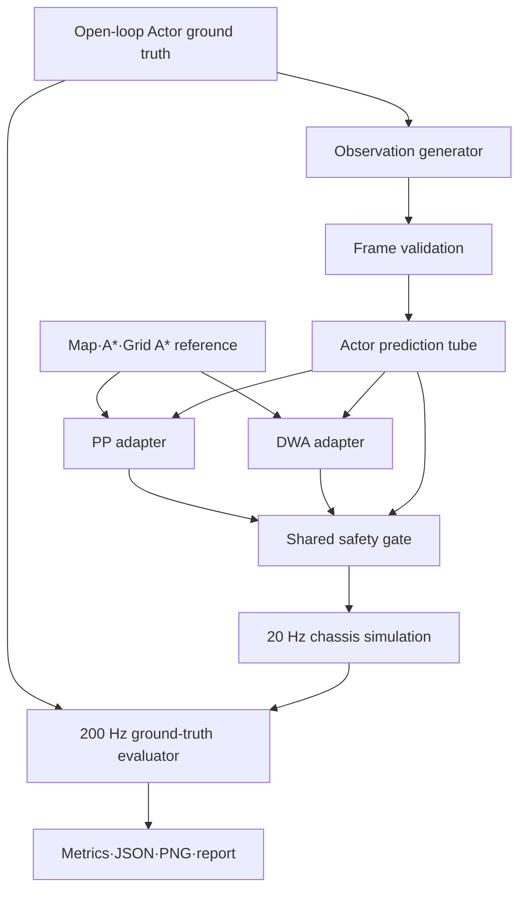

# 동적 원형 Actor 비교실험 설계 명세

## 1. 문서 목적

이 디렉터리는
[움직이는 원형 Actor 회피 비교실험 v5](../dynamic-person-avoidance-experiment-plan-2026-08-10.md)를
코드로 옮기기 위한 전반 설계와 단계별 구현 명세를 관리한다.

문서의 우선순위는 다음과 같다.

1. v5 동결 승인본: 실험 질문, 수치, 안전·통계 계약의 정본
2. 이 문서: 전체 구조, 책임 경계, 단계 순서의 정본
3. 단계별 명세: 해당 단계의 파일, 인터페이스, 시험, 완료조건
4. 구현 코드와 시험 결과

하위 문서가 v5와 충돌하면 임의로 구현하지 않는다. 충돌 위치와 영향을 기록하고 v5를
명시적으로 개정한 다음 구현 명세를 함께 갱신한다.

## 2. 상태와 범위

- 상태: 설계 기준선
- 실행 범위: Python `simulation_only`
- 개인 연구 승인: 완료
- 팀 제품 결정: 미수행
- 경로 분석 7단계와 G1~G5: 미수행
- ROS 2, 실제 센서, 모터, 사람 탑승: 범위 밖

## 구현 현황

아래 표는 2026-08-10에 시작한 동적 Actor 비교실험의 기존 구현 `1~6단계`다. 2026-08-13
이후 동적 지역 기동 원인 분리 연구는 이 번호를 재사용하지 않고
[`R1~R7 master specification`](10-dynamic-local-maneuver-research-master-spec.md)을 따른다.
현재 새 연구는 `R1 prediction 계약 감사 완료`, `R2 ground-truth witness·profile replay`,
`R3 bounded 공간 oracle public 21/21·receipt`, `R4 public 21/21·ready reference 8개·receipt`,
`R5-A v3 static public 21/21·ready 8개 RPP/DWB 종단·receipt` 상태다. `R5-B`는 초기 실패
자료를 보존한 뒤 controller-matched reference와 C++ 전체 DWB 코어로 같은 방향 Actor 좌·우
10개를 모두 추월→재합류→도착시켰다. 2026-08-16에는 별도 횡단 Actor 좌·우도 통과→재합류→
도착했고, 두 위험 사례도 첫 재개→1.7283m 진행→`stop_epoch=2` 재정지→새 reference·허가→
도착을 완료했다. 최신 공개 Ideal 경로 실행에서 gate override와 hard failure는 `0`이다.

같은 세 장면의 제한된 Normal·Stress 진단도 수행했다. Normal 횡단 좌·우는 출발 뒤 첫
frame 누락에서 감속해 실제 정지했고, Normal 다중 위험은 연속 안전 frame을 기다려 늦게
출발한 뒤 다음 누락에서 정지했다. Stress는 방향 예측이 한 번도 `READY`가 되지 않아
출발하지 않았다. hard failure는 없지만 완료도 없으므로 정식 R5-C 자격이 아니며, R2-B
Actor 출현/fresh EMPTY 문제도 그대로 남는다. 상세 기준과 결과는
[`R5-C 공개 관측 열화 진단`](19-r5c-public-observation-diagnostic.md),
[`R5-C 제한 진단 결과`](r5c-public-observation-diagnostic-result-2026-08-16.md)에 기록한다.
새 진단을 포함한 전체 회귀는 `922 passed`, 실패·건너뜀 `0`이다.

이후 기존 R2-B 실패를 다시 재현해 내부 순간 출현과 관측 지연의 계약 충돌임을 확인했다.
fresh `EMPTY`는 미래 무출현 보장이 아니므로 이동 허가로 사용하지 않는다. 실제 카메라·가시
영역이 없는 현재 하네스에서 이 실패를 예측기 수정으로 지우지 않고 R2-B 미해결로 유지한다.
별도로 Actor가 처음부터 존재하는 다중 위험 Normal 장면에서 관측 상실→실제 정지→11개
fresh READY→새 stop epoch·reference·controller session 재출발을 반복 확인했다. 7번 모두
새 session을 사용했고 hard failure는 `0`이지만 35초 장면 안에 목표까지 완료하지 못해 최종
정지를 유지했다. Stress는 READY가 최대 10개만 연속돼 출발하지 않았다. 상세는
[`R2-B Actor 출현과 관측 복구 명세`](20-r2b-appearance-and-observation-recovery.md),
[`R5-C 관측 복구 제한 결과`](r5c-observation-recovery-result-2026-08-16.md)에 기록한다.
이번 제한 복구 변경을 포함한 전체 회귀는 `926 passed`, 실패·건너뜀 `0`이다.

후속으로 원본 R2-B 실패 world를 보존한 채 별도 감시 접근 world를 만들었다. 지연 출현
Actor는 원래 진입 상태와 이후 궤적을 유지하면서 `t=0`까지 역산된 접근 track으로 관측된다.
v6·legacy 대표 Ideal replay는 원본 miss `38/22`를 재현하고 파생 world에서 `0/0`으로
줄었다. 이는 추상 시뮬레이션 entry coverage 결과이며 실제 카메라·FOV·가림 증거가 아니다.
상세는 [`감시 진입 명세`](21-r2b-monitored-entry-coverage.md)와
[`감시 진입 결과`](r2b-monitored-entry-coverage-result-2026-08-16.md)에 기록한다.
이 변경을 포함한 전체 회귀는 `935 passed`, 실패·건너뜀 `0`이다.

사용자 결정에 따라 초음파 전환 연구는 되돌리고, 카메라 등 상위 관측 영역이 기존
`ActorTrack` 계약을 제공한다고 둔 경로 연구로 복귀했다. 공개 Normal 횡단 좌·우에서는
관측 상실 뒤 실제 정지하고 현재 pose·새 stop epoch에 묶인 새 reference/controller session으로
재출발하도록 보정했다. 좌·우 제한 시험은 모두 안전 경계를 통과했으며 world 종료 전에는
실제 정지로 닫는다. 이는 실제 카메라 구현이나 제한 시간 내 항상 도착한 결과가 아니다.
상세는 [`횡단 복구 명세`](22-r5c-crossing-recovery.md)와
[`횡단 복구 결과`](r5c-crossing-recovery-result-2026-08-16.md)에 기록한다.

통과 완료 증거 뒤에는 기존 횡단 경로를 다시 시작하지 않고, 실제 정지 후 새 stop epoch에
묶인 `FOLLOW_ORIGINAL` 경로로 기존 terminal을 향하게 했다. 확장 Normal 진단에서 왼쪽은
tick `1328`, 오른쪽은 tick `1432`에 완료했다. 오른쪽은 마지막 위치 이동과 최종 방향 회전을
분리해 종점 교착을 해소했다. 상세는 [`통과 후 원 경로 복귀 결과`](r5c-post-pass-return-result-2026-08-16.md)에
기록한다. Stress 좌·우는 방향 판단 근거가 준비되지 않아 release·이동 `0`, hard failure `0`의
보수 정지로 닫혔다. 실제 카메라 검증은 미완료다.

실제 카메라 입력 연결을 시작하기 전에 집 PC와 저장소를 확인했지만 인식된 카메라 장치,
영상, 검출·추적 모델과 연결 코드가 없었다. 필요한 최소 장비·영상·입력 경계와 fail-closed
순서는 [`R2-B 카메라 입력 연결 Gate`](23-r2b-camera-input-integration-gate.md)에 기록했다.
실제 입력을 받기 전에는 카메라 통합 완료로 표시하지 않는다.

별도로 사용자는 카메라 등 상위 영역이 기존 `ActorTrack`을 제공한다고 가정하고 경로 알고리즘
R단계를 처음부터 다시 검증하도록 지시했다. 실제 카메라 Gate는 이 경로 lane을 막지 않는다.
R1 재감사는 공개 13개·hard failure `0`, Ideal Capsule `100%`, 표적 회귀 `52 passed`로
완료했다. 진행 정본은 [`카메라 ActorTrack 가정 R단계 재검증`](24-camera-assumed-r-stage-rerun.md)이다.

초기 순수 Python 첫 LEFT 610틱의 약 51분 병목은 후보별 safety 판정과 DWB 수치 코어를
C++20으로 옮겨 줄였다. 이 가속은 후보·점수·안전 기준을 바꾸지 않았다. 다만 이번 최신
횡단·재정지 완료 결과는 Ideal 합성 관측의 경로 기능 증거다. 별도 Normal·Stress 제한
진단은 보수적 정지만 확인했으며 임무 완료는 확인하지 못했다. R2-B 출현 관측, 50ms 종단
자격, receipt, hidden과 제품 알고리즘 채택은 여전히 수행하지 않았다.
새 횡단·재정지 시험을 포함한 최신 전체 실험실 회귀는 `916 passed`, 실패·건너뜀 `0`이다.

R2의 검색 범위·독립 validator·resource limit·분류·산출물 계약은
[`11-witness-automation-and-generalization.md`](11-witness-automation-and-generalization.md)에
정의했다. 좌·우 통과의 후보 공간·종류별 결과·검증·시험 순서는
[`12-pass-structured-witness-search.md`](12-pass-structured-witness-search.md)에 분리했다.
Ideal·Normal·Stress 관측과 자동 witness의 결합은
[`13-witness-profile-replay.md`](13-witness-profile-replay.md)에 분리했다.
ground-truth feasible과 관측상 판단 가능, 실제 controller 실행을 서로 다른 증거로 유지한다.
R5-B 상세 명세와 첫 실패 결과는 각각
[`17-r5b-ideal-temporal-tracking.md`](17-r5b-ideal-temporal-tracking.md),
[`r5b-initial-public-temporal-tracking-result-2026-08-15.md`](r5b-initial-public-temporal-tracking-result-2026-08-15.md),
[`R5-B C++ DWB 안전 배치 가속 결과`](r5b-cpp-dwb-safety-acceleration-result-2026-08-15.md),
[`R5-B 횡단·다중 위험 결과`](r5b-crossing-and-restop-controller-result-2026-08-16.md)에 기록한다.
R3의 검증된 pose·heading path를 persistent controller용 immutable reference와 revision-bound
sliding window로 바꾸는 계약은
[`15-local-maneuver-reference-contract.md`](15-local-maneuver-reference-contract.md)에 정의했다.
이 reference의 존재는 이동 허가나 controller 추종 성공을 뜻하지 않는다.
같은 reference를 persistent RPP와 source-derived DWB가 실행하는 계약, 공통 stop·rotation
section executor, full terminal과 local window의 분리 및 reference-bound shared gate 검사는
[`16-persistent-controller-comparison.md`](16-persistent-controller-comparison.md)에 정의했다.
첫 R5-A clean 실패에서 R4 ready 8개 모두 reverse edge를 포함하지만 R5 v1 controller는 후진을
지원하지 않는 계약 충돌이 확인됐다. [`ADR 0014`](../../decisions/0014-section-bound-bounded-reverse-translation.md)는
R4 v2가 명시한 reverse section에서만 최대 `0.10m/s` 제한 후진을 허용한다. signed static
`R5-A` 대표 case는 RPP·DWB 모두 실제 후진과 종단 완료를 확인했지만 전체 21-case clean
qualification과 receipt는 아직 없으며 temporal·observation-integrated R5-B/C는 차단 상태다.

| 단계 | 상태 |
|---|---|
| 1. 동적 시뮬레이션 기반 | 구현·전용시험·전체 회귀 완료 |
| 2. 관측과 Actor 예측 | 구현·전용시험·전체 회귀 완료 |
| 3. 안전·권한·시간 | 구현·전용시험·전체 회귀 완료 |
| 4. PP·DWA 통합 | 구현·전용시험·전체 회귀 완료 |
| 5. 평가기와 corpus | 구현·전용시험·전체 회귀 완료 |
| 6. runner·hidden·판정 | 구현·전용시험·full hidden 실행 완료 |

### source-derived v7 전환 — 2026-08-12

기존 사용자 정의 DWA의 공개 기능 실패를 분석한 뒤, 공개 ROS DWA·Nav2 DWB 고정 커밋을
소스 기준으로 사용하는 새 reference 구현 방향을 승인했다. 분석 범위, 라이선스, 프로젝트 고유
안전 계약과 구현 순서는
[`공개 DWA·DWB 소스 분석과 프로젝트 적용 설계`](07-open-source-dwa-dwb-analysis-and-adaptation.md)를
따른다. 이는 v6 결과를 삭제하거나 제품 알고리즘을 채택하는 결정이 아니다.

현재 generator·core·critics·goal controller·프로젝트 안전 constraint·adapter·composition까지
구현했고 source-derived 전용시험 `129 passed`, 전체 회귀 `467 passed`를 확인했다. 다만 첫 공개 사례의 `217/217` 후보가
현재 Actor reachable tube에 의해 제거됐다. 따라서 이는 DWB 점수 튜닝 문제가 아니라 corpus의
`LOCAL_DETOUR_FEASIBLE` 분류와 보수적 Actor 운동 가정 사이의 계약 충돌이다. 이 충돌을 결정하기
전에는 source-derived full public, timing qualification과 새 hidden을 진행하지 않는다.

같은 공개 입력의 Python 1-tick은 약 `1.40 s`였고, 주 병목은 약 `90,696`회의 pose safety
판정이었다. 검사기 재사용만으로는 50 ms를 달성하지 못했으므로 현재 구현은 기능 reference이며
실시간 자격을 통과한 controller가 아니다.

이 충돌을 공개 조건 안에서 분리하기 위한
[`방향 관성을 반영한 Actor 예측 v7 명세`](08-directional-actor-prediction-v7.md)와
[`ADR 0010`](../../decisions/0010-directional-actor-prediction.md)을 추가했다. 최신 20개 unique
accepted `observed_velocity` 평균, 최신 `observed_position` anchor, 최근 20개 중 최대
`velocity_sigma/√20`, 최신 position sigma를 사용하며, `norm(v_mean)-2σ >= 0.03 m/s`에서만
direction을 lock한다. endpoint는
`s0`의 제한 감속·가속만 사용하고 속도 불확실성은 exact Capsule 반경에 한 번만 반영한다.
stale·invalid·track/binding 변경에서는 과거 이력을 폐기한다.

공개-only 자격시험은 217개 action primitive의 후보당 41 pose, 2.0초 rollout과 terminal
stopping에서 exact Capsule 계산과 결정론을 확인한다. 이는 기존 witness가 `0.35 s`만 확인한
공백을 닫는 기하 자격이며 closed-loop DWB 우회 성공은 아니다. 실제 legal bypass는
`ONLINE_DWB_BYPASS_UNPROVEN`으로 남고, Stress 저속 Actor의 fail-closed 시험이 최종 통과해야
방향 예측 자격 완료로 기록한다. 해당 targeted 방향 예측·공개-only 자격은 `33 passed`로
완료했다. 이는 전체 공개 폐루프 자격이 아니며 v7 hidden은 생성·열람·실행하지 않았다.

### 예측 계약 감사 1단계 — 2026-08-13

후속 기동 연구의 첫 단계로
[`09-prediction-contract-audit.md`](09-prediction-contract-audit.md)를 추가했다. 이 감사는
공개 v6 13개와 Ideal·Normal·Stress 합성 관측만 사용해 다음을 분리한다.

```text
결정론적 Actor 운동 범위 포함 여부
!=
Gaussian 관측과 방향성 Capsule의 경험적 coverage
```

공개 motion transition `5,420`개에서 동결 방향 운동 계약 위반은 `0`건이고, Ideal
Capsule은 `26,257/26,257`을 포함했다. Normal Capsule은 `19,170/20,118`
(`95.2878%`)이며 `948`개 miss가 있었다. 이 miss는 통계 결과와 limitation으로 기록하며
안전 수치나 prediction envelope를 낮추지 않는다. 공개 corpus에는 가속·감속·정지·회전
transition이 없으므로 해당 기능을 검증했다고 주장하지 않는다. 새 hidden, controller 튜닝과
제품 알고리즘 선택은 수행하지 않았다.

### v6 보정 상태 — 2026-08-11

[v6 보정·재자격 명세](v6-correction-and-requalification.md)에 따라 4~6단계의
연구 구현을 다시 검증하고 있다. 이는 위 표의 v5 구현 이력을 삭제하는 작업이 아니다.

- legacy-v1 공개 36개와 고정 corpus hash는 회귀 lane으로 유지한다.
- 방향·코너·교차로·세로 경로·다중 Actor를 포함한 v6 공개 13개를 별도 lane으로
  추가했다.
- controller에는 평가 범주·split·family·variant·oracle과 이를 드러내는 식별자를
  전달하지 않는다. v6 source·map·Actor 식별자는 semantic world에서 분리한 불투명 ID다.
- category oracle은 지속 rejoin, 같은 방향 추월, 위험 구간별 서로 다른 보호정지
  epoch를 검사한다.
- DWA에는 후보 탈락 진단과 동작 보존형 계산 재사용을 추가했다. 기존 Python+NumPy
  경로는 직렬 500회에서 `100`회 50 ms를 초과했다(PP `0/500`). 이후 동결 계약을
  유지한 선택적 C++ 코어를 구현했고, 공개 대표 98 snapshot의 controller·diagnostic
  digest 불일치 `0/98`을 확인했다. 2026-08-12 독립 timing 재자격은 PP·C++ DWA 모두
  miss `0/500`이었다. 이는 timing 하위 자격이며 expanded public 기능시험·receipt는
  아직 수행하지 않았다.
- v5의 public+hidden 일괄 실행 진입점은 v6 재자격이 끝날 때까지 차단한다. 축소·부분
  공개 실행은 정식 qualification receipt를 만들 수 없으며 새 hidden은 생성하지 않는다.
- 회사 PC의 `final-v4`는 현재 실패 구현의 regression 자료다. 집 PC에는 해당 ignored
  output이 없으므로 `final-v4` 전체 동작 보존을 검증했다고 주장하지 않는다.

v6 보정은 제품 알고리즘 채택, `G1~G5` 결정 또는 경로 분석 7단계가 아니다.
현재 코드 회귀는 동적 `187`개와 기존 실험실 `148`개, 합계 `335 passed`이며 정식
expanded-public receipt와 새 hidden은 없다.

6단계 runner는 manifest/source hash, public hard-safety 사전자격, hidden commitment와
소비 영수증, paired Normal·Stress 실행, 통계·Pareto·10개 승격 조건, PNG와 실패 회귀
후보 보존을 구현했다. 전체 회귀 `274 passed` 뒤 14-worker 결과 계산과 직렬 timing
qualification으로 `public 144 + hidden 120` runs를 실행했다. hard-safety는 `264/264`,
공통 fault 25개는 모두 통과했지만 기능·50 ms·우회·gate override 조건이 미달해 DWA를
승격하지 않고 `PP + shared gate` 연구 기준선을 유지한다. 이 수치는 Python 합성환경의
L1/L2 연구 증거이며 실제 사람 안전성의 증거가 아니다.

목표는 PP 경로추종+공통 safety gate와 사용자 정의 DWA 국소 우회+동일 gate를 같은
조건에서 비교할 수 있는 재현 가능한 시험환경을 만드는 것이다.

## 3. 전체 구조



### 핵심 경계

- controller와 safety gate는 열화된 `DynamicObservationFrame`만 본다.
- evaluator만 정확한 Actor ground truth를 본다.
- expectation category와 hidden label은 runner와 evaluator만 본다.
- PP와 DWA는 동일 reference path, 관측 stream, 차체 제한, gate를 사용한다.
- gate는 online command filter이며 독립된 하드웨어 안전채널이 아니다.
- 이전 tick의 늦은 명령과 이전 `stop_epoch`의 허가는 재사용하지 않는다.

## 4. 모듈 책임

구현은 기존 `simulation/path_planning_lab` 패키지 안에서 수행한다. 별도 프로젝트나 별도
대형 harness를 만들지 않는다.

| 모듈 후보 | 책임 |
|---|---|
| `dynamic_contracts.py` | Actor, observation, authority, command, trace의 불변 자료형 |
| `dynamic_actor.py` | open-loop Actor 궤적과 20 Hz ground-truth 적분 |
| `dynamic_observation.py` | 10 Hz 지연·noise·dropout과 frame validation |
| [R7 단일 관측 누락과 TTL 재사용](34-r7-single-frame-dropout-ttl-holdover-2026-08-18.md) | 마지막 유효 frame의 제한적 재사용과 출발·재출발 금지 경계 |
| [R7 단일 관측 누락 수정 결과](35-r7-dropout-holdover-and-return-result-2026-08-18.md) | TTL 재사용, 통과 후 계획 정지와 원 경로 복귀 결과 |
| [R7 새 hidden-v3 실행 명세](36-r7-hidden-v3-execution-spec-2026-08-18.md) | 새 관측 seed 20개, 일회 실행, PASS·FAIL·중단 처리 규칙 |
| [R7 hidden-v3 사전점검 결과](37-r7-hidden-v3-preflight-result-2026-08-18.md) | runner 수정, 981개 회귀와 seed 없는 clean-clone preflight 결과 |
| [R7 hidden-v3 실패 결과](38-r7-hidden-v3-failure-result-2026-08-18.md) | Normal 9/10, Stress 기준 9/10, hard failure 0과 두 실패 원인 |
| [R7 hidden-v3 Normal 목표 직전 정지 수정](39-r7-hidden-v3-normal-goal-gap-fix-2026-08-18.md) | 목적지 6.56cm 앞 정지 원인, 제한된 동률 수정과 공개 회귀 결과 |
| [R7 Stress 조건부 재출발 정책](40-r7-stress-conditional-release-policy-2026-08-19.md) | gate-confirmed distinct safe frame 11개 뒤 조건부 출발과 누락 시 재정지 정책 |
| [R7 hidden-v4 조건부 evaluator](41-r7-hidden-v4-conditional-evaluator-2026-08-19.md) | 새 commitment namespace, 조건부 Stress 판정과 실제 hidden 전 차단 조건 |
| `dynamic_prediction.py` | 관측 age와 가속 편차를 포함한 Actor tube |
| `dynamic_safety.py` | swept clearance, 제한 감속, hold, `stop_epoch`, resume gate |
| 기존 `followers/pure_pursuit.py` | 동결 PP 규칙에 맞춘 adapter/명령 생성 |
| 기존 `local_algorithms/dwa.py` | 동결 217후보·비용·terminal stopping 계약 |
| `dynamic_evaluation.py` | 200 Hz ground-truth safety와 성능·승차감 지표 |
| `dynamic_corpus.py` | golden/development/hidden/fault episode 생성과 hash |
| `dynamic_runner.py` | paired 실행, manifest, 결과 집계, 통계·승격 판정 |
| 기존 `cli.py` | 동적 실험 명령 진입점 |
| 기존 `experiment_visualization.py` | Actor·로봇·tube·reference trace 시각화 |

공통 자료형은 알고리즘 모듈을 import하지 않는다. runner만 모든 하위 모듈을 조합한다.
evaluator 결과를 controller 입력으로 되돌리는 경로를 만들지 않는다.

## 5. 공통 자료 흐름

한 control tick의 처리 순서는 다음과 같다.

```text
1. 직전 accepted command로 로봇·Actor ground truth 적분
2. 현재 simulation time에 도착한 observation frame 전달
3. source·sequence·revision·hash·TTL 검증
4. 현재 tick의 immutable controller snapshot 생성
5. PP 또는 DWA 명령 계산
6. computation result의 tick·deadline 검증
7. shared safety gate의 swept collision·권한 검사
8. accepted command를 다음 tick actuator queue에 저장
9. ground-truth evaluator와 trace recorder 갱신
```

같은 simulation timestamp의 사건 순서도 위 순서를 따른다. watchdog boundary 시험에서는
observation 전달과 controller snapshot 순서를 의도적으로 뒤집어도 안전정지하는지 확인한다.

## 6. 핵심 계약 ID

| ID | 계약 |
|---|---|
| `DYN-ARCH-001` | controller는 ground truth Actor를 직접 읽지 않는다. |
| `DYN-ARCH-002` | 같은 seed는 같은 Actor·관측·사건 stream을 만든다. |
| `DYN-OBS-001` | fresh empty frame과 no-frame/dropout을 구분한다. |
| `DYN-OBS-002` | stale·invalid source에서는 새 비영점 명령을 적용하지 않는다. |
| `DYN-SAFE-001` | actual surface clearance는 Normal·Stress 모두 `0.08 m` 이상이다. |
| `DYN-SAFE-002` | 늦은 명령은 폐기하고 이후 tick에 재사용하지 않는다. |
| `DYN-AUTH-001` | 보호정지 이전 이동 허가는 새 `stop_epoch`에서 무효다. |
| `DYN-AUTH-002` | 위험 해소만으로 자동 재출발하지 않는다. |
| `DYN-CTRL-001` | PP와 DWA의 자유주행 목표속도는 모두 `0.20 m/s`다. |
| `DYN-EVAL-001` | hard safety는 ground truth 200 Hz swept evaluator가 판정한다. |
| `DYN-HID-001` | hidden 확인 뒤 변경하면 기존 hidden을 regression으로 전환한다. |

각 단계의 시험 ID는 해당 계약 ID를 하나 이상 참조해야 한다.

## 7. 구현 단계와 게이트

| 순서 | 문서 | 핵심 산출물 | 다음 단계 진입조건 |
|---:|---|---|---|
| 1 | [동적 시뮬레이션 기반](01-dynamic-simulation-core.md) | Actor, 20 Hz tick, trace | 같은 seed 완전 재현 |
| 2 | [관측과 Actor 예측](02-observation-and-prediction.md) | 지연·noise·dropout, tube | frame·tube oracle 통과 |
| 3 | [안전·권한·시간](03-safety-authority-and-timing.md) | gate, stop epoch, deadline | fault 단위시험 통과 |
| 4 | [PP·DWA 통합](04-controller-integration.md) | 두 closed-loop pipeline | golden mechanism 통과 |
| 5 | [평가기와 corpus](05-evaluator-and-corpus.md) | 200 Hz evaluator, fault/dev | hard gate와 재현성 통과 |
| 6 | [runner·hidden·판정](06-runner-hidden-and-reporting.md) | manifest, hidden, 통계 보고 | 동결 결과 push |

단계는 순서대로 진행한다. 임시 연구 하네스는 `AGENTS.md`의 실행 규칙에 따라 표적시험,
대표 공개 사례, 읽기 전용 감사, 공개 병렬 실행을 먼저 수행하고 코드 동결 뒤 마지막 전체
회귀를 한 번 수행한다. wall-clock timing qualification은 CPU contention 없이 별도 직렬로
실행한다.

## 8. 완료 산출물

최종 실행은 최소한 다음을 남긴다.

```text
experiment_manifest.json
paired_episode_results.json
metrics_by_controller.json
hard_safety_results.json
contract_fault_results.json
pareto_summary.json
promotion_decision.json
summary.md
visualizations/*.png
regression_candidates/*.json
```

생성 로그와 대용량 결과는 `data/` 또는 실험실의 ignored output 디렉터리에 두며 기본적으로
Git에 커밋하지 않는다. commit에는 코드, 고정 corpus 정의, hash manifest, 요약 보고서만
포함한다.

## 9. 변경 규칙

- 수치 변경은 v5 문서와 해당 단계 문서를 함께 수정한다.
- 새 기능은 `DYN-*` 계약과 대응 시험 ID를 먼저 추가한다.
- 개발 corpus를 보고 튜닝한 횟수를 manifest에 기록한다.
- hidden 실행 뒤 코드가 바뀌면 같은 hidden으로 최종 판정하지 않는다.
- 안전조건 완화는 결과가 나쁘다는 이유로 수행하지 않는다.
- 실제 사람 탑승 또는 실제 구동 출력 시험으로 확대하려면 별도 팀 승인과 안전계획이 필요하다.

## 10. 예상 작업시간

| 단계 | 예상 |
|---|---:|
| 1. 시뮬레이션 기반 | 1.0시간 |
| 2. 관측·예측 | 1.5시간 |
| 3. 안전·권한·시간 | 1.5시간 |
| 4. controller 통합 | 2.0시간 |
| 5. evaluator·corpus | 2.5시간 |
| 6. runner·hidden·보고 | 2.5시간 |
| 회귀 수정 여유 | 1.0시간 |
| 합계 | 약 12시간 |

예상시간은 Python 합성환경 기준이다. 217개 후보와 200 Hz 평가의 성능 병목이 크면
qualification 최적화는 결과를 바꾸지 않는 범위에서 별도 커밋으로 처리한다.
