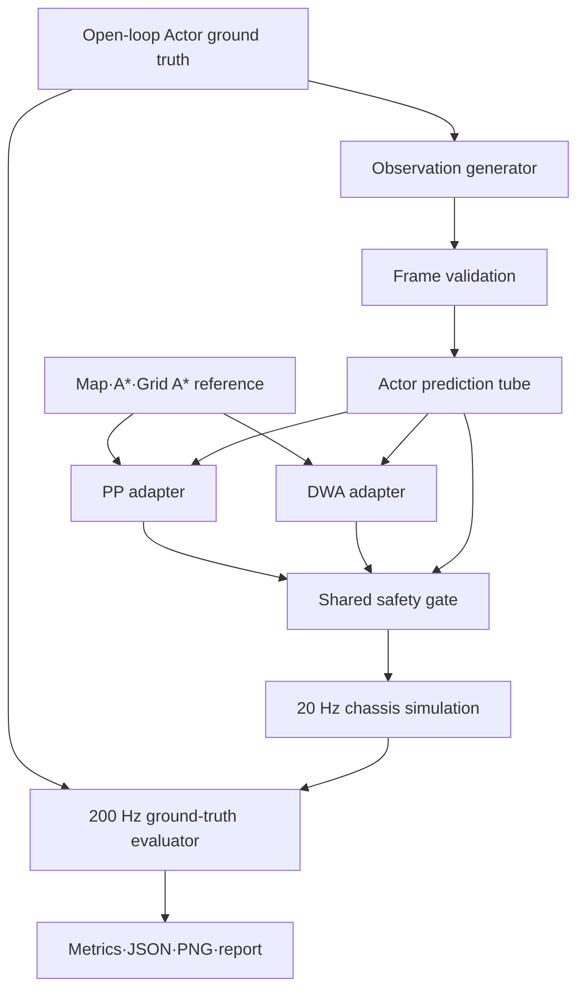

# 동적 원형 Actor 비교실험 설계 명세

## 1. 문서 목적

이 디렉터리는
[움직이는 원형 Actor 회피 비교실험 v5](../dynamic-person-avoidance-experiment-plan-2026-08-10.md)를
코드로 옮기기 위한 전반 설계와 단계별 구현 명세를 관리한다.

문서의 우선순위는 다음과 같다.

1. v5 동결 승인본: 실험 질문, 수치, 안전·통계 계약의 정본
2. 이 문서: 전체 구조, 책임 경계, 단계 순서의 정본
3. 단계별 명세: 해당 단계의 파일, 인터페이스, 시험, 완료조건
4. 구현 코드와 시험 결과

하위 문서가 v5와 충돌하면 임의로 구현하지 않는다. 충돌 위치와 영향을 기록하고 v5를
명시적으로 개정한 다음 구현 명세를 함께 갱신한다.

## 2. 상태와 범위

- 상태: 설계 기준선
- 실행 범위: Python `simulation_only`
- 개인 연구 승인: 완료
- 팀 제품 결정: 미수행
- 경로 분석 7단계와 G1~G5: 미수행
- ROS 2, 실제 센서, 모터, 사람 탑승: 범위 밖

목표는 PP 경로추종+공통 safety gate와 사용자 정의 DWA 국소 우회+동일 gate를 같은
조건에서 비교할 수 있는 재현 가능한 시험환경을 만드는 것이다.

## 3. 전체 구조



### 핵심 경계

- controller와 safety gate는 열화된 `DynamicObservationFrame`만 본다.
- evaluator만 정확한 Actor ground truth를 본다.
- expectation category와 hidden label은 runner와 evaluator만 본다.
- PP와 DWA는 동일 reference path, 관측 stream, 차체 제한, gate를 사용한다.
- gate는 online command filter이며 독립된 하드웨어 안전채널이 아니다.
- 이전 tick의 늦은 명령과 이전 `stop_epoch`의 허가는 재사용하지 않는다.

## 4. 모듈 책임

구현은 기존 `simulation/path_planning_lab` 패키지 안에서 수행한다. 별도 프로젝트나 별도
대형 harness를 만들지 않는다.

| 모듈 후보 | 책임 |
|---|---|
| `dynamic_contracts.py` | Actor, observation, authority, command, trace의 불변 자료형 |
| `dynamic_actor.py` | open-loop Actor 궤적과 20 Hz ground-truth 적분 |
| `dynamic_observation.py` | 10 Hz 지연·noise·dropout과 frame validation |
| `dynamic_prediction.py` | 관측 age와 가속 편차를 포함한 Actor tube |
| `dynamic_safety.py` | swept clearance, 제한 감속, hold, `stop_epoch`, resume gate |
| 기존 `followers/pure_pursuit.py` | 동결 PP 규칙에 맞춘 adapter/명령 생성 |
| 기존 `local_algorithms/dwa.py` | 동결 217후보·비용·terminal stopping 계약 |
| `dynamic_evaluation.py` | 200 Hz ground-truth safety와 성능·승차감 지표 |
| `dynamic_corpus.py` | golden/development/hidden/fault episode 생성과 hash |
| `dynamic_runner.py` | paired 실행, manifest, 결과 집계, 통계·승격 판정 |
| 기존 `cli.py` | 동적 실험 명령 진입점 |
| 기존 `experiment_visualization.py` | Actor·로봇·tube·reference trace 시각화 |

공통 자료형은 알고리즘 모듈을 import하지 않는다. runner만 모든 하위 모듈을 조합한다.
evaluator 결과를 controller 입력으로 되돌리는 경로를 만들지 않는다.

## 5. 공통 자료 흐름

한 control tick의 처리 순서는 다음과 같다.

```text
1. 직전 accepted command로 로봇·Actor ground truth 적분
2. 현재 simulation time에 도착한 observation frame 전달
3. source·sequence·revision·hash·TTL 검증
4. 현재 tick의 immutable controller snapshot 생성
5. PP 또는 DWA 명령 계산
6. computation result의 tick·deadline 검증
7. shared safety gate의 swept collision·권한 검사
8. accepted command를 다음 tick actuator queue에 저장
9. ground-truth evaluator와 trace recorder 갱신
```

같은 simulation timestamp의 사건 순서도 위 순서를 따른다. watchdog boundary 시험에서는
observation 전달과 controller snapshot 순서를 의도적으로 뒤집어도 안전정지하는지 확인한다.

## 6. 핵심 계약 ID

| ID | 계약 |
|---|---|
| `DYN-ARCH-001` | controller는 ground truth Actor를 직접 읽지 않는다. |
| `DYN-ARCH-002` | 같은 seed는 같은 Actor·관측·사건 stream을 만든다. |
| `DYN-OBS-001` | fresh empty frame과 no-frame/dropout을 구분한다. |
| `DYN-OBS-002` | stale·invalid source에서는 새 비영점 명령을 적용하지 않는다. |
| `DYN-SAFE-001` | actual surface clearance는 Normal·Stress 모두 `0.08 m` 이상이다. |
| `DYN-SAFE-002` | 늦은 명령은 폐기하고 이후 tick에 재사용하지 않는다. |
| `DYN-AUTH-001` | 보호정지 이전 이동 허가는 새 `stop_epoch`에서 무효다. |
| `DYN-AUTH-002` | 위험 해소만으로 자동 재출발하지 않는다. |
| `DYN-CTRL-001` | PP와 DWA의 자유주행 목표속도는 모두 `0.20 m/s`다. |
| `DYN-EVAL-001` | hard safety는 ground truth 200 Hz swept evaluator가 판정한다. |
| `DYN-HID-001` | hidden 확인 뒤 변경하면 기존 hidden을 regression으로 전환한다. |

각 단계의 시험 ID는 해당 계약 ID를 하나 이상 참조해야 한다.

## 7. 구현 단계와 게이트

| 순서 | 문서 | 핵심 산출물 | 다음 단계 진입조건 |
|---:|---|---|---|
| 1 | [동적 시뮬레이션 기반](01-dynamic-simulation-core.md) | Actor, 20 Hz tick, trace | 같은 seed 완전 재현 |
| 2 | [관측과 Actor 예측](02-observation-and-prediction.md) | 지연·noise·dropout, tube | frame·tube oracle 통과 |
| 3 | [안전·권한·시간](03-safety-authority-and-timing.md) | gate, stop epoch, deadline | fault 단위시험 통과 |
| 4 | [PP·DWA 통합](04-controller-integration.md) | 두 closed-loop pipeline | golden mechanism 통과 |
| 5 | [평가기와 corpus](05-evaluator-and-corpus.md) | 200 Hz evaluator, fault/dev | hard gate와 재현성 통과 |
| 6 | [runner·hidden·판정](06-runner-hidden-and-reporting.md) | manifest, hidden, 통계 보고 | 동결 결과 push |

단계는 순서대로 진행한다. 다음 단계 구현을 시작하기 전에 현재 단계의 전용시험과 기존
전체 회귀시험을 통과시키고 커밋·push한다.

## 8. 완료 산출물

최종 실행은 최소한 다음을 남긴다.

```text
experiment_manifest.json
paired_episode_results.json
metrics_by_controller.json
hard_safety_results.json
contract_fault_results.json
pareto_summary.json
promotion_decision.json
summary.md
visualizations/*.png
regression_candidates/*.json
```

생성 로그와 대용량 결과는 `data/` 또는 실험실의 ignored output 디렉터리에 두며 기본적으로
Git에 커밋하지 않는다. commit에는 코드, 고정 corpus 정의, hash manifest, 요약 보고서만
포함한다.

## 9. 변경 규칙

- 수치 변경은 v5 문서와 해당 단계 문서를 함께 수정한다.
- 새 기능은 `DYN-*` 계약과 대응 시험 ID를 먼저 추가한다.
- 개발 corpus를 보고 튜닝한 횟수를 manifest에 기록한다.
- hidden 실행 뒤 코드가 바뀌면 같은 hidden으로 최종 판정하지 않는다.
- 안전조건 완화는 결과가 나쁘다는 이유로 수행하지 않는다.
- 실제 사람 탑승 또는 실제 구동 출력 시험으로 확대하려면 별도 팀 승인과 안전계획이 필요하다.

## 10. 예상 작업시간

| 단계 | 예상 |
|---|---:|
| 1. 시뮬레이션 기반 | 1.0시간 |
| 2. 관측·예측 | 1.5시간 |
| 3. 안전·권한·시간 | 1.5시간 |
| 4. controller 통합 | 2.0시간 |
| 5. evaluator·corpus | 2.5시간 |
| 6. runner·hidden·보고 | 2.5시간 |
| 회귀 수정 여유 | 1.0시간 |
| 합계 | 약 12시간 |

예상시간은 Python 합성환경 기준이다. 217개 후보와 200 Hz 평가의 성능 병목이 크면
qualification 최적화는 결과를 바꾸지 않는 범위에서 별도 커밋으로 처리한다.
