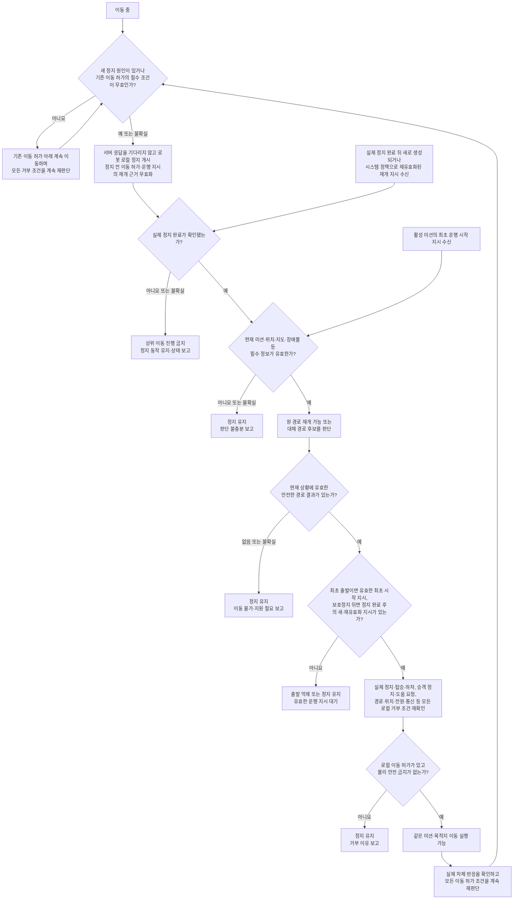

# 경로 기능 5단계 — 기술 중립적 안전·권한 흐름

- 상태: 사용자 승인 — 5단계 완료
- 작성일: 2026-08-09
- 승인일: 2026-08-09
- 상위 기준: [1단계 기준선](../product/path-planning-baseline.md), [2단계 추상 시나리오](../product/path-planning-functional-scenarios.md), [3단계 의존성](../product/path-planning-dependencies.md), [4단계 경로 전략 비교](../product/path-planning-strategy-comparison.md)
- 목적: 구체 기술을 선택하지 않고 `정지 우선 → 실제 정지 확인 → 경로 판단 → 별도 이동 허가`의 책임 경계를 정한다.

## 이번 단계의 승인 범위

이 문서에서 검토할 대상은 다음 다섯 가지뿐이다.

1. 정지 개시와 실제 정지 완료를 분리하는가?
2. 경로의 `재개 가능` 판정과 실제 이동 허가를 분리하는가?
3. 서버·경로 기능이 로봇 로컬 안전 거부권과 물리 안전 금지를 우회하지 못하게 하는가?
4. 정보 부족·오래된 결과·경로 없음·새 위험에서 보수적으로 정지하는가?
5. 책임이 아직 정해지지 않은 부분을 임의로 채우지 않았는가?

이번 단계에서는 전체 경로 재선택, 제한적 현재 경로 수정 또는 조합 운용 정책 중 하나를 추천하거나 채택하지 않는다.

## 증거와 적용 범위

이 흐름은 실제 사람이 타지 않는 저속 축소 모형 POC의 상위 기능 원칙이다.

- 실제 환자나 사람을 태우지 않는다.
- Python·Unity·축소 실물 시험은 각각 논리, 시각적 동작, 해당 모형의 물리 반응만 입증한다.
- 이 문서는 실제 휠체어의 충돌 안전, 제동 성능, 의료기기 안전성 또는 법규 준수를 입증하지 않는다.
- `인증됨`, `safety-rated`, `fail-safe 보장`, PL·SIL·ASIL 같은 안전등급을 주장하지 않는다.
- 실제 제품으로 확장할 경우 전력·제어 시스템, 차체, 사용 환경과 운영 절차는 별도의 위험분석과 시험 대상이다.

## 핵심 용어 구분

| 구분 | 이 문서에서의 의미 | 이것만으로 의미하지 않는 것 |
|---|---|---|
| 서비스 이동 요청 | 환자나 의료진이 목적지 이동 서비스를 요청함 | 활성 미션, 운행 시작 지시, 안전 허가, 모터 동작 |
| 유효한 최초 운행 시작 지시 | 아직 이전 운행 지시를 무효화하는 정지 사건이 개시되지 않은 활성 미션을 처음 시작해야 한다는 시스템 내부의 운행 의도가 현재도 유효함 | 환자·일반 사용자의 안전 승인, 정지 뒤 재개 근거, 로봇 로컬 이동 허가, 모터 동작 |
| 유효한 운행 재개 지시 | 보호정지 뒤 실제 정지 완료가 확인된 후 새로 생성되거나 시스템 정책에 따라 명시적으로 재유효화된 현재 미션의 시스템 운행 의도 | 환자·일반 사용자의 안전 승인, 로봇 로컬 이동 허가, 모터 동작 |
| 경로 결과 | 원래 경로 재개 가능, 대체 경로 후보 있음, 경로 없음 또는 판단 불충분 | 실제 이동 허가 |
| 정지 개시 | 충돌 가능성·판단 불충분·승객 정지·도움 요청 또는 수용된 운행 중 취소·전환처럼 정지가 필요한 사건에서 다른 이동 행동보다 정지 동작을 먼저 시작함 | 이미 물리적으로 완전히 정지함 |
| 로봇 로컬 보호정지 | 충돌 가능성이나 필수 판단 불충분 등 안전 거부 조건 때문에 로봇 로컬 영역이 개시·유지하는 정지 | 물리 비상정지, 전력 격리, 임무 취소 완료 |
| 실제 정지 완료 | 로봇의 실제 물리 반응을 근거로 움직임이 멈췄다고 확인함 | 위험 해소, 재출발 허가 |
| 로봇 로컬 이동 허가 | 현재 조건에서 경로·제어 결과를 실제 구동 쪽으로 넘겨도 된다는 로봇 측의 최종 논리 허가 | 물리 비상정지나 하드웨어 금지의 해제 |
| 물리 안전 금지 | 비상정지, 임계 전원 문제 등 물리 안전 영역이 실제 구동을 허용하지 않음 | 경로 기능이나 서버가 해제할 수 있는 소프트웨어 상태 |
| 상태 보고 | 정지·이동·경로 없음·지원 필요를 운영 영역에 알림 | 보고 성공만으로 실제 상태가 바뀜 |
| 지정된 담당 의료진 | 도움 요청에 응답하도록 해당 환자 정보 또는 담당 병동 알림 대상으로 연결된 의료진 | 알림을 생성한 서버 자체, 로봇의 자동 판단, 일반 사용자나 권한이 정해지지 않은 현장 인원 |

`정지 개시`, `정지 명령 생성`, `실제 정지 완료`는 서로 다른 사실이다. 같은 이유로 `경로 재개 가능`, `로봇 로컬 이동 허가`, `실제 차체 이동`도 서로 다른 사실이다.

## 권한 원칙

### 이동 허가에 대한 우선순위

```text
물리 안전 금지
> 로봇 로컬 안전 거부
> 경로·자율주행 결과
> 서버의 이동 목표와 운영 명령
> 사용자의 이동 요청
```

이 순서는 `누가 이동을 허용할 수 있는가`에 적용한다. 상위 안전 영역 하나라도 이동을 거부하면 하위 영역의 이동 요청은 실행할 수 없다.

반대로 정지·도움 요청은 낮은 우선순위의 이동 요청이 아니다. 사용자, 서버 또는 로봇 어느 영역에서 들어오더라도 더 보수적인 행동을 요구하는 정지 입력으로 취급한다. 어느 영역도 단독으로 위험한 이동을 강제할 수 없지만, 위험을 줄이기 위한 정지는 요청할 수 있다.

### 허가와 거부의 결합

- 실제 이동은 필요한 모든 허가 조건이 충족되고 물리 안전 금지가 없을 때만 가능하다.
- 하나의 유효한 거부 조건만 있어도 이동하지 않는다.
- 서버 응답이 없어도 로봇 로컬 영역은 정지를 개시할 수 있어야 한다.
- 서버와 경로 기능은 로봇 로컬 이동 금지나 물리 안전 금지를 강제로 해제할 수 없다.
- 로봇 로컬 이동 허가는 소프트웨어 영역의 최종 허가다. 실제 구동은 여기에 더해 독립적인 물리 안전 금지가 없어야 성립한다.

마지막 문장은 로봇 로컬 안전 게이트와 물리 안전부를 같은 장치로 구현한다는 뜻이 아니다. 둘의 실제 배치와 구현 관계는 아직 미정이다.

## 영역별 개념 책임

| 영역 | 할 수 있는 일 | 단독으로 할 수 없는 일 | 아직 정하지 않은 것 |
|---|---|---|---|
| 사용자·의료진 화면 | 서비스 이동·취소·정지·도움 요청 입력, 의미적 상태 표시 | 실제 정지 완료 단정, 운행 안전 허가, 로컬 안전 금지 해제, 모터 구동 | 시스템의 정지·재개 상태를 화면에 표현하는 방식 |
| 운영 서버 | 미션·목적지 관리, 정지 요청, 정지 이유·지원 필요 전달과 이력 기록 | 유일한 정지 수단이 되기, 실제 로봇 상태를 서버 기록만으로 단정, 운행 중 취소·목적지 변경을 실제 정지 전에 종결, 로컬·물리 안전 거부 우회 | 서버 단절 중 허용할 동작, 지원 전달 실패 뒤 종단 책임 |
| 경로 기능 | 현재 정보로 원 경로 재개 가능·대체 경로 후보·경로 없음·판단 불충분 결과 생성 | 정지 완료 단정, 모터 직접 구동, 실제 재출발 허가, 안전 금지 해제 | 경로 전략·알고리즘, 실행 위치, 구체 입력·출력 |
| 로봇 자율주행 영역 | 위험 또는 판단 불충분을 로봇 로컬 정지 흐름에 전달하고, 경로 결과와 현재 상태를 이동 허가 판단에 연결 | 물리 비상정지 강제 해제, 불확실한 결과를 이동으로 보정 | 경로 기능과 안전 기능의 내부 분할 |
| 로봇 로컬 안전 경계 | 서버를 기다리지 않는 정지 개시와 모든 현재 거부 조건을 반영한 논리적 이동 허가·거부 | 물리 안전 금지 우회, 경로 후보 생성, 서버 임무 결정 | 자율주행·임베디드·별도 안전부 사이의 실제 배치와 운행 재개 지시 발행 영역 |
| 임베디드 제어 영역 | 허용된 이동을 물리 구동으로 변환, 실제 움직임·정지에 관한 로봇 측 근거 제공, 상위 통신 없이 가능한 로컬 정지에 참여 | 상위 경로 결과만으로 안전을 단정 | 실제 정지 확인 수단, 자율주행부와의 보드·기능 분할 |
| 물리 안전 영역 | 비상정지·임계 전원 등에서 구동을 금지하는 최상위 거부권 제공 | 경로 선택이나 임무 성공 판단 | 회로, 구동 차단 방법, 리셋·해제 절차 |
| 현장 운영자 | 탑승·하차 보완 확인, 도움 요청 대응, 필요한 경우 수동 회수, 승인된 절차에 따른 현장 판단 | 물리 상태 미확인 상태에서 이동 강제 | 일반 장애물·승객 정지 요청에서 사람 확인이 필요한 범위와 시스템 재개 지시의 생성 조건 |

`실제 정지 완료`와 실제 위치·이동 상태는 서버 기록이 아니라 로봇의 실제 물리 반응에 근거해야 한다. 그 근거를 임베디드 제어부, 별도 안전부 또는 다른 로봇 측 영역 중 어디가 권위 있게 제공할지는 아직 결정하지 않는다.

## 기술 중립적 공통 흐름



이 흐름에서 경로 후보의 계산 위치, 센서, 좌표계, 지도 표현과 알고리즘은 정하지 않는다.

`F·H·K·S·N`은 영구 종료가 아니라 정지·출발 억제 상태에서 새 사건을 기다리는 보류 상태다. 실제 정지 여부가 불확실한 상태에서 새 유효 사건이 생기면 `E`부터, 실제 정지가 확인된 상태라면 `G`부터 전체 절차를 다시 거친다. 어느 보류 상태에서도 `O`로 직접 전이하지 않는다. 새 사건이 없으면 현재 정지 또는 출발 억제를 유지한다.

위 흐름은 경로 계산을 시작할 수 있는 시점이 아니라 경로 결과가 이동 허가 후보가 될 수 있는 시점을 나타낸다. 정지 동작이 진행되는 동안 잠정적인 경로 후보를 계산하는 것은 금지하지 않는다. 다만 실제 정지 완료 전에 계산된 결과는 실행 가능한 경로 결과가 아니며, 실제 정지 완료 뒤 현재 정보로 유효성을 다시 확인하고 필요하면 다시 계산해야 한다.

## 흐름 해석 규칙

1. `정지 개시` 뒤 곧바로 경로를 실행하지 않는다. 실제 정지 완료 확인이 먼저다.
2. 실제 정지 완료를 확인하지 못하면 경로 후보가 있어도 이동하지 않는다.
3. 오래된 경로 결과, 다른 미션의 결과 또는 현재 상황과 일치하지 않는 결과는 유효한 후보가 아니다.
4. 필수 정보가 없거나 서로 일치한다고 판단할 수 없으면 가장 그럴듯한 경로를 선택하지 않고 정지한다.
5. 위험 대상이 사라졌다는 관측은 재판단을 시작하는 입력일 뿐 재출발 명령이 아니다.
6. 원 경로 재개 가능과 대체 경로 가능은 같은 이동 허가 절차를 거친다.
7. 운행 시작·재개 지시의 발행 영역은 아직 미정이지만, 활성 미션에 속한 유효한 시스템 운행 지시가 있는지는 실제 이동 허가 전에 반드시 확인한다. 환자나 일반 사용자가 주행 안전을 승인한다는 뜻이 아니다.
8. 이동 중에는 충돌 가능성뿐 아니라 탑승·하차, 승객 정지·도움 요청, 수용된 취소·목적지 변경, 위치·경로, 물리 비상정지, 전원과 필수 통신 등 현재 이동 허가를 구성하는 모든 거부 조건을 계속 재판단한다.
9. 대체 이동 중 새 위험이 생기면 기존 허가는 더 이상 현재 상황의 근거가 아니며 다시 정지부터 시작한다.
10. 경로가 없거나 현재 자동 기능으로 해결할 수 없으면 임무 미완료와 안전정지를 분리해 보고한다.
11. 지원 요청을 만들었다는 사실과 사람에게 실제로 전달됐다는 사실을 구분한다.
12. 정지 이유가 해소돼도 다른 정지 이유가 남아 있으면 이동하지 않는다.
13. 보호정지가 개시되면 정지 전에 사용된 최초 시작 지시 또는 이전 재개 지시를 다시 움직이는 근거로 재사용하지 않는다. 현재 미션은 유지할 수 있지만 실제 정지 완료 뒤 새로 생성되거나 시스템 정책에 따라 명시적으로 재유효화된 재개 지시가 필요하다.
14. 운행 중 미션 취소나 목적지 변경을 서비스 정책상 받아들인 경우에는 로컬 정지와 실제 정지 완료를 먼저 확인한 뒤 기존 미션의 취소·전환을 종결한다. 정책상 허용하지 않는 요청은 현재 물리 미션을 바꾸지 않고 거부한다.

기존 문서의 `대체 이동 가능 → 같은 요청 계속`이라는 축약은 이 문서가 승인되면 다음과 같이 해석한다.

```text
대체 경로 후보 생성
→ 현재 상황에서 후보 유효성 확인
→ 보호정지 뒤라면 실제 정지 완료 후 새로 생성되거나 시스템 정책으로 재유효화된 재개 지시 확인
→ 로봇 로컬 이동 허가 재평가
→ 물리 안전 금지 없음 확인
→ 같은 미션과 목적지로 이동 가능
```

## 정지 원인별 경계

| 원인 | 공통 처리 | 재개에 관한 현재 경계 | 미정 사항 |
|---|---|---|---|
| 장애물 또는 충돌 가능성 | 로컬 정지 개시 → 실제 정지 확인 → 경로·상황 재판단 | 장애물 해소나 경로 후보만으로 자동 재출발하지 않음 | 일반 장애물 정지 뒤 시스템 운행 재개 지시의 발행 영역과 현장 확인 범위 |
| 위치·경로·장애물 판단 불충분 | 로컬 정지 개시 또는 출발 억제 → 판단 불충분 보고 | 필요한 판단이 복구되고 전체 이동 허가를 다시 확인하기 전까지 정지 | 어떤 정보와 어느 수준의 신뢰가 필요한지 |
| 승객 정지 요청 | 즉시 정지 개시 → 기존 이동 허가와 이전 운행 지시의 재개 근거 무효화 → 실제 정지 확인 | 새·재유효화 재개 지시와 전체 이동 허가 전까지 정지 | 사람 확인 필요 여부와 시스템 재개 지시 발행 영역 |
| 승객 도움 요청 | 즉시 정지 개시 → 지원 요청 생성·전달 상태 추적 → 실제 정지 확인 | 지정된 담당 의료진의 확인과 새·재유효화 재개 지시 전까지 정지 | 의료진 확인이 시스템 재개 지시의 생성 조건인지, 전달 실패 뒤 처리 |
| 운행 중 미션 취소·목적지 변경 | 요청을 정책상 수용하면 로컬 정지 개시 → 실제 정지 확인 → 기존 미션 취소·전환 종결 | 이전 미션의 운행 지시는 재사용하지 않음 | 다음 미션·목적지의 지시 발행과 경로 재판단 책임 |
| 물리 비상정지 | 물리 안전 금지가 다른 이동 허가보다 우선 | 장치 해제 자체를 재출발 명령이나 이전 운행 지시의 재유효화로 보지 않으며, 새·재유효화 재개 지시와 전체 허가가 필요 | 회로, 실제 해제·리셋·재개 절차 |
| 임계 전원 문제 | 운행 계속보다 안전정지 우선 | 전원 상태 변화만으로 임의 재출발하지 않음 | 판정 방법·임계값·회수 절차 |
| 통신 문제 | 현재 이동 허가에 필수인 정보나 실제 상태 확인을 잃으면 이동 허가를 성립시킬 수 없음 | 통신 복구만으로 자동 재출발하지 않음 | 서버 연결 단절과 로봇 내부 통신 이상을 구분한 계속·정지 범위 |

통신 문제를 모두 같은 사건으로 확정하지 않는다. 서버 연결이 끊겨도 로봇이 어디까지 현재 동작을 계속할지는 `SYS-03`의 팀 결정 사항이다. 다만 현재 이동 허가에 필수인 로봇 내부 정보나 실제 정지 확인이 불가능하면 정지로 닫는다.

## 안전 불변조건

| ID | 불변조건 |
|---|---|
| AUTH-01 | 이동 허가에서는 하나의 유효한 안전 거부가 여러 이동 요청보다 우선한다. |
| AUTH-02 | 서버가 없어도 로봇 로컬 영역은 충돌 가능성 또는 판단 불충분에 대한 정지를 개시할 수 있다. |
| AUTH-03 | 정지 요청·정지 동작과 실제 정지 완료를 같은 상태로 간주하지 않는다. |
| AUTH-04 | 실제 정지 완료가 확인되기 전에 대체 경로 또는 원 경로 재개를 실행하지 않는다. |
| AUTH-05 | 경로 기능의 `재개 가능` 또는 대체 경로 후보는 시스템의 운행 시작·재개 지시도, 로봇 로컬 이동 허가도 아니다. |
| AUTH-06 | 현재 미션·상황에 유효하지 않거나 최신성을 판단할 수 없는 경로 결과를 실행하지 않는다. |
| AUTH-07 | 경로가 없거나 필수 판단이 불충분하면 이동하지 않고 정지 상태를 유지한다. |
| AUTH-08 | 위험 해소 관측, 입력 복구, 비상정지 해제 중 어느 하나만으로 자동 재출발하지 않는다. |
| AUTH-09 | 서버·경로 기능·사용자 화면은 로봇 로컬 이동 금지와 물리 안전 금지를 강제로 해제할 수 없다. |
| AUTH-10 | 이동 중에도 모든 거부 조건을 계속 확인하며, 새 위험 또는 더 최신의 거부 조건이 생기면 이전 이동 허가와 경로 후보를 현재 실행 근거로 사용하지 않는다. |
| AUTH-11 | 상태 보고 실패나 지원 요청 전달 실패를 이동 허가로 해석하지 않는다. |
| AUTH-12 | 실제 움직임·정지 상태는 서버의 기대 상태가 아니라 로봇의 물리 반응에 근거해 확인한다. |
| AUTH-13 | 승객의 도움 요청 뒤에는 지정된 담당 의료진의 확인과 실제 정지 완료 뒤 새로 생성되거나 시스템 정책에 따라 명시적으로 재유효화된 재개 지시가 있기 전까지 이동하지 않는다. 지원 요청 생성만으로 의료진 확인을 대신하지 않는다. |
| AUTH-14 | 소프트웨어 흐름 시험의 성공을 실제 제동·구동 차단·사람 탑승 안전성의 증거로 확대하지 않는다. |
| AUTH-15 | 보호정지·판단 불충분에 따른 정지 또는 물리 비상정지가 개시되면 현재 미션은 유지할 수 있지만, 정지 전 이동 허가와 그 전환에 사용한 최초 시작·재개 지시를 재출발 근거로 재사용하지 않는다. 실제 정지 완료 뒤 새로 생성되거나 시스템 정책에 따라 명시적으로 재유효화된 현재 미션의 재개 지시가 있어야 이동 재개를 검토한다. 지시 발행 영역은 후속 단계에서 정한다. |
| AUTH-16 | 정지 유지 상태에서 새로운 정보·상태 변화·유효한 지시가 들어와도 실제 이동으로 직접 전이하지 않는다. 실제 정지가 불확실하면 정지 완료 확인부터, 실제 정지가 확인됐다면 필수 정보 유효성 확인부터 전체 허가 절차를 다시 통과한다. 새 사건이 없으면 정지를 유지한다. |
| AUTH-17 | 로봇이 움직이거나 실제 정지가 확인되지 않은 상태에서 미션 취소·목적지 변경 요청을 정책상 수용하면, 서버 기록만 즉시 종결하지 않고 로컬 정지와 실제 정지 완료 뒤 기존 미션의 취소·전환을 종결한다. 출발 전 실제 정지가 확인된 대기 상태에서는 즉시 처리할 수 있다. |
| AUTH-18 | 승객 정지 요청은 즉시 로컬 정지를 개시하고 기존 이동 허가와 이전 운행 지시의 재개 근거를 무효화한다. 정지 뒤 사람 확인이 필요한지와 어느 시스템 영역이 새·재유효화 재개 지시를 만드는지는 후속 결정으로 남긴다. |

## 추상 시나리오에 적용한 확인표

| 시나리오 | 경로 기능의 결과 | 이동 허가 결과 |
|---|---|---|
| A-08 위치·예정 경로 판단 불충분 | 판단 불충분 | 실제 정지 확인 뒤에도 정지 유지 |
| S-01 일부 점유·제한적 수정 후보 가능 | 대체 경로 후보 가능 | 후보 유효성·로컬 허가·물리 금지를 별도 확인하기 전까지 정지 |
| S-03 모든 허용 경로 차단 | 경로 없음 | 정지 유지, 필요 시 지원 요청 |
| C-03 대체 이동 중 새 장애물 | 기존 후보 무효화, 전체 상황 재판단 | 새 위험에 따라 다시 정지 개시 |
| R-01 위험 조건 해소 | 원 경로 재개 가능 또는 불가 | `가능`이어도 별도 이동 허가 전까지 정지 |
| 승객 정지 요청 | 경로 존재 여부와 별도 | 기존 허가·운행 지시 재사용 금지, 새·재유효화 재개 지시와 전체 허가 전까지 정지 |
| 승객 도움 요청 | 경로 존재 여부와 별도 | 지정된 담당 의료진 확인과 새·재유효화 재개 지시 전까지 정지 |
| 운행 중 취소·목적지 변경 | 기존 경로 결과를 새 미션 근거로 사용하지 않음 | 실제 정지 확인 뒤 기존 미션 취소·전환 종결 |
| 필수 로봇 내부 정보 상실 | 판단 불충분 | 정지 유지 |
| 서버 연결 단절 | 경로 판단 가능 범위 미정 | 팀이 `SYS-03`을 정하기 전에는 일괄 계속·일괄 정지 정책을 확정하지 않음 |

## 아직 결정하지 않는 권한·연동 질문

다음은 5단계에서 의도적으로 답하지 않는다.

1. 로봇 로컬 안전 게이트를 자율주행부, 임베디드 제어부, 별도 안전부 중 어디에 둘 것인가?
2. 실제 정지 완료와 실제 위치·이동 상태의 권위 있는 근거를 어느 로봇 측 영역이 제공하는가?
3. 일반 장애물 정지 뒤 시스템의 새·재유효화 운행 재개 지시를 어느 영역이 발행하는가?
4. 일반 승객 정지 요청 뒤 사람 확인이 필요한가? 도움 요청에서는 지정된 담당 의료진 확인을 재개 전제로 확정하되, 그 확인 자체가 시스템 재개 지시를 생성하는 조건인지 별도의 지시가 필요한지는 어떻게 정할 것인가?
5. 물리 비상정지의 해제, 로컬 보호정지의 해제와 실제 재출발 절차를 어떻게 구분하는가?
6. 서버 연결 단절과 로봇 내부 통신 이상에서 각각 어떤 동작을 허용하는가?
7. 지원 요청 전달 실패·장기 정지·미션 중단·수동 회수의 최종 운영 책임자는 누구인가?
8. 실제 정지와 입력·경로 결과의 최신성을 어떤 정보와 수치로 판정하는가?
9. 정지 기능별 회로, 센서, 임계값, 통신과 내부 상태를 어떻게 구현하는가?

이 질문들은 팀 결정 또는 후속 기술 설계 대상이다. 문서에 답이 없다는 이유로 Software A가 임의 값을 가정하지 않는다.

## 조사 근거와 차용 한계

이번 조사는 구조적 원칙을 확인하기 위해 사용했으며 제품이나 패키지를 채택하지 않는다.

- [Nav2 Collision Monitor](https://docs.nav2.org/configuration/packages/collision_monitor/configuring-collision-monitor-node.html)는 계획기와 별도로 제어 출력을 감시해 정지·감속할 수 있다는 구조적 사례다. 공식 문서도 CPU 수준 기능이며 hard real-time 안전 인증을 제공하지 않는다고 밝힌다. 장애물이 사라지면 자체 정지 동작을 해제할 수 있으므로 이 프로젝트의 `해소 관측만으로 재출발 금지` 정책 전체를 대신할 수 없다.
- [Autoware Planning Validator](https://autowarefoundation.github.io/autoware_universe/main/planning/planning_validator/autoware_planning_validator/)와 [Vehicle Command Gate](https://autowarefoundation.github.io/autoware.universe_planning/latest/control/vehicle_cmd_gate/)는 계획 결과 검증과 최종 명령 경계를 분리하는 사례다. 설정에 따라 무효 결과 처리 방식이 달라지므로 구성요소 이름만으로 보수적 종료가 보장되지는 않는다.
- [NASA Runtime Assurance 지침](https://ntrs.nasa.gov/citations/20220015734)은 덜 신뢰되는 주기능과 입력 보증, 감시, 전환 판단, 대체 기능을 분리하는 구조를 설명한다. 여기서는 `경로 기능과 안전 거부권을 분리해 검증한다`는 원칙만 참고하며 항공 인증이나 형식 보증을 주장하지 않는다.
- [EU Machinery Directive 2006/42/EC](https://eur-lex.europa.eu/legal-content/EN/TXT/?uri=CELEX:32006L0042)는 비상정지 해제가 기계를 다시 시작시키는 동작과 같아서는 안 된다는 원칙을 둔다. 이 지침은 2027-01-19까지 적용되고 [Regulation (EU) 2023/1230](https://eur-lex.europa.eu/eli/reg/2023/1230/en)이 2027-01-20부터 일반 적용된다. 이 프로젝트에는 `해제와 재출발을 분리한다`는 개념만 참고하며 법적 적용이나 적합성을 주장하지 않는다.
- [ISO 7176-14:2022](https://www.iso.org/standard/72408.html) 및 [Amd 1:2025](https://www.iso.org/standard/88739.html)는 전동휠체어의 전력·제어 시스템을 정상 사용뿐 아니라 일부 고장 조건에서도 시험 대상으로 본다. 2025 개정은 참조 표준 정정이다. 이 문서에는 `논리 시험과 실제 전력·제어 시험은 다른 증거다`라는 경계만 반영한다.
- [ISO 13482:2014](https://www.iso.org/standard/53820.html)는 개인돌봄 로봇 중 사람 운송 로봇을 다루지만 의료기기 로봇은 범위에서 제외한다. 현재 2판 [ISO/FDIS 13482](https://www.iso.org/standard/83498.html)가 FDIS 등록·최종문 접수 단계로 개발 중이다. 이 축소 POC의 안전 인증 근거로 사용하지 않는다.
- [ISO 31101:2023](https://www.iso.org/standard/80886.html)은 병원 배송 같은 인간 공간 서비스 로봇의 운영 안전관리를 다루지만 제품 안전 표준은 아니라고 명시한다. 따라서 제품 내부 논리와 병원 운영 절차를 서로 다른 증거로 관리해야 한다는 점만 참고한다.

## 5단계 승인 결과

사용자는 핵심 안전 구조를 수정 후 승인했고, 다음 완료 조건을 모두 반영했다.

- [x] 보호정지 전에 사용한 이동 허가와 최초 시작·재개 지시를 보호정지 뒤 재출발 근거로 재사용하지 않음
- [x] 보류 상태의 새 사건은 실제 정지 상태에 따라 `E` 또는 `G`부터 전체 허가 절차를 다시 통과하며 실제 이동으로 직접 전이하지 않음
- [x] 정책상 수용된 운행 중 취소·목적지 변경은 로컬 정지와 실제 정지 완료 뒤 기존 미션의 취소·전환을 종결함
- [x] 승객 정지 요청과 도움 요청을 분리하고, 도움 요청은 지정된 담당 의료진 확인을 재개 전제로 유지함
- [x] 잠정 경로 계산과 실행 가능한 경로 결과를 분리해 기술 중립성을 유지함
- [x] 핵심 용어, 이동 허가 우선순위, 영역별 책임, 18개 안전 불변조건과 축소 POC의 증거 한계를 확정함

독립 재감사에서 P0/P1 문제가 없음을 확인했다.

이 승인은 경로 전략, 구체 알고리즘, 지도·위치 추정, 센서, 하드웨어 회로, 임계값, 통신 형식, 운행 재개 지시 발행 영역 또는 인증을 승인하는 것이 아니다. 5단계 완료가 6단계의 자동 시작을 의미하지 않으며, 사용자의 명시적 진행 지시 전에는 조건부 추천안을 작성하지 않는다.
